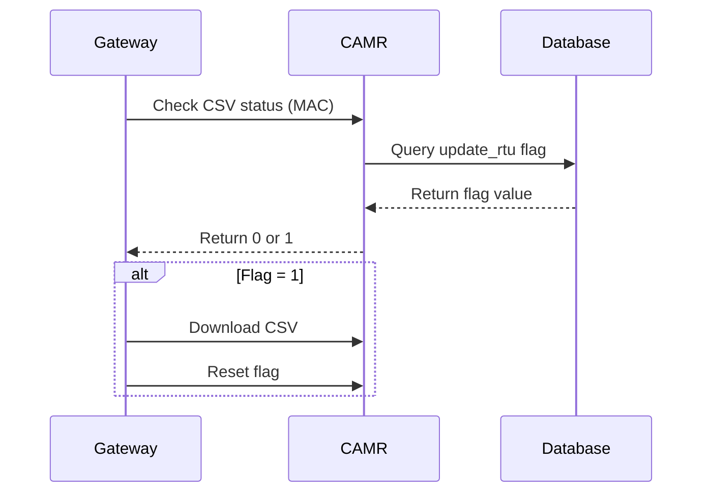
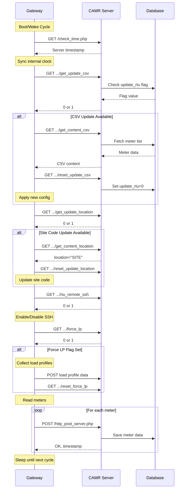

# Gateway Device API

## 📡 Overview

The Gateway Device API provides endpoints for remote terminal units (RTUs/gateways) to communicate with the CAMR central system. Gateways poll these endpoints periodically to:

1. Check for configuration updates
2. Download meter lists (CSV files)
3. Retrieve site codes
4. Check SSH access status
5. Check force load profile status
6. Submit meter reading data

**Controller:** `app/Http/Controllers/CAMRGatewayDeviceController.php`

## 🔐 Authentication

**Gateway Identification:** Gateways are identified by their **MAC address** in the URL path.

**No Authentication Required:** These endpoints are publicly accessible (no middleware protection) to allow gateway devices to communicate.

**Security:** Gateway MAC addresses act as the authentication mechanism. Only registered gateways in the database will receive valid responses.

## 🕒 Time Synchronization

### Check Server Time

**Endpoint:** `GET /check_time.php`  
**Purpose:** Get current server time for gateway synchronization

**Request:**
```http
GET /check_time.php HTTP/1.1
Host: camr.yourdomain.com
```

**Response:**
```
2024-11-05 14:30:15
```

**Format:** `YYYY-MM-DD HH:MM:SS`

**Usage:**
- Gateways use this to synchronize their internal clocks
- Ensures meter reading timestamps are accurate

## 📝 CSV Configuration Updates

Gateways can download updated meter lists and configurations.

### Check CSV Update Status

**Endpoint:** `GET /rtu/index.php/rtu/rtu_check_update/{mac}/get_update_csv`  
**Purpose:** Check if CSV configuration update is pending

**Request:**
```http
GET /rtu/index.php/rtu/rtu_check_update/AA:BB:CC:DD:EE:FF/get_update_csv HTTP/1.1
Host: camr.yourdomain.com
```

**Response:**
```
1
```

**Values:**
- `0` - No update pending
- `1` - CSV update available, gateway should download

**Database Field:** `meter_rtu.update_rtu`

**Flow:**


### Download CSV Configuration

**Endpoint:** `GET /rtu/index.php/rtu/rtu_check_update/{mac}/get_content_csv`  
**Purpose:** Download meter list and configuration

**Request:**
```http
GET /rtu/index.php/rtu/rtu_check_update/AA:BB:CC:DD:EE:FF/get_content_csv HTTP/1.1
Host: camr.yourdomain.com
```

**Response:** (CSV format, one meter per line)
```
meter_name,config_file,addressable_meter
10001,/MODBUS/DTS353.cfg,10001
10002,/MODBUS/DTS353.cfg,10002
1,/MODBUS/GENERIC.cfg,1
```

**CSV Format:**
- **Column 1:** Meter name (meter_name or '1' if default)
- **Column 2:** Configuration file path
- **Column 3:** Addressable meter identifier

**Behavior:**
- Only returns meters with `meter_status = 'Active'`
- Joins `meter_details` with `meter_configuration_file` tables
- Limited to first 32 meters per gateway
- Only processes if `update_rtu = 1`

**Logic:**
```php path=/Users/rli/Documents/DEC/camr_robinsons-main/camr_robinsons-main/app/Http/Controllers/CAMRGatewayDeviceController.php start=58
$gateway_meter_list = MeterModel::join('meter_configuration_file', 
        'meter_configuration_file.config_id', '=', 'meter_details.config_idx')
    ->where('meter_details.rtu_idx', $gatewayID)
    ->where('meter_details.meter_status', 'Active')
    ->skip(0)
    ->take(32)
    ->get([
        'meter_details.meter_id',
        'meter_details.meter_name',
        'meter_details.meter_default_name',
        'meter_configuration_file.config_file'
    ]);
```

### Reset CSV Update Flag

**Endpoint:** `GET /rtu/index.php/rtu/rtu_check_update/{mac}/reset_update_csv`  
**Purpose:** Reset CSV update flag after successful download

**Request:**
```http
GET /rtu/index.php/rtu/rtu_check_update/AA:BB:CC:DD:EE:FF/reset_update_csv HTTP/1.1
Host: camr.yourdomain.com
```

**Response:** (No content)

**Effect:**
- Sets `meter_rtu.update_rtu = 0` for the gateway
- Gateway has acknowledged the CSV download

## 📍 Site Code Configuration

Gateways can download updated site/location codes.

### Check Site Code Update Status

**Endpoint:** `GET /rtu/index.php/rtu/rtu_check_update/{mac}/get_update_location`  
**Purpose:** Check if site code update is pending

**Request:**
```http
GET /rtu/index.php/rtu/rtu_check_update/AA:BB:CC:DD:EE:FF/get_update_location HTTP/1.1
Host: camr.yourdomain.com
```

**Response:**
```
1
```

**Values:**
- `0` - No update pending
- `1` - Site code update available

**Database Field:** `meter_rtu.update_rtu_location`

### Download Site Code

**Endpoint:** `GET /rtu/index.php/rtu/rtu_check_update/{mac}/get_content_location`  
**Purpose:** Download site code configuration

**Request:**
```http
GET /rtu/index.php/rtu/rtu_check_update/AA:BB:CC:DD:EE:FF/get_content_location HTTP/1.1
Host: camr.yourdomain.com
```

**Response:**
```
location = "MALL-01"
```

**Format:** Shell variable assignment format

**Behavior:**
- Returns gateway's `site_code` value
- Only processes if `update_rtu_location = 1`
- Site code is quoted for shell compatibility

### Reset Site Code Update Flag

**Endpoint:** `GET /rtu/index.php/rtu/rtu_check_update/{mac}/reset_update_location`  
**Purpose:** Reset site code flag after successful download

**Request:**
```http
GET /rtu/index.php/rtu/rtu_check_update/AA:BB:CC:DD:EE:FF/reset_update_location HTTP/1.1
Host: camr.yourdomain.com
```

**Response:** (No content)

**Effect:**
- Sets `meter_rtu.update_rtu_location = 0`

## 🔒 Remote SSH Access Control

### Check SSH Status

**Endpoint:** `GET /rtu/index.php/rtu/rtu_check_update/{mac}/rtu_remote_ssh`  
**Purpose:** Check if SSH access should be enabled

**Request:**
```http
GET /rtu/index.php/rtu/rtu_check_update/AA:BB:CC:DD:EE:FF/rtu_remote_ssh HTTP/1.1
Host: camr.yourdomain.com
```

**Response:**
```
1
```

**Values:**
- `0` - SSH disabled
- `1` - SSH enabled (gateway should open SSH port)

**Database Field:** `meter_rtu.update_rtu_ssh`

**Usage:**
- Administrators can remotely enable SSH for troubleshooting
- Gateway reads this flag and enables/disables SSH daemon
- No automatic reset (persists until manually changed)

## 📈 Force Load Profile Collection

### Check Force Load Profile Status

**Endpoint:** `GET /rtu/index.php/rtu/rtu_check_update/{mac}/force_lp`  
**Purpose:** Check if load profile collection should be forced

**Request:**
```http
GET /rtu/index.php/rtu/rtu_check_update/AA:BB:CC:DD:EE:FF/force_lp HTTP/1.1
Host: camr.yourdomain.com
```

**Response:**
```
1
```

**Values:**
- `0` - Normal operation
- `1` - Force load profile collection immediately

**Database Field:** `meter_rtu.update_rtu_force_lp`

### Reset Force Load Profile Flag

**Endpoint:** `GET /rtu/index.php/rtu/rtu_check_update/{mac}/reset_force_lp`  
**Purpose:** Reset flag after load profile collection

**Request:**
```http
GET /rtu/index.php/rtu/rtu_check_update/AA:BB:CC:DD:EE:FF/reset_force_lp HTTP/1.1
Host: camr.yourdomain.com
```

**Response:** (No content)

**Effect:**
- Sets `meter_rtu.update_rtu_force_lp = 0`
- Gateway has completed forced load profile collection

## 📊 Meter Data Submission

### Submit Meter Reading

**Endpoint:** `POST /http_post_server.php` (or via route mapping)  
**Purpose:** Submit meter reading data to central system

**Request:**
```http
POST /http_post_server.php HTTP/1.1
Host: camr.yourdomain.com
Content-Type: application/x-www-form-urlencoded

save_to_meter_data=1&meter_id=10001&location=MALL-01&datetime=2024-11-05%2014:30:00&vrms_a=230.5&vrms_b=231.2&vrms_c=229.8&irms_a=15.3&irms_b=14.8&irms_c=15.1&freq=60.0&pf=0.95&watt=9850.5&va=10368.9&var=3245.2&wh_del=1234567.8&wh_rec=0&wh_net=1234567.8&wh_total=1234567.8&varh_neg=0&varh_pos=456789.1&varh_net=456789.1&varh_total=456789.1&vah_total=2345678.9&max_rec_kw_dmd=0&max_rec_kw_dmd_time=&max_del_kw_dmd=25.5&max_del_kw_dmd_time=2024-11-05%2013:00:00&max_pos_kvar_dmd=8.2&max_pos_kvar_dmd_time=2024-11-05%2013:15:00&max_neg_kvar_dmd=0&max_neg_kvar_dmd_time=&v_ph_angle_a=0&v_ph_angle_b=120&v_ph_angle_c=240&i_ph_angle_a=15&i_ph_angle_b=135&i_ph_angle_c=255&relay_status=1&gateway_mac=AA:BB:CC:DD:EE:FF&soft_rev=1.2.3
```

**Parameters:**

| Parameter | Type | Required | Description |
|-----------|------|----------|-------------|
| `save_to_meter_data` | int | Yes | 1=save to meter_data, 0=save to live_meter_data |
| `meter_id` | string | Yes | Meter identifier |
| `location` | string | Yes | Location/site code |
| `datetime` | string | Yes | Reading timestamp (YYYY-MM-DD HH:MM:SS, URL encoded) |
| `vrms_a` | float | Yes | Phase A voltage (RMS) |
| `vrms_b` | float | Yes | Phase B voltage (RMS) |
| `vrms_c` | float | Yes | Phase C voltage (RMS) |
| `irms_a` | float | Yes | Phase A current (RMS) |
| `irms_b` | float | Yes | Phase B current (RMS) |
| `irms_c` | float | Yes | Phase C current (RMS) |
| `freq` | float | Yes | Frequency (Hz) |
| `pf` | float | Yes | Power factor |
| `watt` | float | Yes | Active power (W) |
| `va` | float | Yes | Apparent power (VA) |
| `var` | float | Yes | Reactive power (VAR) |
| `wh_del` | float | Yes | Energy delivered (Wh) |
| `wh_rec` | float | Yes | Energy received (Wh) |
| `wh_net` | float | Yes | Net energy (Wh) |
| `wh_total` | float | Yes | Total energy (Wh) |
| `varh_neg` | float | Yes | Negative reactive energy (VARh) |
| `varh_pos` | float | Yes | Positive reactive energy (VARh) |
| `varh_net` | float | Yes | Net reactive energy (VARh) |
| `varh_total` | float | Yes | Total reactive energy (VARh) |
| `vah_total` | float | Yes | Total apparent energy (VAh) |
| `max_rec_kw_dmd` | float | Yes | Max received kW demand |
| `max_rec_kw_dmd_time` | string | No | Time of max received demand |
| `max_del_kw_dmd` | float | Yes | Max delivered kW demand |
| `max_del_kw_dmd_time` | string | No | Time of max delivered demand |
| `max_pos_kvar_dmd` | float | Yes | Max positive kVAR demand |
| `max_pos_kvar_dmd_time` | string | No | Time of max positive demand |
| `max_neg_kvar_dmd` | float | Yes | Max negative kVAR demand |
| `max_neg_kvar_dmd_time` | string | No | Time of max negative demand |
| `v_ph_angle_a` | float | Yes | Phase A voltage angle |
| `v_ph_angle_b` | float | Yes | Phase B voltage angle |
| `v_ph_angle_c` | float | Yes | Phase C voltage angle |
| `i_ph_angle_a` | float | Yes | Phase A current angle |
| `i_ph_angle_b` | float | Yes | Phase B current angle |
| `i_ph_angle_c` | float | Yes | Phase C current angle |
| `relay_status` | int | Yes | Relay status (0/1) |
| `gateway_mac` | string | Yes | Gateway MAC address |
| `soft_rev` | string | Yes | Gateway software revision |

**Response:**
```
OK, 2024-11-05 14:30:15
```

**Format:** `OK, {server_timestamp}`

**Behavior:**
- All numeric parameters are coerced to numeric types (`+ 0`)
- Datetime is URL decoded (replaces `%20` with space)
- Data saved to `meter_data` or `live_meter_data` based on `save_to_meter_data` flag
- Returns server time for gateway synchronization

## 🔄 Gateway Polling Workflow

Typical gateway polling sequence:



## 🔧 Administrative Control

Administrators trigger gateway actions via web interface:

### Enable CSV Update
1. Admin updates meters or configuration
2. Web interface sets `meter_rtu.update_rtu = 1`
3. Gateway polls and detects flag
4. Gateway downloads CSV
5. Gateway resets flag

### Enable Site Code Update
1. Admin changes site code
2. Web interface sets `meter_rtu.update_rtu_location = 1`
3. Gateway downloads new site code
4. Gateway resets flag

### Enable SSH Access
1. Admin enables SSH via web interface
2. Sets `meter_rtu.update_rtu_ssh = 1`
3. Gateway enables SSH daemon
4. Flag persists until admin disables

### Force Load Profile
1. Admin requests load profile collection
2. Sets `meter_rtu.update_rtu_force_lp = 1`
3. Gateway collects and uploads load profiles
4. Gateway resets flag

## ⚠️ Important Notes

1. **No Authentication:** Endpoints rely on MAC address identification only
2. **Polling Frequency:** Gateways poll at their configured intervals (typically 5-15 minutes)
3. **32 Meter Limit:** CSV download limited to first 32 meters per gateway
4. **URL Encoding:** Datetime parameters must be URL encoded (%20 for spaces)
5. **Numeric Coercion:** All numeric parameters are coerced with `+ 0`
6. **Two Data Tables:** `save_to_meter_data` flag determines storage location
7. **MAC Address Format:** Use colon-separated format (AA:BB:CC:DD:EE:FF)

## 🐛 Troubleshooting

### Gateway Not Downloading CSV
- Check `meter_rtu.update_rtu` flag is set to 1
- Verify gateway MAC address matches database
- Confirm gateway has active meters assigned
- Check meter status is 'Active'

### Meter Data Not Saving
- Verify all required parameters are present
- Check datetime format and URL encoding
- Confirm `meter_id` exists in system
- Review Laravel logs for errors

### Gateway Shows Wrong Site Code
- Verify `meter_rtu.site_code` is correct
- Ensure `update_rtu_location` flag was set
- Confirm gateway downloaded and applied update

## 📚 Related Documentation

- [Gateway Management](../modules/gateway-management.md) - Admin interface
- [Load Profile API](load-profile-api.md) - Load profile upload
- [Database Schema](../database-schema.md) - Table structures
- [Models](../models.md) - GatewayModel, MeterDataModel

---

**Base Path:** `/rtu/index.php/rtu/rtu_check_update/{mac}/`  
**Authentication:** MAC address based  
**Format:** Plain text responses  
**Polling:** Gateway-initiated
