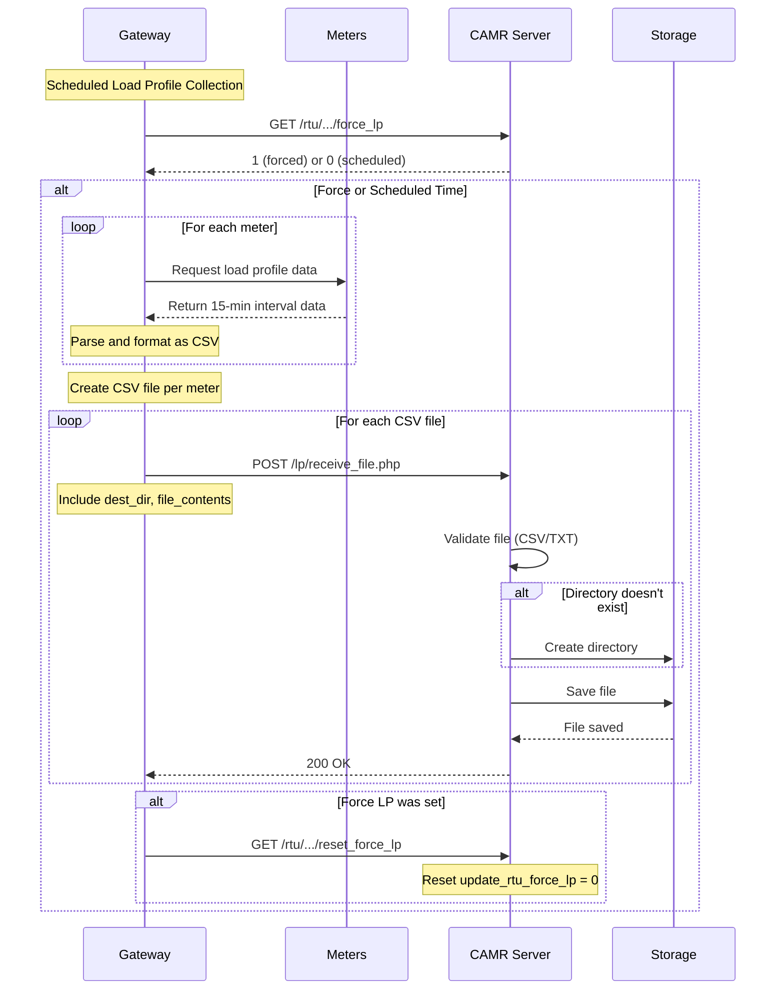

# Load Profile API

## 📈 Overview

The Load Profile API allows gateways to upload load profile data files (15-minute interval measurements) to the CAMR central system. Load profiles provide detailed time-series data showing electricity consumption patterns throughout the day.

**Controller:** `app/Http/Controllers/LoadProfileController.php`  
**Route:** `POST /lp/receive_file.php`  
**Method:** POST (accepts any HTTP method via `Route::any()`)

## 📊 What is a Load Profile?

A **load profile** is a time-series dataset that shows electricity consumption at regular intervals (typically 15 minutes). It provides:

- **Detailed consumption patterns** - How much power is used throughout the day
- **Peak demand identification** - When maximum power consumption occurs
- **Load curves** - Visual representation of consumption over time
- **Billing data** - Accurate measurement for time-of-use billing

**Typical Data Points:**
- `ch_1`: 1.5.0 kW (Instantaneous power)
- `ch_2`: 1-1:1.30.2 kWh (Energy delivered)
- `ch_3`: 1-1:3.30.2 kvarh (Reactive energy delivered)
- `ch_4`: 2.5.0 kW (Instantaneous reverse power)
- `ch_5`: 1-1:2.30.2 kWh (Energy received)
- `ch_6`: 1-1:4.30.2 kvarh (Reactive energy received)
- `ch_7`: Reserved
- `ch_8`: Reserved

## 📡 API Endpoint

### Upload Load Profile File

**Endpoint:** `POST /lp/receive_file.php`  
**Purpose:** Upload load profile CSV file from gateway

**Content-Type:** `multipart/form-data`  
**Authentication:** None (gateway-initiated, identified by IP address)

## 📝 Request Format

### HTTP Request

```http
POST /lp/receive_file.php HTTP/1.1
Host: camr.yourdomain.com
Content-Type: multipart/form-data; boundary=----WebKitFormBoundary7MA4YWxkTrZu0gW

------WebKitFormBoundary7MA4YWxkTrZu0gW
Content-Disposition: form-data; name="dest_dir"

2024-11-05/MALL-01
------WebKitFormBoundary7MA4YWxkTrZu0gW
Content-Disposition: form-data; name="overwrite"

0
------WebKitFormBoundary7MA4YWxkTrZu0gW
Content-Disposition: form-data; name="file_contents"; filename="meter_10001_2024-11-05.csv"
Content-Type: text/csv

meter_id,datetime,event_id,ch_1,ch_2,ch_3,ch_4,ch_5,ch_6,ch_7,ch_8
10001,2024-11-05 00:00:00,1,15.5,3.875,1.2,0,0,0,0,0
10001,2024-11-05 00:15:00,2,16.2,4.050,1.3,0,0,0,0,0
10001,2024-11-05 00:30:00,3,15.8,3.950,1.25,0,0,0,0,0
...
------WebKitFormBoundary7MA4YWxkTrZu0gW--
```

### Parameters

| Parameter | Type | Required | Description |
|-----------|------|----------|-------------|
| `dest_dir` | string | Yes | Destination directory path (e.g., "2024-11-05/MALL-01") |
| `overwrite` | int | No | Overwrite existing file: 0=no, 1=yes (default: not set) |
| `file_contents` | file | Yes | CSV or TXT file containing load profile data |

### File Requirements

**Allowed MIME Types:**
- `text/csv`
- `text/plain`

**Validation:**
- File field name must be `file_contents`
- File extension must be `.csv` or `.txt`
- File is required (validation error if missing)

## 📊 CSV File Format

### Expected Structure

```csv
meter_id,datetime,event_id,ch_1,ch_2,ch_3,ch_4,ch_5,ch_6,ch_7,ch_8
10001,2024-11-05 00:00:00,1,15.5,3.875,1.2,0,0,0,0,0
10001,2024-11-05 00:15:00,2,16.2,4.050,1.3,0,0,0,0,0
10001,2024-11-05 00:30:00,3,15.8,3.950,1.25,0,0,0,0,0
10001,2024-11-05 00:45:00,4,14.9,3.725,1.1,0,0,0,0,0
```

### Column Definitions

| Column | Type | Description |
|--------|------|-------------|
| `meter_id` | string | Meter identifier |
| `datetime` | datetime | Measurement timestamp (YYYY-MM-DD HH:MM:SS) |
| `event_id` | int | Event/sequence identifier |
| `ch_1` | float | Channel 1: 1.5.0 kW (Active power) |
| `ch_2` | double | Channel 2: 1-1:1.30.2 kWh (Energy delivered) |
| `ch_3` | double | Channel 3: 1-1:3.30.2 kvarh (Reactive energy delivered) |
| `ch_4` | double | Channel 4: 2.5.0 kW (Reverse active power) |
| `ch_5` | double | Channel 5: 1-1:2.30.2 kWh (Energy received) |
| `ch_6` | double | Channel 6: 1-1:4.30.2 kvarh (Reactive energy received) |
| `ch_7` | double | Channel 7: Reserved |
| `ch_8` | double | Channel 8: Reserved |

### Typical Interval

**Standard:** 15-minute intervals (96 readings per day per meter)  
**Example:**
- 00:00:00
- 00:15:00
- 00:30:00
- 00:45:00
- 01:00:00
- ... (continues for 24 hours)

## 📁 File Storage

### Storage Location

**Base Path:** `storage/app/files/`  
**Full Path:** `storage/app/files/{dest_dir}/{filename}`

**Example:**
```
storage/app/files/2024-11-05/MALL-01/meter_10001_2024-11-05.csv
```

### Directory Structure

Gateways organize files by date and site:

```
storage/app/files/
├── 2024-11-05/
│   ├── MALL-01/
│   │   ├── meter_10001_2024-11-05.csv
│   │   ├── meter_10002_2024-11-05.csv
│   │   └── meter_10003_2024-11-05.csv
│   └── MALL-02/
│       ├── meter_20001_2024-11-05.csv
│       └── meter_20002_2024-11-05.csv
└── 2024-11-06/
    └── MALL-01/
        └── ...
```

### Auto-Create Directories

If the destination directory doesn't exist, it is automatically created:

```php path=/Users/rli/Documents/DEC/camr_robinsons-main/camr_robinsons-main/app/Http/Controllers/LoadProfileController.php start=43
if(!File::exists($path)) {
    // path does not exist
    // Create Folder
    Storage::makeDirectory($path);
}
```

### Overwrite Behavior

**`overwrite = 0` (default):** Always saves the file (will overwrite if exists)  
**`overwrite = 1`:** Always saves the file (will overwrite if exists)

> **Note:** Currently both values result in the same behavior - the file is saved and will overwrite any existing file with the same name.

## ✅ Response

### Success Response

**HTTP Status:** 200 OK  
**Body:** (Empty or validation success)

The endpoint returns successfully if:
1. File validation passes
2. Directory is created (if needed)
3. File is saved successfully

### Error Responses

#### Missing File

**HTTP Status:** 422 Unprocessable Entity  
**Body:**
```json
{
    "message": "The file contents field is required.",
    "errors": {
        "file_contents": [
            "CSV file is Required"
        ]
    }
}
```

#### Invalid File Type

**HTTP Status:** 422 Unprocessable Entity  
**Body:**
```json
{
    "message": "The file contents must be a file of type: csv, txt.",
    "errors": {
        "file_contents": [
            "The file contents must be a file of type: csv, txt."
        ]
    }
}
```

## 🔄 Gateway Upload Workflow

Typical load profile collection and upload sequence:



## 🐞 Data Processing

### Post-Upload Processing

**Current Implementation:** Files are stored but **not automatically imported** into the `load_profile` database table.

**Typical Workflow:**

1. **Gateway uploads** CSV files to `storage/app/files/`
2. **Files are stored** in date/site directory structure
3. **Manual or scheduled processing** imports data into database
4. **Reports use** the `load_profile` table for analysis

### Database Table Structure

See [Database Schema - load_profile table](../database-schema.md#load_profile) for details.

**Table:** `load_profile`  
**Columns:**
- `id` - Record ID
- `meter_id` - Meter identifier
- `datetime` - Measurement timestamp
- `event_id` - Event identifier
- `ch_1` through `ch_8` - Channel data
- `time_import` - Import timestamp

### Import Process

**Note:** The import logic is not in the LoadProfileController. A separate process (script or scheduled job) would:

1. Scan `storage/app/files/` for new CSV files
2. Parse CSV data
3. Insert records into `load_profile` table
4. Mark or move processed files

## 📊 Use Cases

### 1. Scheduled Daily Collection

**Scenario:** Gateway collects load profiles once per day at midnight

```
Gateway Schedule: Daily at 00:30
1. Collect previous day's 15-min data from all meters
2. Create one CSV file per meter
3. Upload to /lp/receive_file.php with dest_dir="2024-11-04/MALL-01"
4. Server stores files for processing
```

### 2. Force Collection

**Scenario:** Administrator needs immediate load profile data

```
Admin Action: Enable "Force Load Profile" in web interface
1. Admin sets update_rtu_force_lp = 1 for gateway
2. Gateway polls and detects flag
3. Gateway immediately collects and uploads load profiles
4. Gateway resets flag after upload
```

### 3. Historical Data Upload

**Scenario:** Gateway uploads backlog of stored data

```
Gateway Action: Upload historical data
1. Gateway has 7 days of stored load profiles
2. Uploads each day separately:
   - dest_dir="2024-10-28/MALL-01"
   - dest_dir="2024-10-29/MALL-01"
   - ... (continues for 7 days)
3. Server organizes files by date automatically
```

## ⚠️ Important Notes

1. **No Authentication:** Endpoint is publicly accessible (no middleware)
2. **File Validation Only:** Files are validated but not parsed/imported by this endpoint
3. **Auto-Directory Creation:** Directories are created automatically if they don't exist
4. **Overwrite Always:** Current implementation always overwrites existing files
5. **Client IP Logged:** Gateway IP address is captured but not currently used
6. **No Response Body:** Success returns empty or minimal response
7. **File Naming:** Gateway determines filename (typically includes meter ID and date)
8. **Storage Limits:** No size limits or quota checks implemented

## 🐛 Troubleshooting

### File Upload Fails

**Possible Causes:**
- File is not CSV or TXT format
- File field name is not `file_contents`
- `dest_dir` parameter missing or empty
- Storage directory permissions incorrect

**Check:**
```bash
# Verify storage directory is writable
ls -la storage/app/files/
chmod -R 775 storage/app/files/
```

### Files Not Appearing in Reports

**Cause:** Files are stored but not imported into database

**Solution:** Check if a separate import process exists:
```bash
# Look for import scripts
find . -name "*import*" -o -name "*load_profile*"

# Check for scheduled jobs
php artisan schedule:list
```

### Directory Structure Incorrect

**Check:**
```bash
# View actual directory structure
tree storage/app/files/ -L 3

# Check recent uploads
find storage/app/files/ -type f -mtime -1
```

## 🔧 Gateway Implementation Example

### cURL Command

```bash
curl -X POST "http://camr.yourdomain.com/lp/receive_file.php" \
  -F "dest_dir=2024-11-05/MALL-01" \
  -F "overwrite=0" \
  -F "file_contents=@meter_10001_2024-11-05.csv"
```

### Python Example

```python
import requests

url = "http://camr.yourdomain.com/lp/receive_file.php"

data = {
    'dest_dir': '2024-11-05/MALL-01',
    'overwrite': '0'
}

files = {
    'file_contents': ('meter_10001_2024-11-05.csv', open('meter_10001.csv', 'rb'), 'text/csv')
}

response = requests.post(url, data=data, files=files)
print(f"Status: {response.status_code}")
```

### Shell Script Example

```bash
#!/bin/bash
# Gateway load profile upload script

SERVER="http://camr.yourdomain.com"
SITE="MALL-01"
DATE=$(date +%Y-%m-%d)
DEST_DIR="${DATE}/${SITE}"

for csv_file in /data/load_profiles/*.csv; do
    echo "Uploading ${csv_file}..."
    curl -X POST "${SERVER}/lp/receive_file.php" \
      -F "dest_dir=${DEST_DIR}" \
      -F "overwrite=0" \
      -F "file_contents=@${csv_file}"
    
    if [ $? -eq 0 ]; then
        echo "Success: ${csv_file}"
        # Move to processed directory
        mv "${csv_file}" /data/load_profiles/processed/
    else
        echo "Failed: ${csv_file}"
    fi
done
```

## 📚 Related Documentation

- [Gateway Device API](gateway-device-api.md) - Force load profile endpoint
- [Database Schema](../database-schema.md) - load_profile table
- [Gateway Management](../modules/gateway-management.md) - Admin interface
- [Demand Report](../reports/demand-report.md) - Uses load profile data

---

**Endpoint:** `POST /lp/receive_file.php`  
**Content-Type:** `multipart/form-data`  
**Authentication:** None (gateway-initiated)  
**Storage:** `storage/app/files/{dest_dir}/{filename}`  
**Database Import:** Manual/scheduled (separate process)
