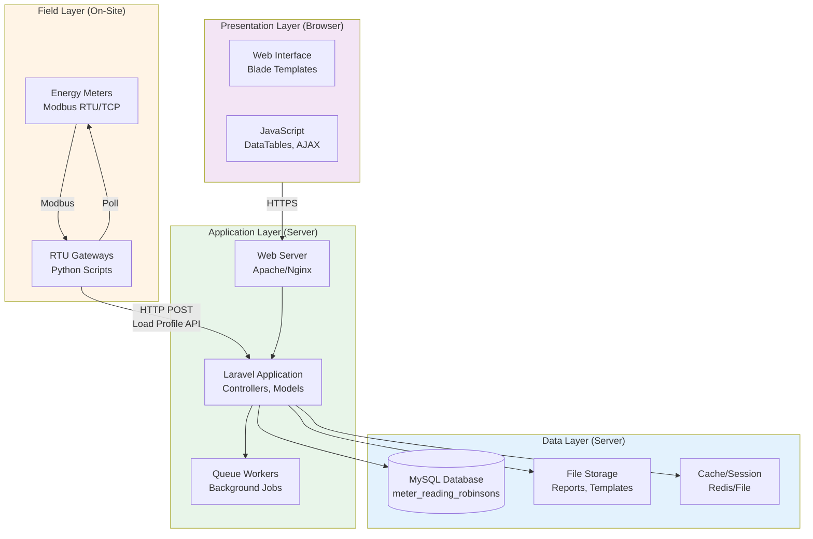
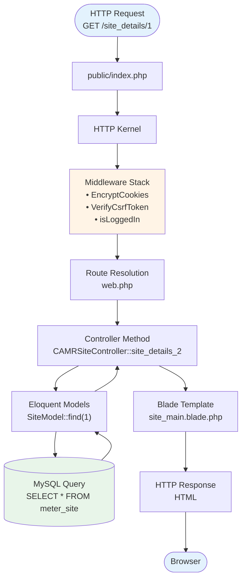
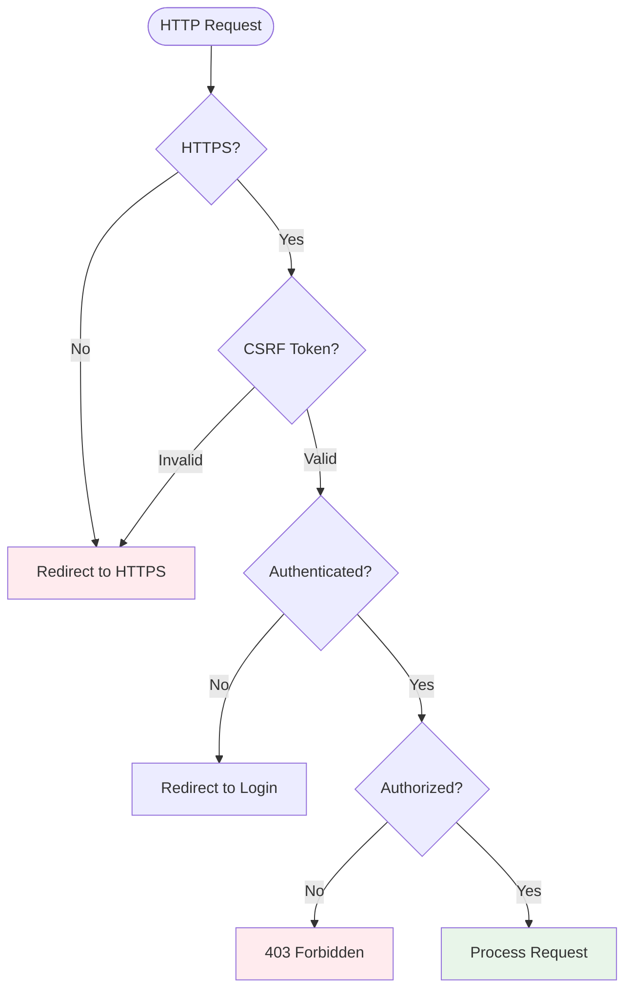
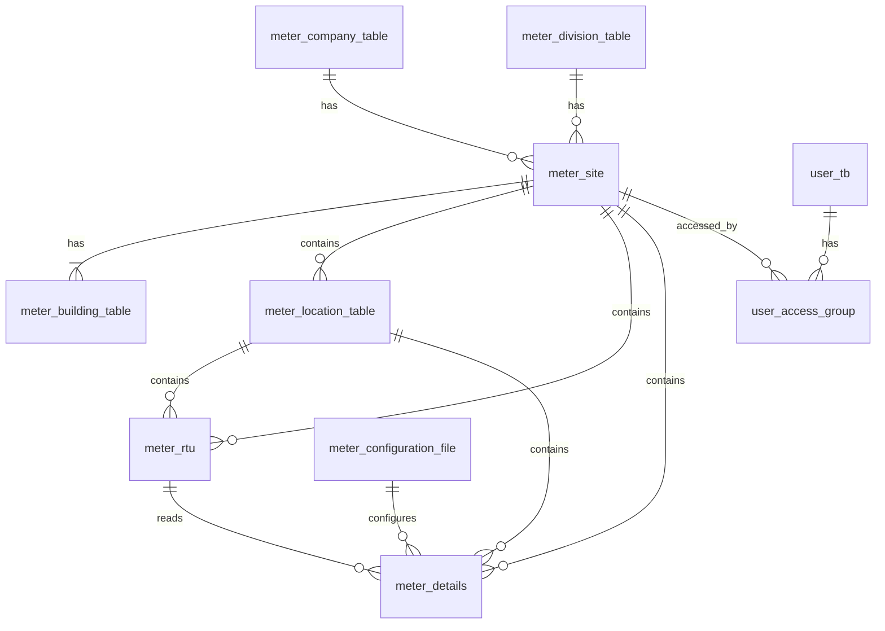
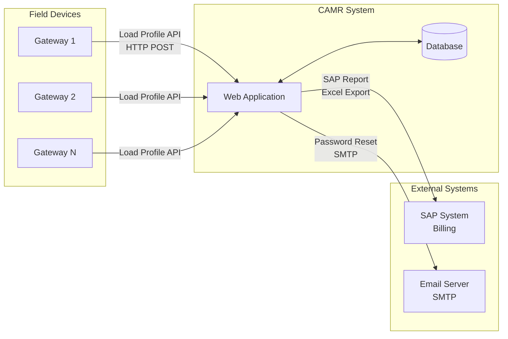

# 🏗️ Application Structure & Architecture

The CAMR (Centralized Automated Meter Reading) system follows a **three-tier architecture** with field devices (RTUs/meters), a centralized Laravel backend, and web-based frontend. This document provides a comprehensive overview of the application structure and architectural patterns.

---

## 📋 System Overview

**Architecture Type:** Three-Tier (Presentation, Application, Data)  
**Pattern:** MVC (Model-View-Controller)  
**Framework:** Laravel 8  
**Deployment:** Monolithic application with distributed field devices

### High-Level Architecture



---

## 🗂️ Directory Structure

### Laravel Application Root

```
camr_robinsons-main/
├── app/                          # Application logic
│   ├── Console/                  # Artisan commands
│   ├── Exceptions/               # Exception handlers
│   ├── Http/
│   │   ├── Controllers/          # Request handlers
│   │   │   ├── CAMRSiteController.php
│   │   │   ├── CAMRGatewayController.php
│   │   │   ├── CAMRMeterController.php
│   │   │   ├── SAPReportController.php
│   │   │   ├── RAWReportController.php
│   │   │   └── ...
│   │   ├── Middleware/           # Request filters
│   │   │   ├── CAMRAuthCheck.php
│   │   │   └── CAMRAlreadyLoggedIn.php
│   │   └── Kernel.php            # HTTP kernel
│   ├── Mail/                     # Mailable classes
│   │   └── ResetPassword.php
│   ├── Models/                   # Eloquent models
│   │   ├── SiteModel.php
│   │   ├── GatewayModel.php
│   │   ├── MeterModel.php
│   │   ├── User.php
│   │   └── ...
│   └── Providers/                # Service providers
│       ├── AppServiceProvider.php
│       └── RouteServiceProvider.php
│
├── bootstrap/                    # Bootstrap files
│   └── cache/                    # Bootstrap cache
│
├── config/                       # Configuration files
│   ├── app.php                   # Application config
│   ├── database.php              # Database config
│   ├── mail.php                  # Mail config
│   └── ...
│
├── database/                     # Database files
│   ├── migrations/               # Schema migrations
│   ├── seeders/                  # Data seeders
│   └── factories/                # Model factories
│
├── public/                       # Web root (document root)
│   ├── index.php                 # Entry point
│   ├── template/                 # Excel templates
│   │   ├── Offline Gateway.xlsx
│   │   ├── Offline Meter.xlsx
│   │   └── ...
│   ├── css/                      # Stylesheets
│   ├── js/                       # JavaScript
│   └── images/                   # Static images
│
├── resources/                    # Raw resources
│   ├── views/                    # Blade templates
│   │   ├── amr/                  # CAMR views
│   │   │   ├── site_main.blade.php
│   │   │   ├── company.blade.php
│   │   │   └── ...
│   │   ├── auth/                 # Auth views
│   │   │   ├── login.blade.php
│   │   │   └── reset.blade.php
│   │   └── layouts/              # Layout templates
│   ├── lang/                     # Language files
│   └── js/                       # JS source files
│
├── routes/                       # Route definitions
│   ├── web.php                   # Web routes
│   ├── api.php                   # API routes
│   └── channels.php              # Broadcast channels
│
├── storage/                      # Storage directory
│   ├── app/                      # Application storage
│   ├── framework/                # Framework cache/sessions
│   │   ├── cache/
│   │   ├── sessions/
│   │   └── views/
│   └── logs/                     # Application logs
│       └── laravel.log
│
├── tests/                        # Automated tests
│   ├── Feature/                  # Feature tests
│   └── Unit/                     # Unit tests
│
├── vendor/                       # Composer dependencies
│
├── .env                          # Environment configuration
├── .gitignore                    # Git ignore rules
├── artisan                       # Artisan CLI
├── composer.json                 # PHP dependencies
├── package.json                  # NPM dependencies
└── README.md                     # Project README
```

---

## 🎯 MVC Architecture

### Model Layer

**Location:** `app/Models/`  
**Purpose:** Data access and business logic

**Key Models:**
```php
app/Models/
├── SiteModel.php              # Sites/buildings
├── GatewayModel.php           # RTU gateways
├── MeterModel.php             # Energy meters
├── BuildingModel.php          # Building details
├── MeterLocationModel.php     # EE rooms
├── CompanyModel.php           # Organizations
├── DivisionModel.php          # Business units
├── ConfigurationFileModel.php # Modbus configs
├── User.php                   # User accounts
└── UserSiteAccessModel.php    # Access control
```

**Responsibilities:**
- Database interaction via Eloquent ORM
- Data validation and sanitization
- Relationships between entities
- Business logic encapsulation

### View Layer

**Location:** `resources/views/`  
**Technology:** Blade templating engine

**View Structure:**
```
resources/views/
├── amr/                       # CAMR application views
│   ├── site_main.blade.php    # Site dashboard
│   ├── company.blade.php      # Company management
│   ├── division.blade.php     # Division management
│   └── configuration_file.blade.php
│
├── auth/                      # Authentication views
│   ├── login.blade.php        # Login page
│   └── reset.blade.php        # Password reset
│
├── emails/                    # Email templates
│   └── reset-password.blade.php
│
└── layouts/                   # Shared layouts
    ├── site_details_script.blade.php
    ├── site_details_gateway_script.blade.php
    └── site_details_meter_script.blade.php
```

**Blade Features Used:**
- Template inheritance (`@extends`, `@section`)
- Component inclusion (`@include`)
- Control structures (`@if`, `@foreach`)
- Data binding (`{{ $variable }}`)
- Raw output (`{!! $html !!}`)

### Controller Layer

**Location:** `app/Http/Controllers/`  
**Purpose:** Request handling and response generation

**Controller Organization:**
```php
app/Http/Controllers/
├── Core Management
│   ├── CAMRSiteController.php        # Site CRUD
│   ├── CAMRGatewayController.php     # Gateway CRUD
│   ├── CAMRMeterController.php       # Meter CRUD
│   ├── CAMRBuildingController.php    # Building CRUD
│   └── CAMRMeterLocationController.php
│
├── Reports
│   ├── SAPReportController.php       # Billing reports
│   ├── RAWReportController.php       # Raw data export
│   ├── SiteReportController.php      # Site as-built
│   ├── ConsumptionReportController.php
│   ├── DemandReportController.php
│   └── OfflineReportController.php
│
├── Configuration
│   ├── CompanyController.php         # Company management
│   ├── DivisionController.php        # Division management
│   └── ConfigurationFileController.php
│
├── User Management
│   ├── UserController.php            # User CRUD
│   ├── UserSiteAccessController.php  # Access control
│   └── CAMRUserAuthController.php    # Authentication
│
├── API
│   ├── CAMRGatewayDeviceController.php  # Gateway API
│   └── LoadProfileController.php         # Data ingestion
│
└── Utilities
    ├── EmailController.php           # Email sending
    └── ReportSettingsController.php  # Report configs
```

**Controller Responsibilities:**
- Validate incoming requests
- Interact with models to retrieve/store data
- Return views with data
- Return JSON responses (AJAX/API)
- Handle file uploads/downloads
- Enforce authorization

---

## 🔄 Request Lifecycle

### Web Request Flow



### API Request Flow (Gateway Data Upload)

```mermaid
flowchart TB
    Gateway(["Gateway Device<br/>HTTP POST"]) --> API[/lp/receive_file.php]
    API --> Controller[LoadProfileController]
    Controller --> Validate["Validate Data<br/>• MAC address<br/>• File format"]
    Validate --> Parse["Parse CSV<br/>Extract readings"]
    Parse --> Store["Store to Database<br/>• meter_data table<br/>• Update last_log_update"]
    Store --> Response["JSON Response<br/>{status: success}"]
    Response --> Gateway
    
    style Gateway fill:#fff4e6
    style API fill:#e8f5e9
    style Store fill:#e3f2fd
```

---

## 🛡️ Security Architecture

### Authentication Layer

**Mechanism:** Session-based authentication  
**Storage:** Database sessions (`sessions` table)

```
User Login
    ↓
Credential Validation (Hash::check)
    ↓
Session Creation (Session::put('loginID', $user_id))
    ↓
All Protected Routes Check Session (CAMRAuthCheck middleware)
```

### Authorization Layer

**Mechanism:** Role-based + Site-based access control

```
User Role:
├── Admin → Access all sites
└── User → Access only assigned sites (user_access_group)
```

**Authorization Flow:**
```php
// In controller
$userRole = User::find(Session::get('loginID'))->user_role;

if ($userRole == 'Admin') {
    $sites = SiteModel::all();
} else {
    $sites = SiteModel::join('user_access_group', ...)
        ->where('user_idx', $userId)
        ->get();
}
```

### Security Layers



---

## 📊 Data Architecture

### Database Schema Overview

**Database:** `meter_reading_robinsons`  
**Tables:** 16+ tables  
**Relationships:** Foreign keys with cascading rules

**Core Tables:**
```
Organizational Hierarchy:
├── meter_company_table
├── meter_division_table
├── meter_site
└── meter_building_table

Physical Infrastructure:
├── meter_location_table (EE rooms)
├── meter_rtu (Gateways)
└── meter_details (Meters)

Configuration:
├── meter_configuration_file (Modbus configs)
└── webpage_settings_table

User Management:
├── user_tb (Users)
└── user_access_group (Permissions)

Data Storage:
├── meter_data (Time-series readings)
└── sessions (User sessions)
```

### Data Relationships



---

## 🔌 Integration Architecture

### External Systems



### API Endpoints

**Gateway Device API:**
- `GET /check_time.php` - Time synchronization
- `GET /rtu/index.php/rtu/rtu_check_update/{mac}/get_update_csv` - Config updates
- `GET /rtu/index.php/rtu/rtu_check_update/{mac}/get_update_location` - Site code updates

**Load Profile API:**
- `POST /lp/receive_file.php` - Meter data upload (CSV files)

---

## ⚡ Performance Architecture

### Caching Strategy

```
Application Cache:
├── Configuration Cache (php artisan config:cache)
├── Route Cache (php artisan route:cache)
├── View Cache (compiled Blade templates)
└── Query Cache (Database query results)

Session Storage:
└── Database sessions (scalable for multi-server)

Optional:
└── Redis (for production, faster than file/database)
```

### Database Optimization

**Indexes:**
```sql
-- Critical indexes
CREATE INDEX idx_site ON meter_details(site_idx);
CREATE INDEX idx_gateway ON meter_details(rtu_idx);
CREATE INDEX idx_last_update ON meter_rtu(last_log_update);
CREATE INDEX idx_user_site ON user_access_group(user_idx, site_idx);
```

**Query Optimization:**
- Server-side DataTables processing
- Pagination for large result sets
- Eager loading relationships (Eloquent `with()`)
- Raw queries for complex reports

---

## 🔗 Related Documentation

- **[Technology Stack](technology-stack.md)** - Detailed technology breakdown
- **[Data Flow](data-flow.md)** - Data movement and processing
- **[Database Schema](database-schema.md)** - Complete database structure
- **[Models](models.md)** - Eloquent model documentation
- **[Installation](installation.md)** - Setup and deployment

---

**Last Updated:** 2024-03-15  
**Document Version:** 1.0  
**Maintainer:** CAMR Development Team
