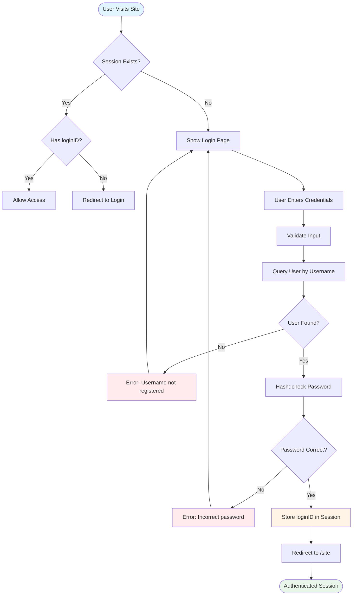

# 🔐 Authentication

The CAMR system implements a **session-based authentication** mechanism using Laravel's built-in session management. User credentials are validated against hashed passwords stored in the database, and authenticated sessions are maintained throughout the user's interaction with the system.

---

## 📋 Overview

**Controller:** `CAMRUserAuthController.php`  
**Middleware:** `CAMRAuthCheck.php`, `CAMRAlreadyLoggedIn.php`  
**Model:** `User.php`  
**Session Key:** `loginID` (stores authenticated user ID)

**Authentication Method:** Session-based (not token-based)  
**Password Hashing:** Bcrypt (Laravel's Hash facade)

---

## 🔑 Key Components

### Authentication Routes

```php path=/Users/rli/Documents/DEC/camr_robinsons-main/camr_robinsons-main/routes/web.php start=51
/*Login Page*/
Route::get('/', [CAMRUserAuthController::class,'login'])
    ->middleware('alreadyLoggedIn');
    
Route::post('login-user', [CAMRUserAuthController::class,'loginUser'])
    ->name('login-user');

/*Reset Password - Unable to Login*/
Route::get('/passwordreset', [CAMRUserAuthController::class,'passwordreset'])
    ->name('passwordreset');
    
Route::post('/reset-password', [EmailController::class, 'sendTemporaryPasswordtoEmail'])
    ->name('sendTemporaryPasswordtoEmail');

/*Logout*/
Route::get('logout', [CAMRUserAuthController::class,'logout']);
```

### Protected Routes

All application routes (except login/logout) use the `isLoggedIn` middleware:

```php path=/Users/rli/Documents/DEC/camr_robinsons-main/camr_robinsons-main/routes/web.php start=62
Route::get('/site', [CAMRSiteController::class,'site'])
    ->name('site')
    ->middleware('isLoggedIn');
```

---

## ⚙️ Login Process

### Login Controller Method

```php path=/Users/rli/Documents/DEC/camr_robinsons-main/camr_robinsons-main/app/Http/Controllers/CAMRUserAuthController.php start=26
public function loginUser(Request $request){ 
    
    $request->validate([
        'user_name'=>'required|min:1|max:50', 
        'InputPassword'=>'required|min:6|max:50'
    ]);
    
    // Find user by username
    $user = User::where('user_name', '=', $request->user_name)->first();
    
    if ($user){
        // Verify password hash
        if(Hash::check($request->InputPassword, $user->user_password)){
            // Store user ID in session
            $request->session()->put('loginID', $user->user_id);
            return redirect('site');
        }else{
            return back()->with('fail', 'Incorrect Password');
        }
    }else{
        return back()->with('fail', 'This Username is not Registered.');
    }
}
```

**Login Flow:**
1. **Validate input** - Username (1-50 chars), password (6-50 chars)
2. **Query user** - Find user by `user_name` field
3. **Verify password** - Use `Hash::check()` to compare against bcrypt hash
4. **Create session** - Store `user_id` in session as `loginID`
5. **Redirect** - Send authenticated user to `/site` dashboard
6. **Error handling** - Return validation messages for failed attempts

---

## 🔄 Authentication Flow Diagram



---

## 🛡️ Middleware Protection

### CAMRAuthCheck Middleware

Protects all authenticated routes by checking for valid session:

```php path=/Users/rli/Documents/DEC/camr_robinsons-main/camr_robinsons-main/app/Http/Middleware/CAMRAuthCheck.php start=17
public function handle(Request $request, Closure $next)
{
    if(!Session()->has('loginID'))
    {
        return redirect('/')->with('fail', "You Have to Login First");
    }
    return $next($request);
}
```

**Registered as:** `isLoggedIn` middleware

**Behavior:**
- Checks if `loginID` exists in session
- If **not present**: Redirect to login page with error message
- If **present**: Allow request to proceed

### CAMRAlreadyLoggedIn Middleware

Prevents authenticated users from accessing login page:

```php
// Middleware prevents re-login if already authenticated
// Redirects to /site if loginID session exists
```

**Registered as:** `alreadyLoggedIn` middleware

---

## 🚪 Logout Process

```php path=/Users/rli/Documents/DEC/camr_robinsons-main/camr_robinsons-main/app/Http/Controllers/CAMRUserAuthController.php start=46
public function logout(){
    if(Session::has('loginID')){
        Session::pull('loginID');
        Session::pull('site_current_tab');
        return redirect('/');
    }
}
```

**Logout Flow:**
1. Check if `loginID` session exists
2. Remove `loginID` from session using `pull()`
3. Remove `site_current_tab` session variable
4. Redirect to login page (`/`)

**Security Note:** `Session::pull()` removes the key entirely (vs. `forget()` which just unsets it)

---

## 🔒 Password Management

### Password Hashing

Passwords are stored using Laravel's `Hash` facade (Bcrypt algorithm):

```php
// During user creation/update
$user->user_password = Hash::make($plainTextPassword);

// During authentication
Hash::check($inputPassword, $user->user_password);
```

**Hash Properties:**
- **Algorithm:** Bcrypt
- **Cost Factor:** Laravel default (10 rounds)
- **Salt:** Automatically generated per password
- **Output Length:** 60 characters

### Password Reset Workflow

**Route:** `GET /passwordreset`  
**Controller:** `EmailController::sendTemporaryPasswordtoEmail`

```php path=/Users/rli/Documents/DEC/camr_robinsons-main/camr_robinsons-main/routes/web.php start=55
Route::get('/passwordreset', [CAMRUserAuthController::class,'passwordreset'])
    ->name('passwordreset');
    
Route::post('/reset-password', [EmailController::class, 'sendTemporaryPasswordtoEmail'])
    ->name('sendTemporaryPasswordtoEmail');
```

**Reset Process:**
1. User clicks "Forgot Password" link
2. Enters registered email address
3. System generates temporary password
4. Email sent with temporary credentials
5. User logs in with temporary password
6. System prompts password change on first login

---

## 👤 User Model

```php path=/Users/rli/Documents/DEC/camr_robinsons-main/camr_robinsons-main/app/Models/User.php start=11
class User extends Authenticatable
{
    protected $table = 'user_tb';
    
    protected $fillable = [
        'user_real_name',
        'user_name',
        'user_password',
    ];

    protected $hidden = [
        'user_password',
        'remember_token'
    ];
}
```

**Key Fields:**
- `user_id` - Primary key
- `user_name` - Login username (unique)
- `user_password` - Bcrypt hashed password
- `user_real_name` - Display name
- `user_role` - Role identifier (Admin, User, etc.)
- `user_email` - Email address for password resets

**Security Features:**
- Password field hidden from JSON serialization
- Extends Laravel's `Authenticatable` class
- No plain-text password storage

---

## 🔐 Session Management

### Session Storage

**Driver:** File-based (default Laravel configuration)  
**Location:** `storage/framework/sessions/`  
**Lifetime:** Configured in `.env` (`SESSION_LIFETIME`)

### Session Variables

| Variable | Purpose | Set By |
|----------|---------|--------|
| `loginID` | Authenticated user ID | CAMRUserAuthController::loginUser |
| `site_current_tab` | Active tab on site details page | CAMRSiteController::save_site_tab |

### Accessing Session Data

```php
// In controllers
if(Session::has('loginID')){
    $userID = Session::get('loginID');
    $user = User::where('user_id', '=', $userID)->first();
}
```

**Pattern Used Throughout Application:**
Most controller methods check for `loginID` and fetch user data:

```php
public function index(){
    if(Session::has('loginID')){
        $data = User::where('user_id', '=', Session::get('loginID'))->first();
        return view('dashboard', compact('data'));
    }
}
```

---

## ⚠️ Security Considerations

### Current Implementation Strengths

✅ **Password Hashing** - Bcrypt with automatic salting  
✅ **Session-Based Auth** - No token exposure in URLs  
✅ **Middleware Protection** - Consistent authentication checks  
✅ **CSRF Protection** - Laravel's `VerifyCsrfToken` middleware active  
✅ **Input Validation** - Username/password length requirements

### Potential Improvements

⚠️ **Rate Limiting**
```php
// Add throttle middleware to login route
Route::post('login-user', [CAMRUserAuthController::class,'loginUser'])
    ->middleware('throttle:5,1'); // 5 attempts per minute
```

⚠️ **Account Lockout**
```php
// Track failed login attempts
// Lock account after 5 consecutive failures
// Require admin unlock or time-based unlock
```

⚠️ **Two-Factor Authentication (2FA)**
```php
// Add OTP verification step after password validation
// Send verification code via email or SMS
```

⚠️ **Password Complexity Rules**
```php
$request->validate([
    'InputPassword' => [
        'required',
        'min:8',
        'regex:/[a-z]/',      // lowercase
        'regex:/[A-Z]/',      // uppercase
        'regex:/[0-9]/',      // number
        'regex:/[@$!%*#?&]/', // special char
    ]
]);
```

⚠️ **Session Timeout Warning**
```javascript
// Frontend JavaScript to warn users before session expires
// Ping server to keep session alive during active use
```

---

## 🛠️ Troubleshooting

### Issue: "You Have to Login First" Loop

**Cause:** Session not persisting (file permissions or cookie issues)

**Solution:**
```bash
# Check session storage permissions
chmod -R 775 storage/framework/sessions/
chown -R www-data:www-data storage/

# Clear session files
php artisan session:flush

# Verify .env configuration
SESSION_DRIVER=file
SESSION_LIFETIME=120
```

### Issue: Password Reset Not Working

**Cause:** Email configuration missing or incorrect

**Solution:**
```bash
# Check .env email settings
MAIL_MAILER=smtp
MAIL_HOST=smtp.gmail.com
MAIL_PORT=587
MAIL_USERNAME=your-email@gmail.com
MAIL_PASSWORD=your-app-password
MAIL_ENCRYPTION=tls

# Test email configuration
php artisan tinker
>>> Mail::raw('Test', function($msg) { $msg->to('test@example.com'); });
```

### Issue: Logout Not Clearing Session

**Cause:** Multiple session variables not removed

**Solution:**
```php
// Instead of pulling individual keys
Session::flush(); // Clear all session data
return redirect('/')->withCookie(Cookie::forget('laravel_session'));
```

### Issue: Cross-Site Session Sharing

**Cause:** Multiple CAMR instances sharing session storage

**Solution:**
```bash
# Use different session names per instance
# In .env
SESSION_COOKIE=camr_robinsons_session
SESSION_DOMAIN=.robinsons-mall.com
```

---

## 📊 Authentication Metrics

### Tracking Login Activity

**Recommended Implementation:**
```php
// Add to loginUser() method
activity('login')
    ->causedBy($user)
    ->withProperties([
        'ip_address' => $request->ip(),
        'user_agent' => $request->userAgent(),
        'timestamp' => now()
    ])
    ->log('User logged in');
```

### Failed Login Attempts

```php
// Track failed attempts in database
DB::table('failed_logins')->insert([
    'username' => $request->user_name,
    'ip_address' => $request->ip(),
    'attempted_at' => now()
]);
```

---

## 📖 Usage Examples

### Example 1: Standard Login

**Scenario:** User accesses CAMR system for daily operations

1. Navigate to `https://camr.robinsons-mall.com/`
2. Enter username: `john.doe`
3. Enter password: `SecurePass123!`
4. Click "Login" button
5. System validates credentials
6. Redirected to `/site` dashboard
7. Session active for 120 minutes (configurable)

### Example 2: Password Reset

**Scenario:** User forgot password

1. Click "Forgot Password?" on login page
2. Enter registered email: `john.doe@robinsons.com`
3. System generates temporary password
4. Receive email with credentials
5. Login with temporary password
6. System prompts password change
7. Set new secure password

### Example 3: Session Expiry

**Scenario:** User idle for extended period

1. User logged in and viewing reports
2. Steps away from computer (30+ minutes)
3. Attempts to navigate to another page
4. Middleware detects expired/missing session
5. Redirected to login with message: "You Have to Login First"
6. Re-authenticate to continue

---

## 🔗 Related Documentation

- **[Site Access Control](site-access-control.md)** - User permissions per site
- **[User Management](user-management.md)** - User CRUD operations
- **[Configuration](configuration.md)** - Session and security settings
- **[Database Schema](database-schema.md)** - `user_tb` table structure
- **[Models](models.md)** - User model implementation

---

## 📝 Best Practices

### For Developers

1. **Always Use Middleware**
   ```php
   // Every protected route MUST have middleware
   Route::get('/protected', [Controller::class, 'method'])
       ->middleware('isLoggedIn');
   ```

2. **Never Store Plain-Text Passwords**
   ```php
   // WRONG
   $user->password = $request->password;
   
   // RIGHT
   $user->password = Hash::make($request->password);
   ```

3. **Check Session Consistently**
   ```php
   // At start of every controller method
   if(!Session::has('loginID')){
       return redirect('/')->with('fail', 'Authentication required');
   }
   ```

### For System Administrators

1. **Monitor Failed Logins**
   - Review logs daily for suspicious activity
   - Block IPs with excessive failed attempts
   - Alert on brute-force patterns

2. **Enforce Password Policies**
   - Minimum 8 characters
   - Require complexity (upper, lower, number, special)
   - Expire passwords every 90 days
   - Prevent password reuse (last 5 passwords)

3. **Session Security**
   - Set appropriate session lifetime
   - Use HTTPS in production
   - Enable secure and httpOnly cookie flags

### For End Users

1. **Password Hygiene**
   - Use unique passwords for CAMR system
   - Never share credentials
   - Change password if suspicious activity detected

2. **Session Management**
   - Always logout when finished
   - Don't leave browser unattended while logged in
   - Close browser window after logout

---

**Last Updated:** 2024-03-15  
**Document Version:** 1.0  
**Maintainer:** CAMR Development Team
