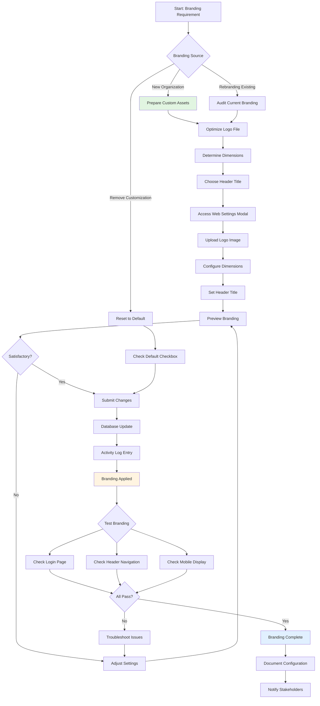

# Custom Branding

The **Custom Branding** feature enables complete visual customization of the CAMR Robinsons application to match organizational branding requirements. This comprehensive guide covers all branding elements, including navigation headers, logos, login pages, and overall theme customization.

---

## 📋 Overview

**Primary Interface:** Web Page Settings Modal (via `CAMRWebpageController.php`)  
**Configuration Table:** `web_page_settings`  
**Branding Components:** Header title, logo images, dimensions, login page styling  
**Customization Scope:** Application-wide (all authenticated and public pages)

### Purpose

Custom Branding in CAMR allows organizations to:

- Replace default DEC branding with custom corporate identity
- Maintain consistent visual identity across all application pages
- Configure separate logo displays for header navigation and login page
- Adjust dimensions dynamically without code changes
- Restore default branding with one-click reset

### Key Customization Areas

1. **Navigation Header** - Top bar across all authenticated pages
2. **Login Page** - Initial authentication screen
3. **Header Title Text** - Application name displayed in navigation
4. **Logo Images** - Company/brand logo in multiple locations
5. **Logo Dimensions** - Size controls for header and login page

---

## 🎨 Branding Components

### 1. Navigation Header Branding

The navigation header appears on **all authenticated pages** after login.

#### Components

- **Header Title:** Displays organization/application name
- **Logo Image:** Brand logo (left side of header)
- **Logo Width:** Adjustable size (1-100 range)

#### Location in Code

```php
// File: resources/views/layouts/navigation.blade.php
<aside id="sidebar" class="sidebar">
  <ul class="sidebar-nav" id="sidebar-nav">
    <li class="nav-item">
      <a class="navbar-brand d-flex align-items-center justify-content-center">
        image_logo }}" 
             width="{{ $WebPageSettings->header_navigation_width }}%" 
             alt="Logo">
        <span class="d-none d-lg-block">{{ $WebPageSettings->navigation_header_title }}</span>
      </a>
    </li>
  </ul>
</aside>
```

#### How Logo is Displayed

```php
// Controller fetches settings
$WebPageSettings = WebPageSettingsModel::first();

// Blade template renders base64 image
image_logo }}" 
     width="{{ $WebPageSettings->header_navigation_width }}%" />
```

### 2. Login Page Branding

The login page is the **first visual touchpoint** for all users.

#### Components

- **Logo Image:** Same logo as header (different dimensions)
- **Logo Width:** Separate size control (1-200 range)
- **Page Title:** Derived from `navigation_header_title`

#### Location in Code

```php
// File: resources/views/auth/login.blade.php
<div class="card mb-3">
  <div class="card-body">
    <div class="pt-4 pb-2">
      <div class="img-holder_login" align="center">
        image_logo }}" 
             width="{{ $WebPageSettings->login_page_logo_width }}%" 
             alt="Logo">
      </div>
      <h5 class="card-title text-center pb-0 fs-4">
        {{ $WebPageSettings->navigation_header_title }}
      </h5>
    </div>
  </div>
</div>
```

### 3. Header Title Customization

The header title serves as the application identifier across all pages.

#### Configuration

- **Field:** `navigation_header_title`
- **Max Length:** 255 characters
- **Default:** "Centralized Automated Meter Reading"
- **Recommended Length:** 30-50 characters for optimal display

#### Display Locations

1. **Sidebar Navigation** (desktop/tablet view)
2. **Login Page** (as page title)
3. **Browser Title Bar** (via layout template)

```php
// Example: Customizing for Robinsons
$WebPageSettings->navigation_header_title = "Robinsons CAMR System";
```

### 4. Logo Image Management

Logos are stored as **base64-encoded LONGBLOB** in the database.

#### Technical Specifications

- **Database Field:** `image_logo` (LONGBLOB)
- **Storage Format:** Base64-encoded string
- **Max Size:** ~16MB (LONGBLOB limit)
- **Validation Max:** 10MB (application-enforced)
- **Accepted Formats:** JPG, JPEG, PNG

#### Upload Process

```php
// File: app/Http/Controllers/CAMRWebpageController.php
if ($request->hasFile('image_logo')) {
    // Validate file
    $request->validate([
        'image_logo' => 'image|mimes:jpg,png,jpeg|max:10048',
    ]);
    
    // Read file contents
    $path = $request->file('image_logo')->getRealPath();
    $logo = file_get_contents($path);
    
    // Convert to base64
    $image_blob = base64_encode($logo);
    
    // Store in database
    $WebPageSettings = WebPageSettingsModel::first();
    $WebPageSettings->image_logo = $image_blob;
    $WebPageSettings->update();
}
```

#### Advantages of Base64 Storage

- **No File System Dependencies:** Logo travels with database backups
- **Simplified Deployment:** No need to sync logo files across servers
- **Version Control:** Logo changes tracked via activity log
- **Single Source of Truth:** One database field controls all logo displays

### 5. Logo Dimension Controls

#### Header Navigation Width

- **Field:** `header_navigation_width`
- **Type:** Double (numeric)
- **Range:** 1-100
- **Unit:** Percentage (relative to container width)
- **Default:** 70
- **Affects:** Sidebar logo size on all authenticated pages

```php
// Small logo for compact header
$WebPageSettings->header_navigation_width = 50;

// Large logo for prominent branding
$WebPageSettings->header_navigation_width = 90;
```

#### Login Page Logo Width

- **Field:** `login_page_logo_width`
- **Type:** Double (numeric)
- **Range:** 1-200
- **Unit:** Percentage (relative to card width)
- **Default:** 100
- **Affects:** Logo size on login/authentication page

```php
// Subtle login logo
$WebPageSettings->login_page_logo_width = 80;

// Prominent login branding
$WebPageSettings->login_page_logo_width = 150;
```

---

## 🔧 Implementation Guide

### Accessing Branding Settings

**For Admin Users:**

1. Log into CAMR system
2. Click user profile icon (top-right corner)
3. Select "Header Title and Logo Settings" from dropdown
4. Modal opens with branding configuration form

### Applying Custom Branding

#### Step 1: Prepare Logo Assets

```bash
# Recommended logo specifications
Dimensions: 300x300 to 500x500 pixels
Format: PNG (with transparency) or JPG
File Size: Under 500KB (optimized)

# Optimization example (using ImageMagick)
convert original_logo.png -resize 400x400 -quality 90 optimized_logo.png
```

#### Step 2: Configure Settings

**Via Web Interface:**

1. Uncheck "Default" checkbox (enables custom settings)
2. Enter custom **Header Title** (e.g., "Robinsons CAMR")
3. Set **Header Logo Width** (e.g., 75)
4. Set **Login Logo Width** (e.g., 120)
5. Click "Upload" and select logo file
6. Preview logo in both preview cards
7. Click "Submit" to save

**Via Database (Direct):**

```sql
-- Update branding settings directly
UPDATE web_page_settings SET
  default_web_settings = 0,
  navigation_header_title = 'Robinsons CAMR System',
  header_navigation_width = 75,
  login_page_logo_width = 120,
  image_logo = '<base64_encoded_image_string>',
  updated_at = NOW();
```

#### Step 3: Verify Branding Application

**Checklist:**

- [ ] Log out and check login page logo/title
- [ ] Log in and verify header navigation branding
- [ ] Test on desktop browser (Chrome, Firefox, Safari)
- [ ] Test on mobile/tablet devices
- [ ] Check browser title bar text
- [ ] Verify logo proportions and clarity

### Restoring Default Branding

**Quick Reset:**

1. Open "Header Title and Logo Settings" modal
2. Check the "Default" checkbox
3. Click "Submit"
4. System applies DEC default branding automatically

**Manual Restore (Database):**

```sql
UPDATE web_page_settings SET
  default_web_settings = 1,
  navigation_header_title = 'Centralized Automated Meter Reading',
  header_navigation_width = 70,
  login_page_logo_width = 100,
  image_logo = '<default_DEC_base64_logo>';
```

---

## 📊 Branding Workflow



---

## 🎯 Real-World Branding Examples

### Example 1: Robinsons Land Corporation

**Objective:** Apply Robinsons corporate branding to CAMR system

**Configuration:**

```php
Header Title: "Robinsons CAMR System"
Header Logo Width: 80
Login Logo Width: 125
Logo File: robinsons_logo.png (400x400px, 220KB)
Color Scheme: Corporate blue/white (CSS customization separate)
```

**Result:**

- Professional Robinsons branding across all pages
- Consistent with other Robinsons IT systems
- Clear identification for mall staff users

### Example 2: Property Management Firm

**Objective:** Multi-tenant branding for property management company

**Configuration:**

```php
Header Title: "PropMgmt Energy Monitoring"
Header Logo Width: 65
Login Logo Width: 100
Logo File: propmgmt_logo.png (350x350px, 180KB)
```

**Result:**

- Neutral branding suitable for multiple client properties
- Professional appearance for B2B usage
- Smaller logo allows more header space

### Example 3: Utility Company Deployment

**Objective:** Utility company using CAMR for retail client monitoring

**Configuration:**

```php
Header Title: "SmartGrid Retail Portal"
Header Logo Width: 90
Login Logo Width: 150
Logo File: utility_logo.png (500x500px, 320KB)
```

**Result:**

- Prominent utility branding for customer confidence
- Large login logo reinforces brand trust
- Clear differentiation from other utility portals

---

## 🚨 Common Branding Issues

### Issue 1: Logo Appears Pixelated or Blurry

**Symptoms:**

- Logo looks sharp in original file but blurry in application
- Pixelation visible when viewed at normal distance

**Possible Causes:**

- Original logo resolution too low
- Excessive upscaling via dimension settings
- Image compression during base64 conversion

**Solutions:**

```bash
# Use higher resolution source image
Minimum: 300x300 pixels
Recommended: 400x400 to 600x600 pixels

# Verify image quality before upload
identify -verbose logo.png | grep -i quality

# Re-export from vector source if available
inkscape -w 500 -h 500 logo.svg -o logo.png
```

- Upload higher resolution logo (keep under 500KB)
- Reduce dimension percentages if upscaling occurs
- Use PNG format for better quality retention

### Issue 2: Logo File Upload Fails

**Symptoms:**

- Error message: "The image logo must be an image"
- Upload button doesn't respond
- File selection dialog doesn't open

**Possible Causes:**

- File exceeds 10MB limit
- Invalid MIME type
- Browser/JavaScript error

**Solutions:**

```php
// Verify validation rules
$request->validate([
    'image_logo' => 'image|mimes:jpg,png,jpeg|max:10048',
]);

// Check file size programmatically
$fileSize = $request->file('image_logo')->getSize() / 1024; // KB
if ($fileSize > 10240) {
    return response()->json(['error' => 'File too large']);
}
```

- Compress/optimize image before upload
- Verify file is true image format (not renamed file)
- Check browser console for JavaScript errors
- Try different browser

### Issue 3: Branding Not Applying Consistently

**Symptoms:**

- Logo appears on some pages but not others
- Header title shows on login but not after authentication
- Old branding persists after update

**Possible Causes:**

- Browser caching old assets
- Incomplete session refresh
- Multiple web_page_settings rows (should only be one)

**Solutions:**

```php
// Verify single configuration row
$settingsCount = WebPageSettingsModel::count();
if ($settingsCount > 1) {
    // Delete duplicates, keep most recent
    WebPageSettingsModel::orderBy('updated_at', 'desc')
        ->skip(1)
        ->take(PHP_INT_MAX)
        ->delete();
}
```

- Clear browser cache (Ctrl+F5 or Cmd+Shift+R)
- Log out and log back in
- Verify single row in `web_page_settings` table
- Check `WebPageSettingsModel::first()` returns expected data

### Issue 4: Logo Dimensions Not Optimal

**Symptoms:**

- Logo too large, overlapping navigation elements
- Logo too small, hard to see or unprofessional appearance
- Different sizing needed for desktop vs. mobile

**Possible Causes:**

- Incorrect dimension percentage chosen
- Logo aspect ratio not considered
- Responsive design not tested

**Solutions:**

```css
/* Custom CSS adjustments (if needed) */
@media (max-width: 768px) {
  .sidebar .navbar-brand img {
    max-width: 50% !important;
  }
}

@media (min-width: 1920px) {
  .sidebar .navbar-brand img {
    max-width: 60% !important;
  }
}
```

**Recommended Dimension Ranges:**

- **Desktop Header:** 60-80
- **Mobile Header:** 40-60
- **Login Page (Desktop):** 100-140
- **Login Page (Mobile):** 80-120

### Issue 5: Base64 Logo Not Rendering

**Symptoms:**

- Broken image icon displayed
- Logo space empty
- Browser console shows image load error

**Possible Causes:**

- Incomplete base64 string in database
- Missing `data:image/png;base64,` prefix in Blade template
- Database character encoding issue

**Solutions:**

```php
// Verify base64 string integrity
$logo_data = WebPageSettingsModel::first()->image_logo;
$is_valid_base64 = base64_decode($logo_data, true) !== false;

if (!$is_valid_base64) {
    // Re-encode logo
    $image_path = storage_path('app/public/backup_logo.png');
    $logo = file_get_contents($image_path);
    $image_blob = base64_encode($logo);
    
    $WebPageSettings = WebPageSettingsModel::first();
    $WebPageSettings->image_logo = $image_blob;
    $WebPageSettings->update();
}
```

```blade
{{-- Ensure correct Blade syntax --}}
image_logo }}" />

{{-- NOT (missing data URI prefix) --}}
image_logo }}" />
```

---

## ✅ Branding Best Practices

### 1. Logo Design Specifications

**Optimal Logo Characteristics:**

- **Format:** PNG with transparency for non-rectangular logos
- **Dimensions:** Square or near-square (400x400 to 600x600 pixels)
- **File Size:** 200-500KB (compressed without quality loss)
- **Color Mode:** RGB (not CMYK)
- **DPI:** 72-96 DPI (web standard)

```bash
# Convert CMYK to RGB
convert logo_cmyk.png -colorspace RGB logo_rgb.png

# Optimize PNG
pngquant logo.png --output optimized_logo.png --quality 80-95
```

### 2. Consistent Brand Application

**Branding Consistency Checklist:**

- [ ] Logo matches official brand guidelines
- [ ] Title uses official organization name
- [ ] Colors align with brand palette (if CSS customized)
- [ ] Typography consistent with corporate standards
- [ ] Favicon updated to match logo (separate process)

### 3. Multi-Environment Branding

**Recommendation:** Differentiate environments visually

```php
// Example: Environment-specific titles
if (env('APP_ENV') === 'production') {
    $title = "Robinsons CAMR System";
} elseif (env('APP_ENV') === 'staging') {
    $title = "[STAGING] Robinsons CAMR";
} else {
    $title = "[DEV] Robinsons CAMR";
}
```

### 4. Branding Documentation

**Maintain Branding Records:**

```markdown
# CAMR Branding Configuration Log

## Current Configuration (as of 2024-11-15)

- **Header Title:** Robinsons CAMR System
- **Header Logo Width:** 80
- **Login Logo Width:** 125
- **Logo File:** robinsons_logo_2024.png
- **Logo Size:** 220KB
- **Logo Dimensions:** 400x400px
- **Upload Date:** 2024-11-15
- **Uploaded By:** admin@robinsons.com
- **Reason:** Corporate rebranding Q4 2024

## Previous Configurations

### Configuration 1 (2024-01-10)
- Title: "Robinsons Energy Monitoring"
- Logo: robinsons_logo_old.png
- Change Reason: Initial deployment
```

### 5. Backup and Recovery

**Branding Backup Strategy:**

```bash
# Export web_page_settings
mysqldump -u root -p meter_reading_robinsons web_page_settings > branding_backup_$(date +%Y%m%d).sql

# Extract logo as image file
mysql -u root -p -e "SELECT image_logo FROM meter_reading_robinsons.web_page_settings" \
  | tail -n 1 | base64 -d > logo_backup_$(date +%Y%m%d).png
```

**Keep Backups Of:**

- Original logo source files (PSD, AI, SVG)
- Database export with current branding
- Extracted logo PNG/JPG file
- Branding configuration documentation

### 6. Testing Across Devices

**Cross-Device Testing Checklist:**

| Device Type | Screen Size | Logo Clarity | Title Readable | Dimensions OK |
|-------------|-------------|--------------|----------------|--------------|
| Desktop (1920x1080) | Large | ✅ | ✅ | ✅ |
| Laptop (1366x768) | Medium | ✅ | ✅ | ✅ |
| Tablet (iPad) | Medium | ✅ | ✅ | ✅ |
| Mobile (iPhone) | Small | ✅ | ✅ | Adjust |
| Mobile (Android) | Small | ✅ | ✅ | Adjust |

---

## 📋 Branding Change Workflow

### Pre-Change Phase

1. **Stakeholder Approval:** Get sign-off on new branding
2. **Asset Preparation:** Optimize logo files
3. **Backup Current Config:** Export existing branding
4. **Schedule Change:** Choose low-traffic time window
5. **Notify Users:** Communicate upcoming visual changes

### Change Implementation

1. **Access Settings:** Admin login → Web Settings modal
2. **Upload Assets:** Upload new logo file
3. **Configure Dimensions:** Adjust header/login widths
4. **Set Title:** Update header title text
5. **Preview:** Verify in preview cards
6. **Submit:** Apply changes

### Post-Change Verification

1. **Visual Inspection:** Check login page and header
2. **Cross-Browser Test:** Test Chrome, Firefox, Safari, Edge
3. **Mobile Test:** Verify on iOS and Android devices
4. **User Feedback:** Monitor for reported issues
5. **Documentation:** Update branding configuration log

---

## 🔗 Related Documentation

- [Web Page Settings](web-settings.md) - Technical implementation details
- [Configuration Files](configuration/config-files.md) - System configuration management
- [User Management](user-management.md) - Admin access requirements
- [Architecture](architecture.md) - Application structure and Blade templates

---

## 📝 Summary

**Custom Branding** in CAMR Robinsons provides organizations with comprehensive control over the application's visual identity. The branding system uses base64-encoded logo storage in a centralized database table, enabling consistent brand application across all pages without file system dependencies.

Key features include:

- **Header Title Customization** - Custom application names up to 255 characters
- **Logo Upload & Storage** - Base64-encoded LONGBLOB supporting JPG/PNG up to 10MB
- **Flexible Dimensions** - Separate controls for header (1-100) and login (1-200) sizing
- **Real-Time Preview** - Instant visual feedback before applying changes
- **One-Click Reset** - Restore default DEC branding instantly
- **Activity Logging** - Full audit trail of all branding changes

The branding system follows Laravel best practices with model-based storage, form validation, and activity logging for compliance and audit requirements. Organizations can maintain professional, consistent branding that aligns with corporate identity standards while using the CAMR platform for meter reading operations.
