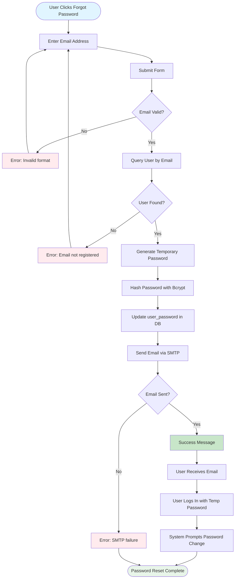

# 📧 Email Configuration

The CAMR system uses Laravel's **Mail** facade to send email notifications, primarily for password reset functionality. The system supports SMTP, Mailgun, Postmark, Amazon SES, and sendmail drivers.

---

## 📋 Overview

**Controller:** `EmailController.php`  
**Mailable:** `ResetPassword.php` (app/Mail/)  
**Configuration:** `.env` file + `config/mail.php`  
**Primary Use Case:** Password reset emails

**Default Driver:** SMTP (Gmail)

---

## 🔑 SMTP Configuration

### Environment Variables

```bash path=/Users/rli/Documents/DEC/camr_robinsons-main/camr_robinsons-main/.env start=27
MAIL_MAILER=smtp
MAIL_HOST=smtp.gmail.com
MAIL_PORT=587
MAIL_USERNAME=
MAIL_PASSWORD=
MAIL_ENCRYPTION=tls
MAIL_FROM_ADDRESS=
MAIL_FROM_NAME="Centralized Automated Meter Reading"
```

| Variable | Description | Example | Required |
|----------|-------------|---------|----------|
| `MAIL_MAILER` | Mail driver | smtp, mailgun, ses | Yes |
| `MAIL_HOST` | SMTP server | smtp.gmail.com | Yes |
| `MAIL_PORT` | SMTP port | 587 (TLS), 465 (SSL) | Yes |
| `MAIL_USERNAME` | SMTP username | your-email@gmail.com | Yes |
| `MAIL_PASSWORD` | SMTP password | App-specific password | Yes |
| `MAIL_ENCRYPTION` | Encryption type | tls, ssl | Yes |
| `MAIL_FROM_ADDRESS` | From email | noreply@company.com | Yes |
| `MAIL_FROM_NAME` | From name | Centralized Automated Meter Reading | Yes |

---

## ⚙️ Provider-Specific Setup

### Gmail Configuration

**Requirements:**
1. Gmail account
2. **App Password** (if 2FA enabled)
3. "Less secure app access" enabled (if not using app password)

**Setup Steps:**

1. **Enable 2-Step Verification** (Recommended)
   - Go to Google Account settings
   - Security → 2-Step Verification → Enable

2. **Generate App Password**
   - Security → App passwords
   - Select app: Mail
   - Select device: Other (Laravel CAMR)
   - Copy generated 16-character password

3. **Configure .env**
   ```bash
   MAIL_MAILER=smtp
   MAIL_HOST=smtp.gmail.com
   MAIL_PORT=587
   MAIL_USERNAME=your-email@gmail.com
   MAIL_PASSWORD=abcd efgh ijkl mnop  # App password
   MAIL_ENCRYPTION=tls
   MAIL_FROM_ADDRESS=your-email@gmail.com
   MAIL_FROM_NAME="CAMR System"
   ```

**Port Options:**
- **587** - TLS/STARTTLS (Recommended)
- **465** - SSL (Alternative)

### Microsoft 365 / Outlook

```bash
MAIL_MAILER=smtp
MAIL_HOST=smtp.office365.com
MAIL_PORT=587
MAIL_USERNAME=your-email@yourdomain.com
MAIL_PASSWORD=your-password
MAIL_ENCRYPTION=tls
MAIL_FROM_ADDRESS=your-email@yourdomain.com
MAIL_FROM_NAME="CAMR System"
```

### Custom SMTP Server

```bash
MAIL_MAILER=smtp
MAIL_HOST=mail.yourdomain.com
MAIL_PORT=587
MAIL_USERNAME=camr@yourdomain.com
MAIL_PASSWORD=secure_password
MAIL_ENCRYPTION=tls
MAIL_FROM_ADDRESS=noreply@yourdomain.com
MAIL_FROM_NAME="CAMR - Robinson's"
```

### Development (Log Driver)

For local development, log emails instead of sending:

```bash
MAIL_MAILER=log
```

Emails will be written to `storage/logs/laravel.log`

---

## 📝 Email Implementation

### EmailController

```php path=/Users/rli/Documents/DEC/camr_robinsons-main/camr_robinsons-main/app/Http/Controllers/EmailController.php start=25
public function sendTemporaryPasswordtoEmail(Request $request)
{
    $request->validate(
        ['user_email_address' => 'required',], 
        ['user_email_address.required' => 'Email Address is Required']
    );
    
    // Find user by email
    $user = User::where('user_email_address', '=', $request->user_email_address)->first();
    
    if ($user){
        if($request->user_email_address == $user->user_email_address){
            
            $title = 'Centralized Automated Meter Reading: Password Reset';
            $body = 'Your password has been changed successfully. Please use below password to log in.';
            $user_id = $user->user_id;
            $name = $user->user_real_name;
            $user_name = $user->user_name;
            $user_password = '';  // Temporary password generated here

            Mail::to($user->user_email_address)
                ->send(new ResetPassword($title, $body, $name, $user_id, $user_name, $user_password));

            return response()->json(['success'=>'Email sent successfully!']);
        }else{
            return response()->json(['success'=>'Incorrect Email!']);
        }
    }else{
        return response()->json(['success'=>'Email Not Found!']);
    }
}
```

**Process:**
1. Validate email address input
2. Query user by email
3. Generate temporary password (implementation detail not shown)
4. Send email using `ResetPassword` mailable
5. Return success/error response

### ResetPassword Mailable

**File:** `app/Mail/ResetPassword.php`

```php
use Illuminate\Mail\Mailable;

class ResetPassword extends Mailable
{
    public $title;
    public $body;
    public $name;
    public $user_id;
    public $user_name;
    public $user_password;

    public function __construct($title, $body, $name, $user_id, $user_name, $user_password)
    {
        $this->title = $title;
        $this->body = $body;
        $this->name = $name;
        $this->user_id = $user_id;
        $this->user_name = $user_name;
        $this->user_password = $user_password;
    }

    public function build()
    {
        return $this->subject($this->title)
                    ->view('emails.reset-password');
    }
}
```

**Email Template:** `resources/views/emails/reset-password.blade.php`

---

## 💬 Email Content

### Password Reset Email

**Subject:** Centralized Automated Meter Reading: Password Reset

**Body:**
```
Dear {{ $name }},

Your password has been changed successfully. Please use the credentials below to log in:

Username: {{ $user_name }}
Temporary Password: {{ $user_password }}

For security reasons, please change your password after logging in.

Login URL: {{ config('app.url') }}

Best regards,
CAMR System Administration
```

---

## 🔄 Password Reset Workflow



---

## 🧪 Testing Email Configuration

### Test via Tinker

```bash
php artisan tinker
```

```php
// Send test email
Mail::raw('This is a test email from CAMR', function($message) {
    $message->to('recipient@example.com')
            ->subject('CAMR Test Email');
});

// Check for errors
// If no exception thrown, email sent successfully
```

### Test via Route

Create temporary test route:

```php
// routes/web.php
Route::get('/test-email', function() {
    Mail::to('test@example.com')->send(new \App\Mail\ResetPassword(
        'Test Email',
        'This is a test.',
        'Test User',
        1,
        'testuser',
        'TempPass123'
    ));
    return 'Email sent!';
});
```

Navigate to: `http://your-domain.com/test-email`

### Check Logs

If using `log` driver:

```bash
tail -f storage/logs/laravel.log
```

Look for email content in logs.

---

## 🛠️ Troubleshooting

### Issue: "Failed to authenticate on SMTP server"

**Error:** `Swift_TransportException: Failed to authenticate`

**Causes:**
- Incorrect username/password
- 2FA enabled without app password
- "Less secure apps" disabled

**Solution:**
```bash
# Gmail: Generate app password
# Or enable less secure apps (not recommended)

# Verify credentials
MAIL_USERNAME=correct-email@gmail.com
MAIL_PASSWORD=correct-app-password

# Test connection
telnet smtp.gmail.com 587
```

### Issue: "Connection refused"

**Error:** `Connection refused [smtp.gmail.com #587]`

**Causes:**
- Firewall blocking port 587/465
- Incorrect host/port
- Network restrictions

**Solution:**
```bash
# Test SMTP connectivity
telnet smtp.gmail.com 587

# If fails, check firewall
sudo ufw allow out 587/tcp

# Try alternative port (SSL)
MAIL_PORT=465
MAIL_ENCRYPTION=ssl
```

### Issue: "Could not instantiate mail function"

**Error:** `Could not instantiate mail function`

**Cause:** PHP mail() function not configured (when using `mail` driver)

**Solution:**
```bash
# Switch to SMTP driver
MAIL_MAILER=smtp

# Or configure sendmail
apt-get install sendmail
```

### Issue: Emails Go to Spam

**Causes:**
- No SPF/DKIM records
- Sending from generic domain
- High spam score

**Solution:**
1. **Add SPF Record:**
   ```dns
   TXT  @  "v=spf1 include:_spf.google.com ~all"
   ```

2. **Add DKIM Record:**
   - Configure in Gmail/provider settings
   - Add TXT record to DNS

3. **Use Company Domain:**
   ```bash
   MAIL_FROM_ADDRESS=noreply@robinsons-mall.com
   ```

4. **Verify Sender Reputation:**
   - Use services like MXToolbox
   - Check if IP is blacklisted

### Issue: Email Not Sending (No Error)

**Cause:** Queue driver misconfigured

**Solution:**
```bash
# Check queue configuration
QUEUE_CONNECTION=sync  # Use sync for immediate send

# If using queues, process them
php artisan queue:work
```

---

## 📊 Email Logging & Monitoring

### Log All Emails

Add to `App\Providers\AppServiceProvider::boot()`:

```php
use Illuminate\Support\Facades\Mail;
use Illuminate\Mail\Events\MessageSent;

public function boot()
{
    Event::listen(MessageSent::class, function ($event) {
        \Log::info('Email sent', [
            'to' => $event->message->getTo(),
            'subject' => $event->message->getSubject(),
            'timestamp' => now()
        ]);
    });
}
```

### Track Failed Emails

```php
use Illuminate\Mail\Events\MessageSending;

Mail::failures(function($failures) {
    \Log::error('Email failed', ['failures' => $failures]);
});
```

---

## 🔒 Security Best Practices

### 1. Use App Passwords

❌ **Don't:**
```bash
MAIL_PASSWORD=my_gmail_password
```

✅ **Do:**
```bash
MAIL_PASSWORD=abcd efgh ijkl mnop  # App-specific password
```

### 2. Secure Credentials

```bash
# Restrict .env file permissions
chmod 600 .env

# Never commit .env to git
echo ".env" >> .gitignore
```

### 3. Use TLS Encryption

```bash
MAIL_ENCRYPTION=tls  # Encrypt connection
MAIL_PORT=587        # TLS port
```

### 4. Rate Limiting

Prevent email abuse:

```php
// In routes/web.php
Route::post('/reset-password', [EmailController::class, 'sendTemporaryPasswordtoEmail'])
    ->middleware('throttle:3,60'); // 3 attempts per hour
```

### 5. Validate Email Format

```php
$request->validate([
    'user_email_address' => 'required|email:rfc,dns'
]);
```

---

## 📝 Production Configuration

### Recommended Settings

```bash
# Use company SMTP server
MAIL_MAILER=smtp
MAIL_HOST=smtp.company.com
MAIL_PORT=587
MAIL_USERNAME=camr@company.com
MAIL_PASSWORD=${MAIL_PASSWORD}  # From secrets manager
MAIL_ENCRYPTION=tls
MAIL_FROM_ADDRESS=noreply@company.com
MAIL_FROM_NAME="CAMR - Robinson's Malls"

# Queue emails for better performance
QUEUE_CONNECTION=database
```

### Email Queue Setup

```bash
# Create jobs table
php artisan queue:table
php artisan migrate

# Process queue
php artisan queue:work --tries=3
```

### Supervisor Configuration

```ini
; /etc/supervisor/conf.d/camr-queue.conf
[program:camr-queue-worker]
process_name=%(program_name)s_%(process_num)02d
command=php /var/www/camr/artisan queue:work --sleep=3 --tries=3
autostart=true
autorestart=true
user=www-data
numprocs=2
redirect_stderr=true
stdout_logfile=/var/www/camr/storage/logs/queue-worker.log
```

---

## 📖 Usage Examples

### Example 1: User Forgot Password

1. User navigates to `/passwordreset`
2. Enters email: `john.doe@robinsons.com`
3. System generates temporary password: `Temp2024!xY`
4. Email sent with subject: "Centralized Automated Meter Reading: Password Reset"
5. User receives email within 1-2 minutes
6. User logs in with temporary password
7. System prompts: "Please change your password"

### Example 2: Email Not Received

**Troubleshooting steps:**
1. Check spam/junk folder
2. Verify email address is correct
3. Check Laravel logs: `tail -f storage/logs/laravel.log`
4. Test SMTP connection: `telnet smtp.gmail.com 587`
5. Verify credentials in `.env`
6. Send test email via Tinker

---

## 🔗 Related Documentation

- **[Environment Setup](environment.md)** - Mail configuration variables
- **[Authentication](../authentication.md)** - Password reset workflow
- **[User Management](../user-management.md)** - User email addresses
- **[Configuration](../configuration.md)** - Application configuration

---

**Last Updated:** 2024-03-15  
**Document Version:** 1.0  
**Maintainer:** CAMR Development Team
