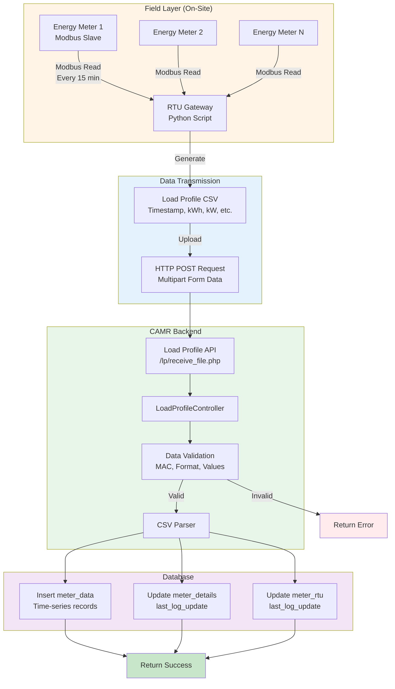
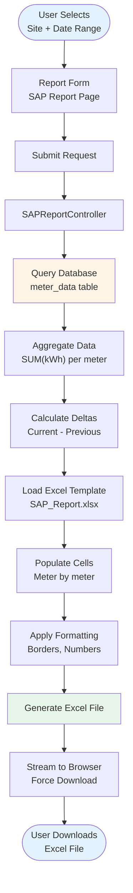
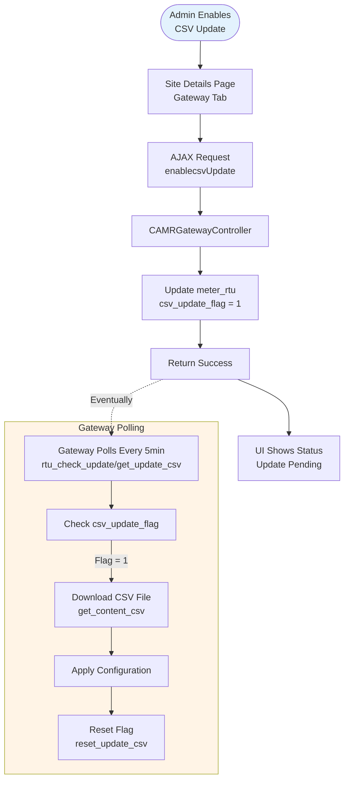
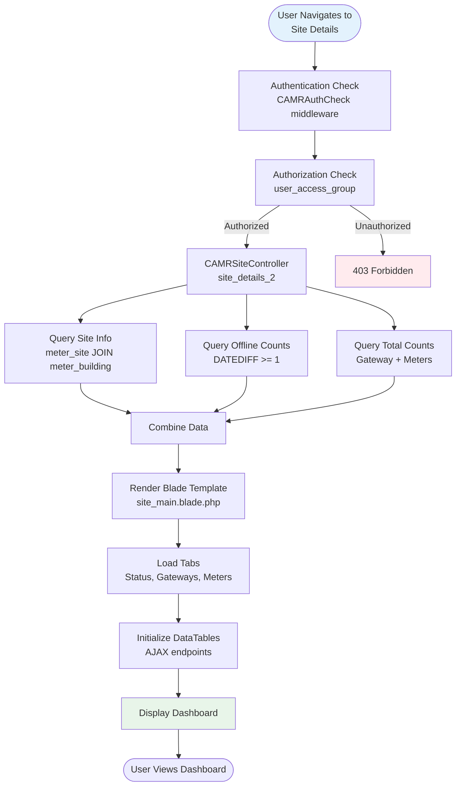
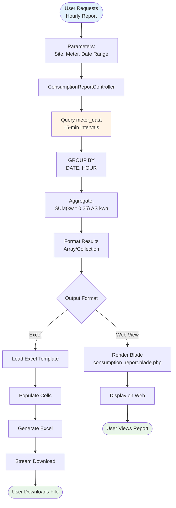
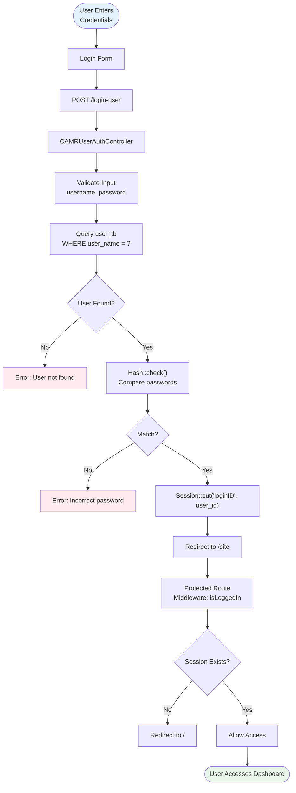
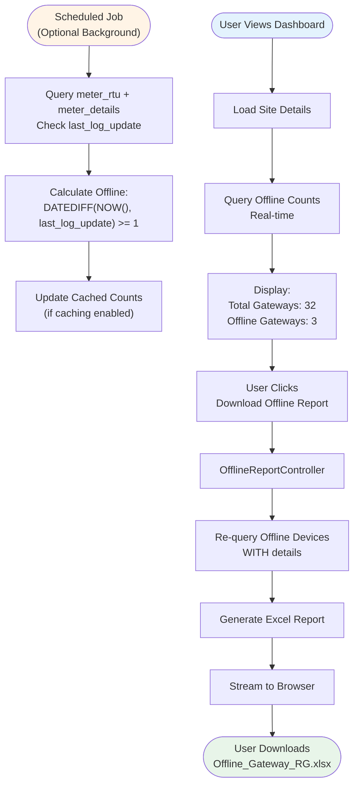

# 🔄 Data Flow

This document illustrates how data flows through the CAMR system, from meter readings in the field to reports generated by users. Understanding data flow is critical for troubleshooting, optimization, and system maintenance.

---

## 📋 Overview

The CAMR system processes data through multiple stages:

1. **Collection** - Meters generate readings
2. **Transmission** - Gateways collect and upload data
3. **Storage** - Backend stores data in database
4. **Processing** - System aggregates and calculates metrics
5. **Presentation** - Users access data via reports and dashboards

---

## ⚡ Primary Data Flow: Meter Reading to Database

### Complete Flow Diagram



### Detailed Step-by-Step

#### Step 1: Meter Polling (Gateway)

**Frequency:** Every 15 minutes  
**Protocol:** Modbus RTU/TCP  
**Location:** Field (gateway device)

```python
# Gateway Python script (simplified)
import pymodbus
import time

while True:
    for meter in meters:
        # Read Modbus registers based on config file
        config = get_config_file(meter.config_id)
        
        for register in config.registers:
            value = modbus_client.read_holding_registers(
                register.address, 
                register.count, 
                unit=meter.modbus_address
            )
            
            parsed_value = parse_value(value, register.data_type) * register.multiplier
            readings[register.name] = parsed_value
        
        # Store readings for CSV generation
        store_reading(meter.id, readings)
    
    time.sleep(900)  # 15 minutes
```

**Data Read:**
- Voltage (L1, L2, L3)
- Current (L1, L2, L3)
- Active Power (kW)
- Reactive Power (kVAr)
- Power Factor
- Active Energy Import (kWh) ✅ Primary metric
- Frequency

#### Step 2: CSV Generation (Gateway)

**Format:** Load Profile CSV  
**Location:** Gateway device

**CSV Structure:**
```csv
Timestamp,Meter_ID,Gateway_MAC,kWh_Import,kWh_Export,kW,kVAr,PF,Voltage_Avg,Current_Avg
2024-03-15 08:00:00,MTR-001,00:11:22:33:44:55,12345.678,0.000,150.5,45.2,0.95,230.5,350.2
2024-03-15 08:15:00,MTR-001,00:11:22:33:44:55,12350.123,0.000,148.3,43.8,0.96,230.2,348.9
```

**File Naming:** `LoadProfile_{MAC}_{YYYYMMDD_HHMMSS}.csv`

#### Step 3: HTTP Upload (Gateway → CAMR)

**Endpoint:** `POST /lp/receive_file.php`  
**Method:** HTTP POST (multipart/form-data)  
**Frequency:** Every 15 minutes (after polling)

**Request:**
```http
POST /lp/receive_file.php HTTP/1.1
Host: camr.robinsons-mall.com
Content-Type: multipart/form-data; boundary=----WebKitFormBoundary

------WebKitFormBoundary
Content-Disposition: form-data; name="file"; filename="LoadProfile_001122334455_20240315_080000.csv"
Content-Type: text/csv

[CSV content]
------WebKitFormBoundary--
```

#### Step 4: Data Validation (Backend)

**Controller:** `LoadProfileController.php`  
**Location:** `app/Http/Controllers/LoadProfileController.php`

**Validation Checks:**
```php
public function LoadProfile(Request $request)
{
    // 1. Validate file upload
    if (!$request->hasFile('file')) {
        return response()->json(['error' => 'No file uploaded'], 400);
    }
    
    // 2. Extract gateway MAC from filename
    $filename = $request->file('file')->getClientOriginalName();
    $mac = extract_mac_from_filename($filename);
    
    // 3. Verify gateway exists
    $gateway = GatewayModel::where('gateway_mac', $mac)->first();
    if (!$gateway) {
        return response()->json(['error' => 'Gateway not found'], 404);
    }
    
    // 4. Parse CSV
    $csv = $request->file('file');
    $data = parse_csv($csv);
    
    // 5. Validate data format
    foreach ($data as $row) {
        if (!validate_row($row)) {
            return response()->json(['error' => 'Invalid data format'], 400);
        }
    }
    
    // Proceed to storage...
}
```

#### Step 5: Data Storage (Backend)

**Tables Updated:**
1. `meter_data` - Time-series readings
2. `meter_details.last_log_update` - Last data timestamp
3. `meter_rtu.last_log_update` - Last gateway communication

**Storage Logic:**
```php
foreach ($data as $row) {
    // Insert time-series data
    DB::table('meter_data')->insert([
        'meter_idx' => $row['meter_id'],
        'timestamp' => $row['timestamp'],
        'kwh_import' => $row['kwh_import'],
        'kwh_export' => $row['kwh_export'],
        'kw' => $row['kw'],
        'kvar' => $row['kvar'],
        'power_factor' => $row['pf'],
        'voltage_avg' => $row['voltage'],
        'current_avg' => $row['current'],
        'created_at' => now()
    ]);
    
    // Update meter last update
    DB::table('meter_details')
        ->where('meter_id', $row['meter_id'])
        ->update(['last_log_update' => $row['timestamp']]);
}

// Update gateway last update
DB::table('meter_rtu')
    ->where('gateway_mac', $mac)
    ->update(['last_log_update' => now()]);

return response()->json(['status' => 'success']);
```

---

## 📊 Report Generation Data Flow

### SAP Report Flow



**Query Example:**
```sql
SELECT 
    m.meter_name,
    m.customer_name,
    -- Current reading
    (SELECT kwh_import FROM meter_data 
     WHERE meter_idx = m.meter_id 
     AND DATE(timestamp) = '2024-03-31' 
     ORDER BY timestamp DESC LIMIT 1) AS current_reading,
    -- Previous reading
    (SELECT kwh_import FROM meter_data 
     WHERE meter_idx = m.meter_id 
     AND DATE(timestamp) = '2024-02-29' 
     ORDER BY timestamp DESC LIMIT 1) AS previous_reading
FROM meter_details m
WHERE m.site_idx = ?
ORDER BY m.meter_name;
```

**Calculation:**
```php
$consumption = $current_reading - $previous_reading;
$amount = $consumption * $rate_per_kwh;
```

---

## 🔄 Configuration Update Data Flow

### Gateway Configuration Update



**API Endpoints:**
```php
// Check if update available
GET /rtu/index.php/rtu/rtu_check_update/{mac}/get_update_csv
Response: {"update_available": true}

// Download configuration
GET /rtu/index.php/rtu/rtu_check_update/{mac}/get_content_csv
Response: [CSV file content]

// Confirm update applied
GET /rtu/index.php/rtu/rtu_check_update/{mac}/reset_update_csv
Response: {"status": "success"}
```

---

## 🔍 User Query Data Flow

### Site Dashboard Load



**Lazy Loading Pattern:**
- Initial page load: Only basic site info + counts
- Tab clicks: AJAX request for detailed data (DataTables)
- Benefits: Faster initial load, reduced memory usage

---

## 📈 Aggregation Data Flow

### Hourly Consumption Report



**Query Logic:**
```sql
SELECT 
    DATE(timestamp) AS report_date,
    HOUR(timestamp) AS report_hour,
    SUM(kw * 0.25) AS hourly_kwh  -- 15min interval * 4 = hourly
FROM meter_data
WHERE meter_idx = ?
  AND timestamp BETWEEN ? AND ?
GROUP BY DATE(timestamp), HOUR(timestamp)
ORDER BY timestamp;
```

---

## 🔐 Authentication Data Flow



**Session Storage:**
- **Driver:** Database (sessions table)
- **Lifetime:** 120 minutes (configurable)
- **Data:** `loginID`, `site_current_tab`, etc.

---

## 📉 Offline Detection Data Flow



**Offline Threshold:** 24 hours (DATEDIFF >= 1)

---

## 🔗 Related Documentation

- **[Architecture](architecture.md)** - System structure and components
- **[Technology Stack](technology-stack.md)** - Technologies used
- **[Gateway Device API](api/gateway-device-api.md)** - Gateway communication details
- **[Load Profile API](api/load-profile-api.md)** - Data upload format
- **[Database Schema](database-schema.md)** - Data storage structure
- **[Models](models.md)** - Data access layer

---

**Last Updated:** 2024-03-15  
**Document Version:** 1.0  
**Maintainer:** CAMR Development Team
