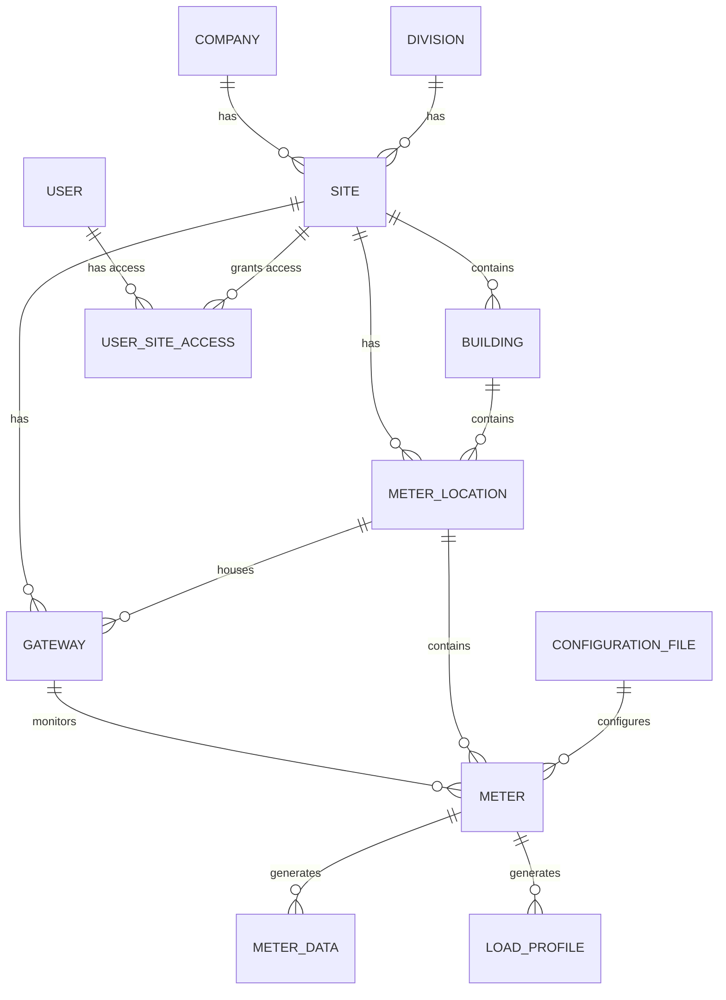

# Database Schema

## 📊 Overview

The CAMR system uses a MySQL database named `meter_reading_robinsons` with 16 tables organized around core entities: Sites, Gateways (RTUs), Meters, Buildings, Users, and time-series meter data.

## 🗂️ Entity Relationship Diagram



## 📋 Tables

### Core Infrastructure Tables

#### `meter_site`
Physical locations (malls, properties) where metering equipment is deployed.

| Column | Type | Description |
|--------|------|-------------|
| `site_id` | INT (PK, AI) | Unique site identifier |
| `division_idx` | INT | Foreign key to `meter_division_table` |
| `company_idx` | INT | Foreign key to `meter_company_table` |
| `building_idx` | INT | Foreign key to `meter_building_table` (nullable) |
| `site_code` | VARCHAR(100) | Building code as site identifier |
| `created_by_user_idx` | INT | User who created the record |
| `created_at` | DATETIME | Creation timestamp |
| `modified_by_user_idx` | INT | User who last modified |
| `updated_at` | DATETIME | Last update timestamp |
| `last_log_update` | DATETIME | Last log entry timestamp |
| `deleted_at` | VARCHAR(50) | Soft delete timestamp |

#### `meter_rtu` (Gateways)
Remote terminal units that collect meter data and communicate with the central system.

| Column | Type | Description |
|--------|------|-------------|
| `rtu_id` | INT (PK, AI) | Unique gateway identifier |
| `site_idx` | INT | Foreign key to `meter_site` |
| `location_idx` | INT | Foreign key to `meter_location_table` |
| `site_code` | VARCHAR(100) | Site code for gateway |
| `gateway_sn` | VARCHAR(255) | Gateway serial number |
| `gateway_mac` | VARCHAR(255) | MAC address (used in API) |
| `gateway_ip` | VARCHAR(255) | IP address |
| `connection_type` | VARCHAR(50) | Connection type (e.g., Ethernet) |
| `ip_netmask` | VARCHAR(255) | Network mask |
| `ip_gateway` | VARCHAR(255) | Gateway IP |
| `rtu_server_ip` | VARCHAR(50) | Server IP for gateway |
| `gateway_description` | VARCHAR(255) | Description |
| `update_rtu` | INT | Flag: CSV update pending (0/1) |
| `update_rtu_location` | INT | Flag: Site code update pending (0/1) |
| `update_rtu_ssh` | INT | Flag: SSH enabled (0/1) |
| `update_rtu_force_lp` | INT | Flag: Force load profile (0/1) |
| `idf_number` | VARCHAR(255) | IDF number |
| `switch_name` | VARCHAR(255) | Network switch name |
| `idf_port` | VARCHAR(255) | Switch port number |
| `created_at` | VARCHAR(20) | Creation timestamp |
| `created_by_user_idx` | INT | Creator user ID |
| `updated_at` | VARCHAR(20) | Update timestamp |
| `modified_by_user_idx` | INT | Modifier user ID |
| `last_log_update` | VARCHAR(20) | Last communication timestamp |
| `soft_rev` | VARCHAR(100) | Software/firmware revision |

**Key Flags:**
- `update_rtu` - Triggers CSV configuration file download
- `update_rtu_location` - Triggers site code file download
- `update_rtu_ssh` - Enables remote SSH access
- `update_rtu_force_lp` - Forces load profile collection

#### `meter_details` (Meters)
Electricity meters connected to gateways.

| Column | Type | Description |
|--------|------|-------------|
| `meter_id` | INT (PK, AI) | Unique meter identifier |
| `site_idx` | INT | Foreign key to `meter_site` |
| `rtu_idx` | INT | Foreign key to `meter_rtu` |
| `location_idx` | INT | Foreign key to `meter_location_table` |
| `building_idx` | INT | Foreign key to `meter_building_table` |
| `config_idx` | INT | Foreign key to `meter_configuration_file` |
| `site_code` | VARCHAR(100) | Site code |
| `meter_name` | VARCHAR(255) | Meter name/identifier |
| `meter_name_addressable` | INT | Is meter addressable (1=yes) |
| `meter_load_profile` | VARCHAR(50) | Load profile enabled (YES/NO) |
| `meter_default_name` | VARCHAR(255) | Default meter name |
| `meter_type` | VARCHAR(255) | Meter type |
| `meter_brand` | VARCHAR(255) | Meter manufacturer |
| `meter_role` | VARCHAR(100) | Role (e.g., "Client Meter") |
| `meter_remarks` | VARCHAR(255) | Additional notes |
| `customer_name` | VARCHAR(255) | Customer/tenant name |
| `meter_multiplier` | DOUBLE | Multiplier for readings (default 1) |
| `meter_status` | VARCHAR(50) | Meter status |
| `last_log_update` | VARCHAR(30) | Last data received timestamp |
| `soft_rev` | VARCHAR(50) | Software revision |
| `created_at` | DATETIME | Creation timestamp |
| `created_by_user_idx` | INT | Creator user ID |
| `updated_at` | DATETIME | Update timestamp |
| `modified_by_user_idx` | INT | Modifier user ID |

#### `meter_building_table`
Buildings within sites (subdivisions of sites).

| Column | Type | Description |
|--------|------|-------------|
| `building_id` | INT (PK, AI) | Unique building identifier |
| `site_idx` | INT | Foreign key to `meter_site` |
| `building_code` | VARCHAR(255) | Building code |
| `building_description` | VARCHAR(255) | Building name/description |
| `cut_off` | INT | Billing cut-off day |
| `device_ip_range` | VARCHAR(255) | IP address range for devices |
| `ip_network` | VARCHAR(255) | Network address |
| `ip_netmask` | VARCHAR(255) | Network mask |
| `ip_gateway` | VARCHAR(255) | Gateway IP |
| `created_at` | DATETIME | Creation timestamp |
| `created_by_user_idx` | INT | Creator user ID |
| `updated_at` | DATETIME | Update timestamp |
| `modified_by_user_idx` | INT | Modifier user ID |

#### `meter_location_table`
Meter locations (EE rooms) within buildings.

| Column | Type | Description |
|--------|------|-------------|
| `location_id` | INT (PK, AI) | Unique location identifier |
| `site_idx` | INT | Foreign key to `meter_site` |
| `building_id` | INT | Foreign key to `meter_building_table` |
| `location_code` | VARCHAR(255) | Location code (e.g., "EER-01") |
| `location_description` | VARCHAR(255) | Location description |
| `created_at` | TIMESTAMP | Creation timestamp |
| `created_by_user_idx` | INT | Creator user ID |
| `updated_at` | TIMESTAMP | Update timestamp |
| `modified_by_user_idx` | INT | Modifier user ID |

### Data Tables

#### `meter_data`
Time-series electrical measurement data from meters.

| Column | Type | Description |
|--------|------|-------------|
| `id` | BIGINT (PK, AI) | Unique record identifier |
| `location` | VARCHAR(30) | Location name (default: "Home") |
| `meter_id` | VARCHAR(30) | Meter identifier (indexed) |
| `datetime` | DATETIME | Measurement timestamp (indexed) |
| `vrms_a` | DOUBLE | Phase A voltage (RMS) |
| `vrms_b` | DOUBLE | Phase B voltage (RMS) |
| `vrms_c` | DOUBLE | Phase C voltage (RMS) |
| `irms_a` | DOUBLE | Phase A current (RMS) |
| `irms_b` | DOUBLE | Phase B current (RMS) |
| `irms_c` | DOUBLE | Phase C current (RMS) |
| `freq` | DOUBLE | Frequency (Hz) |
| `pf` | DOUBLE | Power factor |
| `watt` | DOUBLE | Active power (W) |
| `va` | DOUBLE | Apparent power (VA) |
| `var` | DOUBLE | Reactive power (VAR) |
| `wh_del` | DOUBLE | Energy delivered (Wh) |
| `wh_rec` | DOUBLE | Energy received (Wh) |
| `wh_net` | DOUBLE | Net energy (Wh) |
| `wh_total` | DOUBLE | Total energy (Wh) |
| `varh_neg` | DOUBLE | Negative reactive energy (VARh) |
| `varh_pos` | DOUBLE | Positive reactive energy (VARh) |
| `varh_net` | DOUBLE | Net reactive energy (VARh) |
| `varh_total` | DOUBLE | Total reactive energy (VARh) |
| `vah_total` | DOUBLE | Total apparent energy (VAh) |
| `max_rec_kw_dmd` | DOUBLE | Max received kW demand |
| `max_rec_kw_dmd_time` | DATETIME | Time of max received demand |
| `max_del_kw_dmd` | DOUBLE | Max delivered kW demand |
| `max_del_kw_dmd_time` | DATETIME | Time of max delivered demand |
| `max_pos_kvar_dmd` | DOUBLE | Max positive kVAR demand |
| `max_pos_kvar_dmd_time` | DATETIME | Time of max positive demand |
| `max_neg_kvar_dmd` | DOUBLE | Max negative kVAR demand |
| `max_neg_kvar_dmd_time` | DATETIME | Time of max negative demand |
| `v_ph_angle_a` | DOUBLE | Phase A voltage angle |
| `v_ph_angle_b` | DOUBLE | Phase B voltage angle |
| `v_ph_angle_c` | DOUBLE | Phase C voltage angle |
| `i_ph_angle_a` | DOUBLE | Phase A current angle |
| `i_ph_angle_b` | DOUBLE | Phase B current angle |
| `i_ph_angle_c` | DOUBLE | Phase C current angle |
| `mac_addr` | TEXT | Gateway MAC address |
| `soft_rev` | TEXT | Software revision |
| `relay_status` | INT | Relay status |
| `dt` | TIMESTAMP | Database insert timestamp |
| `genset_status` | INT | Generator status (nullable) |

**Indexes:**
- Composite index on `(meter_id, datetime, location)`

#### `load_profile`
Load profile data (15-minute interval measurements).

| Column | Type | Description |
|--------|------|-------------|
| `id` | BIGINT (PK, AI) | Unique record identifier |
| `meter_id` | TEXT | Meter identifier |
| `datetime` | TEXT | Measurement timestamp |
| `event_id` | TEXT | Event identifier |
| `ch_1` | FLOAT | Channel 1: 1.5.0 kW |
| `ch_2` | DOUBLE | Channel 2: 1-1:1.30.2 kWh |
| `ch_3` | DOUBLE | Channel 3: 1-1:3.30.2 kvarh |
| `ch_4` | DOUBLE | Channel 4: 2.5.0 kW |
| `ch_5` | DOUBLE | Channel 5: 1-1:2.30.2 kWh |
| `ch_6` | DOUBLE | Channel 6: 1-1:4.30.2 kvarh |
| `ch_7` | DOUBLE | Channel 7 |
| `ch_8` | DOUBLE | Channel 8 |
| `time_import` | TIMESTAMP | Import timestamp |

### User & Access Control Tables

#### `user_tb`
User accounts for system access.

| Column | Type | Description |
|--------|------|-------------|
| `user_id` | INT (PK, AI) | Unique user identifier |
| `user_id_sap` | TEXT | SAP user ID (default: "N/A") |
| `user_name` | VARCHAR(100) | Username (login) |
| `user_real_name` | VARCHAR(100) | Full name |
| `user_job_title` | VARCHAR(100) | Job title |
| `user_password` | VARCHAR(255) | Hashed password |
| `user_type` | VARCHAR(100) | User type (Admin, User) |
| `user_expiration` | DATE | Account expiration date |
| `user_list_src` | VARCHAR(100) | User source (default: "AMR") |
| `user_access` | VARCHAR(100) | Access level: "All" or "Selected" |
| `user_email_address` | VARCHAR(100) | Email address |
| `user_site_list_ids` | TEXT | Comma-separated site IDs (if Selected) |
| `created_at` | DATETIME | Creation timestamp |
| `created_by_user_idx` | INT | Creator user ID |
| `updated_at` | DATETIME | Update timestamp |
| `modified_by_user_idx` | INT | Modifier user ID |

**Access Levels:**
- `All` - User can access all sites
- `Selected` - User can only access sites in `user_site_list_ids`

#### `user_access_group`
User-site access mapping (many-to-many relationship).

| Column | Type | Description |
|--------|------|-------------|
| `user_access_id` | INT (PK, AI) | Unique access record identifier |
| `user_idx` | TEXT | User ID (from SAP or local) |
| `user_name` | TEXT | Username |
| `user_expiration` | DATE | Access expiration date |
| `site_idx` | INT | Foreign key to `meter_site` |
| `created_at` | DATETIME | Creation timestamp |
| `created_by_user_idx` | INT | Creator user ID |
| `updated_at` | DATETIME | Update timestamp |
| `updated_by_user_idx` | INT | Modifier user ID |
| `access_list_src` | TEXT | Access source |

### Configuration Tables

#### `meter_company_table`
Company/organization entities.

| Column | Type | Description |
|--------|------|-------------|
| `company_id` | INT (PK, AI) | Unique company identifier |
| `company_code` | VARCHAR(255) | Company code |
| `company_name` | VARCHAR(255) | Company name |
| `created_by_user_idx` | INT | Creator user ID |
| `created_at` | DATETIME | Creation timestamp |
| `modified_by_user_idx` | INT | Modifier user ID |
| `updated_at` | DATETIME | Update timestamp |

#### `meter_division_table`
Divisions within companies.

| Column | Type | Description |
|--------|------|-------------|
| `division_id` | INT (PK, AI) | Unique division identifier |
| `division_code` | VARCHAR(255) | Division code |
| `division_name` | VARCHAR(255) | Division name |
| `created_by_user_idx` | INT | Creator user ID |
| `created_at` | DATETIME | Creation timestamp |
| `modified_by_user_idx` | INT | Modifier user ID |
| `updated_at` | DATETIME | Update timestamp |

#### `meter_configuration_file`
Meter configuration files for different meter models.

| Column | Type | Description |
|--------|------|-------------|
| `config_id` | INT (PK, AI) | Unique config identifier |
| `meter_model` | TEXT | Meter model/type |
| `config_file` | TEXT | Configuration file content |
| `created_by_user_idx` | INT | Creator user ID |
| `created_at` | DATETIME | Creation timestamp |
| `modified_by_user_idx` | INT | Modifier user ID |
| `updated_at` | DATETIME | Update timestamp |

#### `web_page_settings`
Web interface customization settings.

| Column | Type | Description |
|--------|------|-------------|
| `setting_id` | INT (PK, AI) | Setting identifier |
| `logo_path` | TEXT | Path to logo image |
| `header_title` | VARCHAR(255) | Header title text |
| `nav_title` | VARCHAR(255) | Navigation title |
| Settings for web UI customization |

#### `sessions`
Laravel session storage.

| Column | Type | Description |
|--------|------|-------------|
| `id` | VARCHAR(255) (PK) | Session identifier |
| `user_id` | BIGINT | User ID (nullable) |
| `ip_address` | VARCHAR(45) | Client IP address |
| `user_agent` | TEXT | Browser user agent |
| `payload` | LONGTEXT | Session data |
| `last_activity` | INT | Last activity timestamp |

#### `activity_log`
Audit trail (Spatie Laravel ActivityLog package).

| Column | Type | Description |
|--------|------|-------------|
| `id` | BIGINT (PK, AI) | Log entry identifier |
| `log_name` | VARCHAR(255) | Log category |
| `description` | TEXT | Action description |
| `subject_type` | VARCHAR(255) | Model class name |
| `subject_id` | BIGINT | Model ID |
| `causer_type` | VARCHAR(255) | User model class |
| `causer_id` | BIGINT | User ID |
| `properties` | JSON | Additional properties |
| `created_at` | TIMESTAMP | Log timestamp |

## 🔗 Relationships

### Hierarchy
```
Company → Division → Site → Building → Meter Location
                              ↓              ↓
                           Gateway -----→ Meter
                              ↓              ↓
                         Meter Data    Load Profile
```

### Key Relationships

1. **Site Management**
   - `meter_site.company_idx` → `meter_company_table.company_id`
   - `meter_site.division_idx` → `meter_division_table.division_id`

2. **Gateway-Site**
   - `meter_rtu.site_idx` → `meter_site.site_id`
   - `meter_rtu.location_idx` → `meter_location_table.location_id`

3. **Meter Relationships**
   - `meter_details.site_idx` → `meter_site.site_id`
   - `meter_details.rtu_idx` → `meter_rtu.rtu_id`
   - `meter_details.building_idx` → `meter_building_table.building_id`
   - `meter_details.location_idx` → `meter_location_table.location_id`
   - `meter_details.config_idx` → `meter_configuration_file.config_id`

4. **Building-Location**
   - `meter_building_table.site_idx` → `meter_site.site_id`
   - `meter_location_table.site_idx` → `meter_site.site_id`
   - `meter_location_table.building_id` → `meter_building_table.building_id`

5. **User Access**
   - `user_access_group.user_idx` → `user_tb.user_id`
   - `user_access_group.site_idx` → `meter_site.site_id`

6. **Data Collection**
   - `meter_data.meter_id` (string) matches `meter_details.meter_name`
   - `load_profile.meter_id` (string) matches `meter_details.meter_name`

## 📊 Indexing Strategy

### Performance Indexes

1. **meter_data**
   - Composite index: `(meter_id, datetime, location)`
   - Critical for report generation and time-series queries

2. **Primary Keys**
   - All tables use auto-incrementing integer primary keys
   - Exception: `sessions` uses VARCHAR primary key

### Query Patterns

- **Site Dashboard**: Queries join `meter_site` → `meter_rtu` → `meter_details`
- **Reports**: Query `meter_data` filtered by date range and meter_id
- **Load Profile**: Query `load_profile` with datetime filtering
- **Access Control**: Query `user_access_group` joined with `user_tb`

## 🔄 Data Flow

1. **Gateway → meter_data**: Gateways push meter readings
2. **Gateway → load_profile**: Gateways upload load profile files
3. **User Actions → activity_log**: All user actions logged for audit
4. **Configuration Changes → meter_rtu flags**: Update flags trigger gateway actions

## 💾 Storage Considerations

- **meter_data**: Grows continuously (hourly readings)
- **load_profile**: Grows continuously (15-min intervals)
- **activity_log**: Grows with user activity
- **Recommendation**: Implement data archival/partitioning strategy

## 🔍 Common Queries

### Get all meters for a site
```sql
SELECT m.*, r.gateway_sn, b.building_description, l.location_description
FROM meter_details m
JOIN meter_rtu r ON m.rtu_idx = r.rtu_id
JOIN meter_building_table b ON m.building_idx = b.building_id
JOIN meter_location_table l ON m.location_idx = l.location_id
WHERE m.site_idx = ?
```

### Get meter data for date range
```sql
SELECT * FROM meter_data
WHERE meter_id = ?
  AND datetime BETWEEN ? AND ?
ORDER BY datetime ASC
```

### Check gateway online status
```sql
SELECT rtu_id, gateway_sn, last_log_update,
  TIMESTAMPDIFF(HOUR, last_log_update, NOW()) as hours_offline
FROM meter_rtu
WHERE site_idx = ?
ORDER BY last_log_update DESC
```

---

**Database:** meter_reading_robinsons  
**Engine:** InnoDB (recommended for transactions)  
**Charset:** utf8mb4  
**Collation:** utf8mb4_unicode_ci
