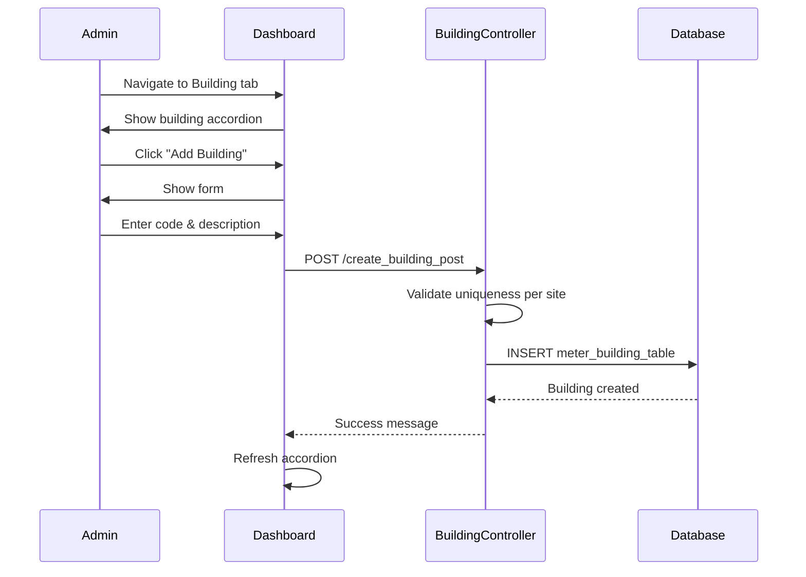
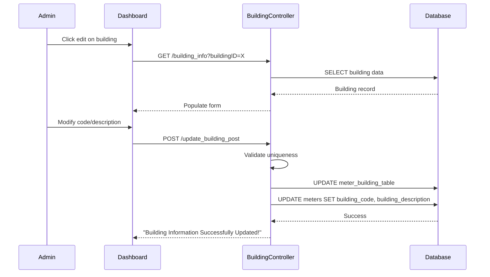

# Building Management

## 🏢 Overview

Building Management organizes sites into logical building structures. Buildings are subdivisions within a site that group meter locations and equipment.

**Controller:** `CAMRBuildingController.php`  
**Model:** `BuildingModel` (table: `meter_building_table`)  
**Access:** Site Dashboard → Building Tab

## 🔑 Key Concepts

### Building Hierarchy

```
Site
└── Building
    └── Meter Location (EE Room)
        ├── Gateways
        └── Meters
```

### Building Attributes

- **Building Code** - Short identifier (e.g., "BLD-A", "NORTH-WING")
- **Building Description** - Full name
- **Site Assignment** - Parent site
- **Cut-off Day** - Billing cycle day (stored in primary building record)
- **Network Configuration** - IP settings (stored in primary building record)

## 📝 Features

### 1. View Buildings

**Display Format:** Accordion view
- Expandable/collapsible sections
- Ordered by building code
- Shows building code and description

**API Endpoint:**
```php
GET /get_building_accordion?siteID={siteID}
```

**Response:**
```json
[
    {
        "id": 1,
        "building_code": "NORTH-WING",
        "building_description": "North Wing Building"
    },
    {
        "id": 2,
        "building_code": "SOUTH-WING",
        "building_description": "South Wing Building"
    }
]
```

### 2. Create Building

**Required Fields:**
- Building Code (unique per site)
- Building Description (unique per site)
- Site ID (auto-populated)

**Validation Rules:**
```php path=/Users/rli/Documents/DEC/camr_robinsons-main/camr_robinsons-main/app/Http/Controllers/CAMRBuildingController.php start=52
$request->validate([
    'building_code' => [
        'required',
        Rule::unique('meter_building_table')->where(
            fn ($query) => $query
                ->where('building_code', $request->building_code)
                ->where('meter_site_id', $request->siteID)
        )
    ],
    'building_description' => [
        'required',
        Rule::unique('meter_building_table')->where(
            fn ($query) => $query
                ->where('building_description', $request->building_description)
                ->where('meter_site_id', $request->siteID)
        )
    ]
]);
```

**Process:**
```php path=/Users/rli/Documents/DEC/camr_robinsons-main/camr_robinsons-main/app/Http/Controllers/CAMRBuildingController.php start=70
$bldg = new BuildingModel();
$bldg->building_code = $request->building_code;
$bldg->building_description = $request->building_description;
$bldg->meter_site_id = $request->siteID;
$result = $bldg->save();
```

### 3. Edit Building

**Editable Fields:**
- Building Code
- Building Description

**Cascade Updates:**
When building code/description is updated, all associated meters are automatically updated:

```php path=/Users/rli/Documents/DEC/camr_robinsons-main/camr_robinsons-main/app/Http/Controllers/CAMRBuildingController.php start=113
$MeterUpdateBuildingInfo = MeterModel::where('building_id', '=', $request->buildingID)
    ->update([
        'building_code' => $request->building_code,
        'building_description' => $request->building_description,
    ]);
```

**Note:** Site assignment cannot be changed (must delete and recreate)

### 4. Delete Building

**Process:**
```php path=/Users/rli/Documents/DEC/camr_robinsons-main/camr_robinsons-main/app/Http/Controllers/CAMRBuildingController.php start=42
public function delete_building_confirmed(Request $request) {
    $buildingID = $request->buildingID;
    BuildingModel::find($buildingID)->delete();
    return 'Deleted';
}
```

**Validation:**
- Should check for meter locations before deletion
- Should check for meters before deletion
- Best practice: Remove all child records first

## 🔄 Workflows

### Create Building Workflow



### Update Building Workflow



## 📑 Database Schema

### meter_building_table Structure

```sql
CREATE TABLE meter_building_table (
    id INT PRIMARY KEY AUTO_INCREMENT,
    building_id INT, -- Legacy, same as id
    meter_site_id INT,
    site_idx INT,
    building_code VARCHAR(255),
    building_description VARCHAR(255),
    cut_off INT, -- Billing cut-off day
    device_ip_range VARCHAR(255),
    ip_network VARCHAR(255),
    ip_netmask VARCHAR(255),
    ip_gateway VARCHAR(255),
    created_by_user_idx INT,
    modified_by_user_idx INT,
    created_at DATETIME,
    updated_at DATETIME,
    UNIQUE KEY unique_building_code (building_code, meter_site_id),
    UNIQUE KEY unique_building_desc (building_description, meter_site_id)
);
```

### Query Buildings for Site

```sql
SELECT 
    id,
    building_code,
    building_description
FROM meter_building_table
WHERE meter_site_id = ?
ORDER BY building_code ASC;
```

### Query Building with Counts

```sql
SELECT 
    mbt.id,
    mbt.building_code,
    mbt.building_description,
    COUNT(DISTINCT mlt.location_id) AS location_count,
    COUNT(DISTINCT md.meter_id) AS meter_count
FROM meter_building_table mbt
LEFT JOIN meter_location_table mlt 
    ON mlt.building_idx = mbt.id
LEFT JOIN meter_details md 
    ON md.building_id = mbt.id
WHERE mbt.meter_site_id = ?
GROUP BY mbt.id
ORDER BY mbt.building_code;
```

## 💡 Best Practices

### Naming Conventions

**Building Codes:**
- Keep short and descriptive
- Use consistent prefixes
- Examples:
  - `BLD-A`, `BLD-B`, `BLD-C`
  - `NORTH-WING`, `SOUTH-WING`
  - `MAIN-BLDG`, `ANNEX`
  - `TOWER-1`, `TOWER-2`

**Building Descriptions:**
- Full descriptive names
- Include location/designation
- Examples:
  - `Building A - North Wing`
  - `Main Building`
  - `South Tower`
  - `Annex Building`

### Organization

**Logical Grouping:**
- By physical structure
- By ownership/tenant
- By electrical system
- By geographic location

**Single vs Multiple Buildings:**
- **Single Building:** Small sites, one electrical system
- **Multiple Buildings:** Large complexes, separate structures

## 🐛 Troubleshooting

### Cannot Create Building - Duplicate Code

**Issue:** Building code must be unique per site

**Check:**
```sql
SELECT id, building_code, building_description
FROM meter_building_table
WHERE building_code = ? AND meter_site_id = ?;
```

**Solution:** Use different building code

### Cannot Create Building - Duplicate Description

**Issue:** Building description must be unique per site

**Check:**
```sql
SELECT id, building_code, building_description
FROM meter_building_table
WHERE building_description = ? AND meter_site_id = ?;
```

**Solution:** Use different description

### Cannot Delete Building

**Issue:** Building has associated records

**Check Dependencies:**
```sql
-- Check meter locations
SELECT COUNT(*) FROM meter_location_table
WHERE building_idx = ?;

-- Check meters
SELECT COUNT(*) FROM meter_details
WHERE building_id = ?;
```

**Solution:** 
1. Delete or reassign meter locations
2. Delete or reassign meters
3. Then delete building

### Building Not Appearing

**Check:**
1. Building created successfully
2. Correct site selected
3. Building not deleted
4. Refresh accordion view

## 📊 Usage Examples

### Multi-Building Site Setup

**Scenario:** Large mall with 3 towers

```sql
-- Tower 1
INSERT INTO meter_building_table 
    (building_code, building_description, meter_site_id)
VALUES 
    ('TOWER-1', 'Tower 1 - East Wing', 5);

-- Tower 2
INSERT INTO meter_building_table 
    (building_code, building_description, meter_site_id)
VALUES 
    ('TOWER-2', 'Tower 2 - West Wing', 5);

-- Tower 3
INSERT INTO meter_building_table 
    (building_code, building_description, meter_site_id)
VALUES 
    ('TOWER-3', 'Tower 3 - Central', 5);
```

### Query Hierarchy

```sql
SELECT 
    ms.site_id,
    mbt.building_code AS site_building_code,
    mbt.building_description AS site_building_name,
    mbt2.building_code AS building_code,
    mbt2.building_description AS building_name,
    mlt.location_code,
    mlt.location_description
FROM meter_site ms
JOIN meter_building_table mbt 
    ON mbt.site_idx = ms.site_id
LEFT JOIN meter_building_table mbt2 
    ON mbt2.meter_site_id = ms.site_id
LEFT JOIN meter_location_table mlt 
    ON mlt.building_idx = mbt2.id
WHERE ms.site_id = ?
ORDER BY mbt2.building_code, mlt.location_code;
```

## 📚 Related Documentation

- [Site Management](site-management.md) - Parent site context
- [Meter Location Management](meter-location-management.md) - Child locations
- [Meter Management](meter-management.md) - Associated meters
- [Database Schema](../database-schema.md) - meter_building_table

---

**Access:** Login required (`isLoggedIn` middleware)  
**Parent:** Site (one-to-many relationship)  
**Children:** Meter Locations (one-to-many relationship)  
**Display:** Accordion view in Site Dashboard  
**Cascade Updates:** Building changes auto-update associated meters
