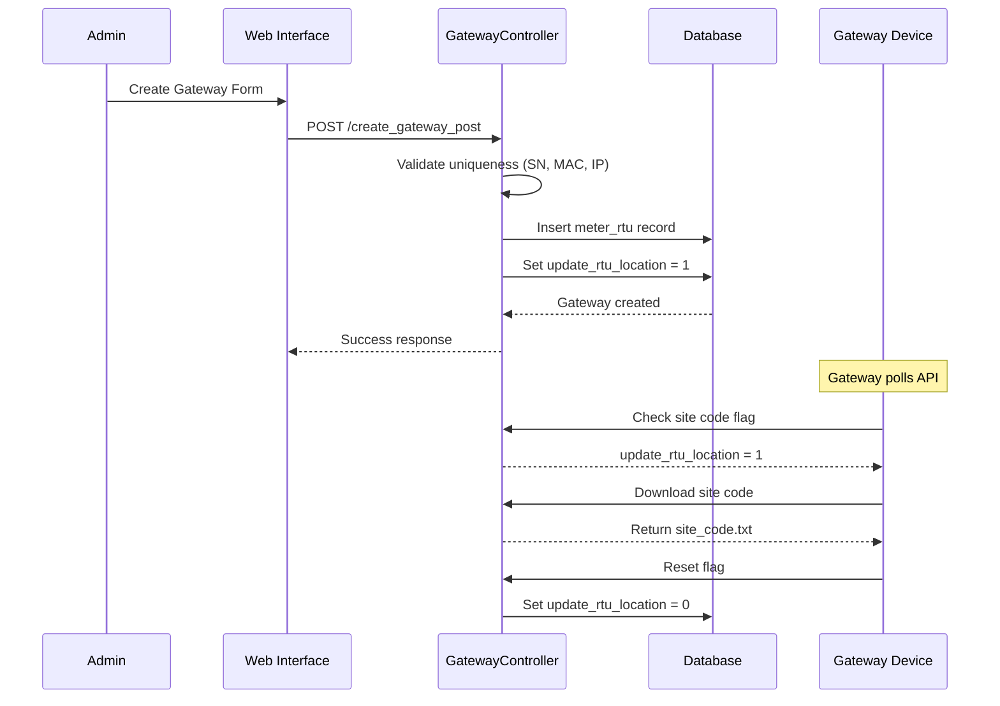
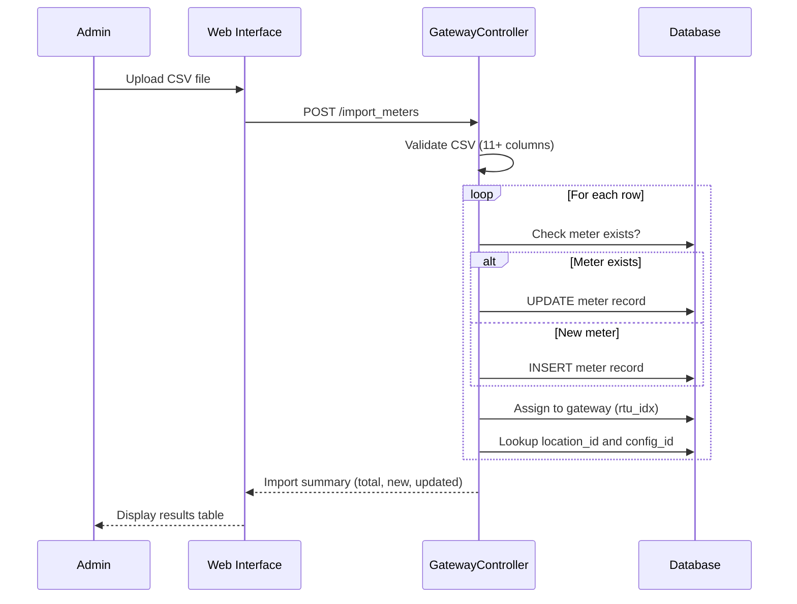
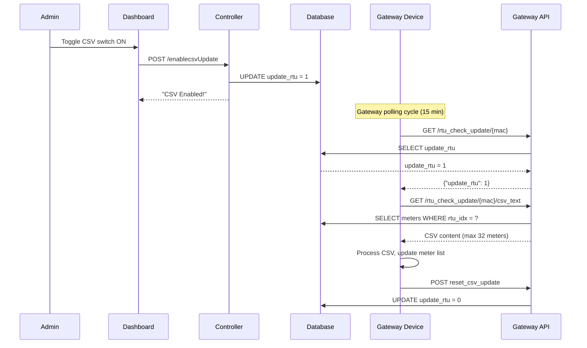

# Gateway Management

## 📡 Overview

Gateway Management handles Remote Terminal Units (RTUs) that collect meter data and communicate with the central CAMR system. Gateways are physical devices deployed at sites that poll meters and transmit consumption data.

**Controller:** `app/Http/Controllers/CAMRGatewayController.php`  
**Model:** `GatewayModel` (table: `meter_rtu`)  
**Access:** Site Dashboard → Gateway Tab

## 📊 Key Features

### 1. Gateway Listing

**Views Available:**
- All gateways for a site
- Gateways filtered by building and EE room
- Offline gateways only

**Displayed Information:**
- Gateway Serial Number
- MAC Address
- IP Address (LAN) or SIM Number (3G/4G/5G)
- IDF Number, Switch Name, Port
- Location Code and Description
- Software Revision
- Online/Offline Status
- Last Update Timestamp
- Configuration Flags (CSV, Building Code)

### 2. Online/Offline Status

**Status Calculation:**
```php path=/Users/rli/Documents/DEC/camr_robinsons-main/camr_robinsons-main/app/Http/Controllers/CAMRGatewayController.php start=164
if($last_log_update == "0000/00/00 00:00") {
    $status = "No Data"; // No meters connected/spare gateway
} else if($diff->format("%a") <= 0) {
    $status = "Online"; // Updated within 24 hours
} else {
    $status = "Offline"; // No update for 1+ days
}
```

**Status Indicators:**
- 🟢 **Online** - Cloud check icon, last update < 24 hours
- 🔴 **Offline** - Cloud slash icon, offline for 1+ days
- ⚫ **No Data** - No meters assigned or spare gateway

### 3. Configuration Flags

Gateways have toggle switches for remote configuration:

#### CSV Update (`update_rtu`)
- **Purpose:** Enable gateway to download meter batch CSV file
- **Use Case:** After adding/removing meters, enable CSV update
- **Process:** Gateway polls API → Downloads CSV → Resets flag
- **Max Meters:** 32 meters per gateway

#### Building Code Update (`update_rtu_location`)
- **Purpose:** Update gateway's site code configuration
- **Use Case:** After site code changes or gateway relocation
- **Process:** Gateway polls API → Downloads site code → Resets flag

#### SSH Access (`update_rtu_ssh`) *Optional*
- **Purpose:** Enable remote SSH access to gateway
- **Use Case:** For 3G/4G/5G gateways or cloud-accessible systems
- **Note:** Commented out in default deployment for security

#### Force Load Profile (`update_rtu_force_lp`) *Optional*
- **Purpose:** Force gateway to collect and upload load profile data
- **Use Case:** On-demand historical data collection
- **Note:** Commented out in default deployment

### 4. Create Gateway

**Required Fields:**
- Gateway Serial Number (unique)
- MAC Address (unique)
- IP Address or SIM Number (unique)
- Location (EE Room assignment)

**Optional Fields:**
- IDF Number
- Switch Name
- IDF Port
- Gateway Description
- Connection Type (LAN/3G/4G/5G)

**Validation Rules:**
```php path=/Users/rli/Documents/DEC/camr_robinsons-main/camr_robinsons-main/app/Http/Controllers/CAMRGatewayController.php start=521
$request->validate([
    'gateway_sn'   => 'required|unique:meter_rtu,gateway_sn',
    'gateway_mac'  => 'required|unique:meter_rtu,gateway_mac',
    'gateway_ip'   => 'required|unique:meter_rtu,gateway_ip',
    'location_id'  => 'required'
]);
```

**Auto-Enabled Flags:**
- `update_rtu_location = 1` (Building code update enabled on creation)

### 5. Edit Gateway

**Editable Fields:**
- Gateway Serial Number
- MAC Address
- IP Address/SIM Number
- Location assignment
- IDF details (number, switch, port)
- Gateway description
- Connection type

**Note:** Cannot change site assignment (must delete and recreate)

### 6. Delete Gateway

**Cascade Behavior:**
- Deletes gateway record
- **Does NOT delete** associated meters (commented out)
- Meters remain in database but become orphaned

**Best Practice:** Reassign meters before deleting gateway

### 7. Import Meters via CSV

**CSV Format (11 columns):**
1. Location Code
2. Meter Name
3. Tenant/Meter Tagging
4. Meter Brand
5. Meter Type
6. Status (read/ACTIVE/Active → ACTIVE, else INACTIVE)
7. Configuration File
8. Alternate Address (optional)
9. Meter Role
10. Multiplier
11. Remarks

**Import Logic:**
- Check if meter exists by `meter_name` and `site_idx`
- If exists: **Update** meter record
- If new: **Create** meter record
- All imported meters assigned to gateway

**Addressable vs Non-Addressable:**
```php path=/Users/rli/Documents/DEC/camr_robinsons-main/camr_robinsons-main/app/Http/Controllers/CAMRGatewayController.php start=687
if($alternate_address == '') {
    $meter_default_name = $meter_name;
    $meter_name_addressable = 1; // Use meter name directly
} else {
    $meter_default_name = $alternate_address;
    $meter_name_addressable = 0; // Use alternate address
}
```

**Validation:**
- Minimum 11 columns required
- Location code must exist in `meter_location_table`
- Configuration file must exist in `meter_configuration_file`

**Response:**
```json
{
    "success": "CSV File Successfully Imported!",
    "total_line": 150,
    "result_csv_import": [
        {
            "meter_name": "Meter001",
            "import_mode": "New Meter"
        },
        {
            "meter_name": "Meter002",
            "import_mode": "Existing Meter"
        }
    ]
}
```

## 🔄 Workflows

### Gateway Registration Workflow



### Meter Import Workflow



### CSV Update Workflow



## 📑 Database Schema

### Gateway Record Structure

```sql
CREATE TABLE meter_rtu (
    rtu_id INT PRIMARY KEY AUTO_INCREMENT,
    site_idx INT,
    site_code VARCHAR(255),
    gateway_sn VARCHAR(255) UNIQUE,
    gateway_mac VARCHAR(255) UNIQUE,
    gateway_ip VARCHAR(255) UNIQUE,
    location_idx INT,
    idf_number VARCHAR(255),
    switch_name VARCHAR(255),
    idf_port VARCHAR(255),
    connection_type VARCHAR(50),
    gateway_description TEXT,
    update_rtu TINYINT DEFAULT 0,
    update_rtu_location TINYINT DEFAULT 0,
    update_rtu_ssh TINYINT DEFAULT 0,
    update_rtu_force_lp TINYINT DEFAULT 0,
    last_log_update DATETIME,
    soft_rev VARCHAR(50),
    created_by_user_idx INT,
    modified_by_user_idx INT,
    created_at DATETIME,
    updated_at DATETIME
);
```

### Query Gateway with Location

```sql
SELECT 
    mr.rtu_id,
    mr.gateway_sn,
    mr.gateway_mac,
    mr.gateway_ip,
    mr.last_log_update,
    mr.soft_rev,
    mlt.location_code,
    mlt.location_description
FROM meter_rtu mr
LEFT JOIN meter_location_table mlt 
    ON mlt.location_id = mr.location_idx
WHERE mr.site_idx = ?
ORDER BY mr.gateway_sn;
```

### Query Offline Gateways

```sql
SELECT *
FROM meter_rtu
WHERE site_idx = ?
AND (
    DATEDIFF(NOW(), last_log_update) >= 1
    OR last_log_update = '0000-00-00 00:00:00'
);
```

## 🐛 Troubleshooting

### Gateway Shows Offline

**Check:**
1. Network connectivity (ping gateway IP)
2. Gateway polling service status
3. API endpoint accessibility
4. Last successful poll in `last_log_update`

```sql
SELECT 
    gateway_sn,
    gateway_ip,
    last_log_update,
    DATEDIFF(NOW(), last_log_update) AS days_offline
FROM meter_rtu
WHERE rtu_id = ?;
```

### CSV Update Not Working

**Verify:**
1. Flag enabled: `update_rtu = 1`
2. Gateway polling API endpoint
3. Meter count ≤ 32 (API limitation)
4. Configuration files exist for all meters

```sql
SELECT COUNT(*) AS meter_count
FROM meter_details
WHERE rtu_idx = ?;
```

### Cannot Delete Gateway

**Check Dependencies:**
- Meters assigned to gateway
- Recent meter data records

**Solution:** Reassign meters to another gateway first

```sql
UPDATE meter_details
SET rtu_idx = <new_gateway_id>
WHERE rtu_idx = <old_gateway_id>;
```

### Meter Import Fails

**Common Issues:**
1. **Column count < 11** → Verify CSV format
2. **Invalid location code** → Check `meter_location_table`
3. **Invalid config file** → Check `meter_configuration_file`
4. **File encoding** → Use UTF-8

**Debug Query:**
```sql
-- Verify location exists
SELECT location_id FROM meter_location_table 
WHERE location_code = 'EER-001';

-- Verify config file exists
SELECT config_id FROM meter_configuration_file 
WHERE config_file = 'default.cfg';
```

## ⚡ Performance Considerations

### Gateway Limitations

**32 Meter Limit:**
- Each gateway can handle max 32 meters
- CSV API enforces this limit
- Exceeding limit requires multiple gateways

**Polling Frequency:**
- Default: 15-minute intervals
- Configurable per deployment
- Balance between data freshness and network load

### Database Indexes

```sql
-- Recommended indexes for performance
CREATE INDEX idx_site_idx ON meter_rtu(site_idx);
CREATE INDEX idx_location_idx ON meter_rtu(location_idx);
CREATE INDEX idx_last_log ON meter_rtu(last_log_update);
CREATE UNIQUE INDEX idx_mac ON meter_rtu(gateway_mac);
```

## 🔐 Security Considerations

### MAC Address Authentication
- Gateway API uses MAC address for authentication
- No username/password required
- MAC address must be unique and registered

### SSH Access
- Disabled by default (commented out)
- Only enable for 3G/4G/5G gateways with VPN
- Requires firewall rules and key management

## 📚 Related Documentation

- [Database Schema](../database-schema.md) - meter_rtu table
- [Models](../models.md) - GatewayModel
- [Gateway Device API](../api/gateway-device-api.md) - Polling endpoints
- [Site Management](site-management.md) - Parent site context
- [Meter Management](meter-management.md) - Associated meters
- [Meter Location Management](meter-location-management.md) - EE room assignment

---

**Access:** Login required (`isLoggedIn` middleware)  
**DataTables:** Server-side processing enabled  
**Activity Logging:** All gateway operations logged via Spatie ActivityLog
