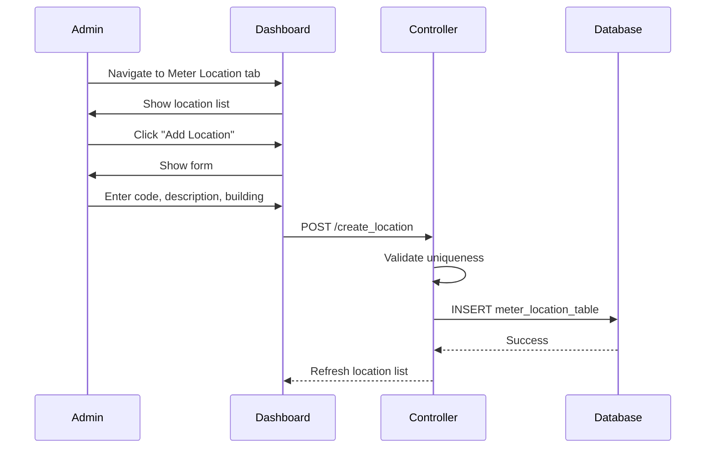
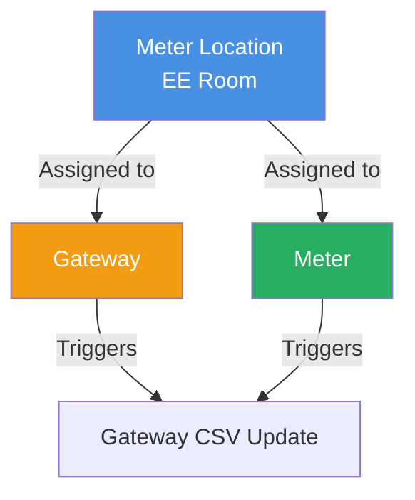

# Meter Location Management

## 📍 Overview

Meter Location Management handles EE (Electrical Equipment) rooms where meters are physically installed. Locations provide organizational structure within buildings.

**Table:** `meter_location_table`  
**Access:** Site Dashboard → Meter Location Tab

## 🔑 Key Concepts

### Location Hierarchy

```
Site
└── Building
    └── Meter Location (EE Room)
        ├── Gateways (assigned)
        └── Meters (assigned)
```

### Location Attributes

- **Location Code** - Unique identifier (e.g., "EER-01", "GROUND-EE-ROOM")
- **Location Description** - Full name/description
- **Building Assignment** - Parent building
- **Site Assignment** - Parent site

## 📝 Features

### 1. Create Location

**Required Fields:**
- Location Code (unique per site)
- Location Description
- Building selection

**Example:**
- Code: `GROUND-EE-ROOM`
- Description: `Ground Floor Electrical Equipment Room`
- Building: `Building A`

### 2. Edit Location

**Editable Fields:**
- Location Description
- Building assignment

**Note:** Location Code typically not changed after creation

### 3. Delete Location

**Validation:**
- Cannot delete if gateways assigned
- Cannot delete if meters assigned

**Best Practice:** Reassign equipment before deletion

### 4. View Locations

**Display:**
- Location Code
- Description
- Building name
- Number of gateways
- Number of meters
- Status indicators

## 🔄 Workflows

### Create Location Workflow



### Assignment Impact



## 📑 Database Schema

### meter_location_table Structure

```sql
CREATE TABLE meter_location_table (
    location_id INT PRIMARY KEY AUTO_INCREMENT,
    site_idx INT,
    building_idx INT,
    location_code VARCHAR(255),
    location_description VARCHAR(255),
    created_by_user_idx INT,
    modified_by_user_idx INT,
    created_at DATETIME,
    updated_at DATETIME,
    UNIQUE KEY unique_location_per_site (location_code, site_idx)
);
```

### Query Locations with Counts

```sql
SELECT 
    mlt.location_id,
    mlt.location_code,
    mlt.location_description,
    mbt.building_description,
    COUNT(DISTINCT mr.rtu_id) AS gateway_count,
    COUNT(DISTINCT md.meter_id) AS meter_count
FROM meter_location_table mlt
LEFT JOIN meter_building_table mbt 
    ON mbt.building_id = mlt.building_idx
LEFT JOIN meter_rtu mr 
    ON mr.location_idx = mlt.location_id
LEFT JOIN meter_details md 
    ON md.location_idx = mlt.location_id
WHERE mlt.site_idx = ?
GROUP BY mlt.location_id
ORDER BY mlt.location_code;
```

## 💡 Best Practices

### Naming Conventions

**Location Codes:**
- Use descriptive prefixes: `EER-`, `EE-`, `ELEC-`
- Include floor/area: `GROUND-EE`, `2F-EER`, `BASEMENT-EE`
- Keep consistent format across site
- Examples:
  - `GROUND-EE-ROOM`
  - `2F-EER-NORTH`
  - `BASEMENT-ELEC`

**Location Descriptions:**
- Full descriptive name
- Include floor and area
- Examples:
  - `Ground Floor Electrical Equipment Room`
  - `Second Floor EE Room - North Wing`
  - `Basement Electrical Room`

### Organization

**Group by Function:**
- Main electrical rooms
- Sub-distribution panels
- Generator rooms
- Mechanical rooms with meters

**Logical Grouping:**
- By building
- By floor
- By tenant area
- By electrical system

## 🐛 Troubleshooting

### Cannot Create Location - Duplicate Code

**Issue:** Location code must be unique per site

**Check:**
```sql
SELECT location_id, location_code 
FROM meter_location_table
WHERE location_code = ? AND site_idx = ?;
```

**Solution:** Use different location code or verify site selection

### Cannot Delete Location

**Issue:** Location has assigned equipment

**Check Dependencies:**
```sql
-- Check gateways
SELECT COUNT(*) FROM meter_rtu 
WHERE location_idx = ?;

-- Check meters
SELECT COUNT(*) FROM meter_details 
WHERE location_idx = ?;
```

**Solution:** Reassign all equipment first

### Location Not Appearing in Dropdowns

**Check:**
1. Location created successfully
2. Correct site selection
3. Correct building selection
4. Location not deleted

## 📊 Usage Examples

### Import CSV with Location Codes

When importing meters via CSV, location codes must exist:

```csv
Location Code,Meter Name,Customer,Brand,Type,Status,Config,Address,Role,Multiplier,Remarks
GROUND-EE-ROOM,Meter001,Tenant A,Schneider,kWh,Active,default.cfg,,Main,1.0,Main meter
2F-EER-NORTH,Meter002,Tenant B,ABB,kWh,Active,abb.cfg,,Sub,20.0,With CT
```

### Query Meters by Location

```sql
SELECT 
    md.meter_name,
    md.customer_name,
    mlt.location_code,
    mlt.location_description,
    mr.gateway_sn
FROM meter_details md
JOIN meter_location_table mlt 
    ON mlt.location_id = md.location_idx
JOIN meter_rtu mr 
    ON mr.rtu_id = md.rtu_idx
WHERE mlt.location_code = 'GROUND-EE-ROOM';
```

## 📚 Related Documentation

- [Site Management](site-management.md) - Parent site context
- [Building Management](building-management.md) - Parent building structure
- [Gateway Management](gateway-management.md) - Gateway assignment
- [Meter Management](meter-management.md) - Meter assignment
- [Database Schema](../database-schema.md) - meter_location_table

---

**Access:** Login required (`isLoggedIn` middleware)  
**Parent:** Building (one-to-many relationship)  
**Children:** Gateways and Meters (one-to-many relationship)  
**Activity Logging:** All operations logged via Spatie ActivityLog
