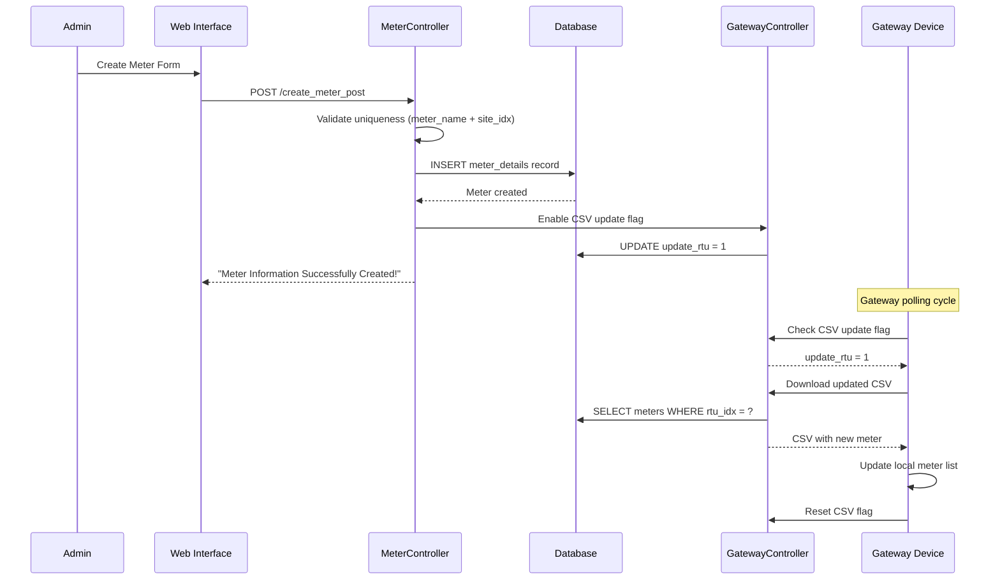
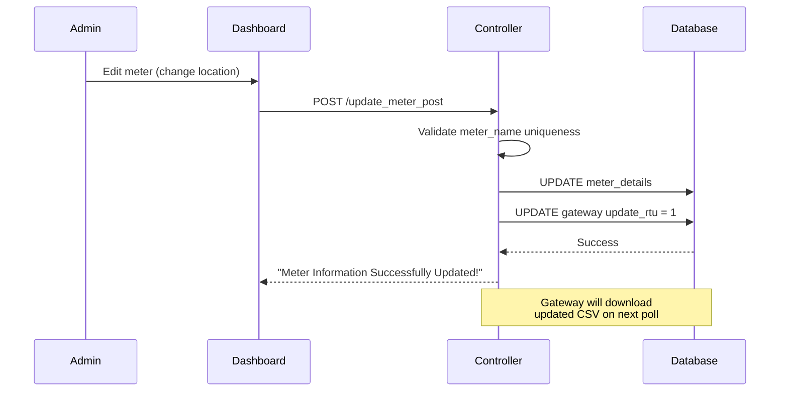
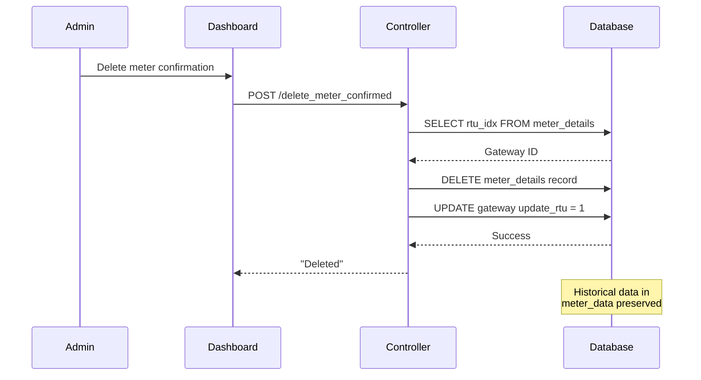

# Meter Management

## ⚡ Overview

Meter Management handles electrical meters that measure power consumption. Meters are connected to gateways and assigned to specific locations (EE rooms). The system tracks meter readings, online/offline status, and configuration details.

**Controller:** `app/Http/Controllers/CAMRMeterController.php`  
**Model:** `MeterModel` (table: `meter_details`)  
**Access:** Site Dashboard → Meter Tab

## 📊 Key Features

### 1. Meter Listing

**Views Available:**
- All meters for a site
- Meters filtered by location (EE room)
- Meters per gateway
- Offline meters only

**Displayed Information:**
- Meter Name (Serial Number/Description)
- Alternate Address (meter_default_name)
- Customer/Tenant Name
- Meter Role (Main, Sub, Check, etc.)
- Meter Status (ACTIVE/INACTIVE)
- Configuration File
- Location Code and Description
- Gateway Serial Number
- Online/Offline Status
- Last Update Timestamp
- Remarks

### 2. Online/Offline Status

**Status Calculation:**
```php path=/Users/rli/Documents/DEC/camr_robinsons-main/camr_robinsons-main/app/Http/Controllers/CAMRMeterController.php start=97
if($last_log_update == "0000/00/00 00:00") {
    $status = "No Data"; // Never polled
} else if($diff->format("%a") <= 0) {
    $status = "Online"; // Updated within 24 hours
} else {
    $status = "Offline"; // No update for 1+ days
}
```

**Status Indicators:**
- 🟢 **Online** - Cloud check icon, data received < 24 hours ago
- 🔴 **Offline** - Cloud slash icon, no data for 1+ days
- ⚫ **No Data** - Never successfully polled

### 3. Meter Types

**Addressable vs Non-Addressable:**

| Type | meter_name_addressable | meter_default_name | Use Case |
|------|------------------------|--------------------|-----------|
| **Addressable** | 1 | Same as meter_name | Direct communication via serial number |
| **Non-Addressable** | 0 | Alternate address | Uses gateway-specific address mapping |

**Meter Roles:**
- **Main** - Primary meter for tenant/location
- **Sub** - Sub-meter for specific circuits
- **Check** - Verification meter
- **Spare** - Backup/unused meter

**Meter Status:**
- **ACTIVE** - Actively being polled and billed
- **INACTIVE** - Not polled, not billed

### 4. Create Meter

**Required Fields:**
- Meter Name (unique per site)
- Alternate Address (meter_default_name)
- Configuration File (meter model/protocol)
- Gateway Assignment (rtu_sn_number_id)
- Location Assignment (EE room)

**Optional Fields:**
- Customer/Tenant Name
- Meter Type (e.g., "kWh", "kVA")
- Meter Brand (e.g., "Schneider", "ABB")
- Meter Multiplier (CT/PT ratio)
- Meter Role
- Meter Status (ACTIVE/INACTIVE)
- Remarks

**Validation Rules:**
```php path=/Users/rli/Documents/DEC/camr_robinsons-main/camr_robinsons-main/app/Http/Controllers/CAMRMeterController.php start=359
$request->validate([
    'meter_name' => [
        'required',
        Rule::unique('meter_details')->where(
            fn ($query) => $query
                ->where('meter_name', $request->meter_name)
                ->where('site_idx', $request->siteID)
        )
    ],
    'meter_model_id'     => 'required', // config file
    'meter_default_name' => 'required', // alternate address
    'rtu_sn_number_id'   => 'required', // gateway
    'location_id'        => 'required'  // EE room
]);
```

**Auto-Actions on Create:**
1. Meter record inserted into `meter_details`
2. Gateway CSV update flag enabled (`update_rtu = 1`)
3. Activity log created (via Spatie)

### 5. Edit Meter

**Editable Fields:**
- Meter Name
- Addressability flag
- Alternate Address
- Customer/Tenant Name
- Configuration File
- Meter Type and Brand
- Multiplier
- Meter Role
- Location Assignment
- Gateway Assignment
- Status (ACTIVE/INACTIVE)
- Remarks

**Auto-Actions on Update:**
1. Meter record updated
2. Gateway CSV update flag enabled
3. Activity log updated

**Note:** Cannot change site assignment (delete and recreate required)

### 6. Delete Meter

**Process:**
1. Retrieve meter's gateway ID
2. Delete meter record
3. Enable gateway CSV update flag
4. Activity log created

**Auto-Actions on Delete:**
```php path=/Users/rli/Documents/DEC/camr_robinsons-main/camr_robinsons-main/app/Http/Controllers/CAMRMeterController.php start=347
/*Enable CSV Update*/
$enable_csv = GatewayModel::find($meter_info_data[0]->rtu_idx);
$enable_csv->update_rtu = 1;
$enable_csv->update();
```

**Cascade Behavior:**
- Meter record deleted
- Gateway notified to update meter list
- Historical meter data retained in `meter_data` table

### 7. Query Offline Meters

**SQL Query:**
```sql
SELECT 
    md.meter_id,
    md.meter_name,
    md.customer_name,
    md.last_log_update,
    mlt.location_code,
    mr.gateway_sn
FROM meter_details md
LEFT JOIN meter_location_table mlt ON mlt.location_id = md.location_idx
LEFT JOIN meter_rtu mr ON mr.rtu_id = md.rtu_idx
WHERE md.site_idx = ?
AND (
    DATEDIFF(NOW(), md.last_log_update) >= 1
    OR md.last_log_update = '0000-00-00 00:00:00'
);
```

## 🔄 Workflows

### Meter Registration Workflow



### Meter Update Workflow



### Meter Deletion Workflow



## 📑 Database Schema

### Meter Record Structure

```sql
CREATE TABLE meter_details (
    meter_id INT PRIMARY KEY AUTO_INCREMENT,
    site_idx INT,
    site_code VARCHAR(255),
    rtu_idx INT,
    location_idx INT,
    meter_name VARCHAR(255),
    meter_name_addressable TINYINT,
    meter_default_name VARCHAR(255),
    customer_name VARCHAR(255),
    config_idx INT,
    meter_type VARCHAR(50),
    meter_brand VARCHAR(50),
    meter_multiplier DECIMAL(10,2),
    meter_role VARCHAR(50),
    meter_status VARCHAR(20),
    meter_remarks TEXT,
    last_log_update DATETIME,
    last_wh_total DECIMAL(15,2),
    soft_rev VARCHAR(50),
    meter_load_profile TEXT,
    meter_reading TEXT,
    created_by_user_idx INT,
    modified_by_user_idx INT,
    created_at DATETIME,
    updated_at DATETIME,
    UNIQUE KEY unique_meter_per_site (meter_name, site_idx)
);
```

### Query Meter with Full Details

```sql
SELECT 
    md.meter_id,
    md.meter_name,
    md.meter_default_name,
    md.customer_name,
    md.meter_role,
    md.meter_status,
    md.last_log_update,
    md.meter_multiplier,
    mlt.location_code,
    mlt.location_description,
    mr.gateway_sn,
    mcf.config_file
FROM meter_details md
LEFT JOIN meter_location_table mlt 
    ON mlt.location_id = md.location_idx
LEFT JOIN meter_rtu mr 
    ON mr.rtu_id = md.rtu_idx
LEFT JOIN meter_configuration_file mcf 
    ON mcf.config_id = md.config_idx
WHERE md.site_idx = ?
ORDER BY md.meter_name;
```

### Query Meters Per Gateway

```sql
SELECT 
    md.meter_id,
    md.meter_name,
    md.meter_default_name,
    md.customer_name,
    md.meter_status,
    mlt.location_code,
    mcf.config_file
FROM meter_details md
LEFT JOIN meter_location_table mlt 
    ON mlt.location_id = md.location_idx
LEFT JOIN meter_configuration_file mcf 
    ON mcf.config_id = md.config_idx
WHERE md.rtu_idx = ?
ORDER BY md.meter_name;
```

## 🔧 Configuration Files

**Purpose:** Define meter communication protocol and settings

**Stored in:** `meter_configuration_file` table

**Common Configuration Files:**
- `default.cfg` - Standard ModBus RTU
- `schneider_pm5560.cfg` - Schneider PM5560 series
- `abb_m2m.cfg` - ABB M2M series
- `socomec_diris.cfg` - Socomec Diris A series

**Usage:**
- Gateway reads config file to determine polling parameters
- Each meter must have assigned configuration file
- Config files stored on gateway device

## 🐛 Troubleshooting

### Meter Shows Offline

**Check:**
1. Meter status = ACTIVE
2. Gateway online and polling
3. Meter assigned to correct gateway
4. Configuration file correct for meter model
5. Physical wiring and RS485 connections

```sql
SELECT 
    md.meter_name,
    md.meter_status,
    md.last_log_update,
    mr.gateway_sn,
    mr.last_log_update AS gateway_last_update,
    mcf.config_file
FROM meter_details md
JOIN meter_rtu mr ON mr.rtu_id = md.rtu_idx
JOIN meter_configuration_file mcf ON mcf.config_id = md.config_idx
WHERE md.meter_id = ?;
```

### Cannot Create Meter - Duplicate Error

**Issue:** Meter name must be unique per site

**Check:**
```sql
SELECT meter_id, meter_name, meter_status
FROM meter_details
WHERE meter_name = 'Meter001' 
AND site_idx = 5;
```

**Solution:** 
- Use unique meter name/serial number
- Or delete/deactivate existing meter

### Gateway Not Receiving Meter Updates

**Verify CSV Update Flag:**
```sql
SELECT 
    gateway_sn,
    update_rtu,
    last_log_update
FROM meter_rtu
WHERE rtu_id = ?;
```

**Manual Enable:**
```sql
UPDATE meter_rtu
SET update_rtu = 1
WHERE rtu_id = ?;
```

### Meter Reading Zero or NULL

**Common Causes:**
1. Wrong configuration file
2. Incorrect alternate address
3. RS485 communication errors
4. CT/PT multiplier not set
5. Meter not responding

**Debug Steps:**
1. Verify configuration file matches meter model
2. Check alternate address matches physical meter
3. Verify meter multiplier set correctly
4. Test RS485 wiring continuity
5. Check gateway logs for polling errors

### Meter Multiplier Not Applied

**Check:**
```sql
SELECT 
    meter_name,
    meter_multiplier,
    last_wh_total
FROM meter_details
WHERE meter_id = ?;
```

**Application:** Multiplier applied during data collection by gateway
- CT ratio: e.g., 100:5 = 20x multiplier
- PT ratio: e.g., 11000:110 = 100x multiplier
- Combined: CT × PT = total multiplier

## ⚡ Performance Considerations

### Meter Limits Per Gateway

**32 Meter Maximum:**
- Hard limit enforced by CSV API
- RS485 bus can support up to 32 devices
- Polling time increases linearly with meter count

**Polling Time Estimate:**
- 1-5 meters: ~30 seconds
- 10-20 meters: ~2-3 minutes
- 25-32 meters: ~5-7 minutes

### Database Indexes

```sql
-- Recommended indexes for performance
CREATE INDEX idx_site_idx ON meter_details(site_idx);
CREATE INDEX idx_rtu_idx ON meter_details(rtu_idx);
CREATE INDEX idx_location_idx ON meter_details(location_idx);
CREATE INDEX idx_meter_status ON meter_details(meter_status);
CREATE INDEX idx_last_log ON meter_details(last_log_update);
CREATE UNIQUE INDEX idx_meter_site ON meter_details(meter_name, site_idx);
```

## 💡 Best Practices

### Naming Conventions

**Meter Names:**
- Use meter serial number when available
- Format: `BRAND-SERIALNUMBER` (e.g., `SCHNEIDER-PM5560-12345`)
- Or use logical naming: `BUILDING-FLOOR-ROOM` (e.g., `NORTH-3F-EER01`)

**Customer Names:**
- Use tenant business name
- Include unit/suite number if applicable
- Example: `Starbucks - Unit 101`

### Meter Roles

**Main Meter:**
- Primary billing meter for tenant
- Sum of all sub-meters should equal main meter

**Sub Meters:**
- HVAC, Lighting, Outlets, etc.
- Used for energy breakdown analysis

**Check Meters:**
- Verification meters for accuracy
- Should match main meter ±2%

### Status Management

**ACTIVE:**
- Meter being polled by gateway
- Included in reports and billing
- Counted in online/offline statistics

**INACTIVE:**
- Meter not polled
- Excluded from reports
- Use for decommissioned or spare meters

## 📚 Related Documentation

- [Database Schema](../database-schema.md) - meter_details table
- [Models](../models.md) - MeterModel
- [Gateway Management](gateway-management.md) - Gateway assignment
- [Meter Location Management](meter-location-management.md) - Location assignment
- [Configuration Files](../configuration/config-files.md) - Meter protocols
- [SAP Report](../reports/sap-report.md) - Meter billing data
- [Consumption Report](../reports/consumption-report.md) - Meter readings

---

**Access:** Login required (`isLoggedIn` middleware)  
**DataTables:** Server-side processing enabled  
**Activity Logging:** All meter operations logged via Spatie ActivityLog  
**Auto CSV Update:** Gateway CSV flag automatically enabled on create/update/delete
