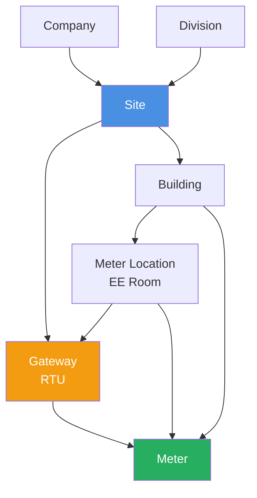
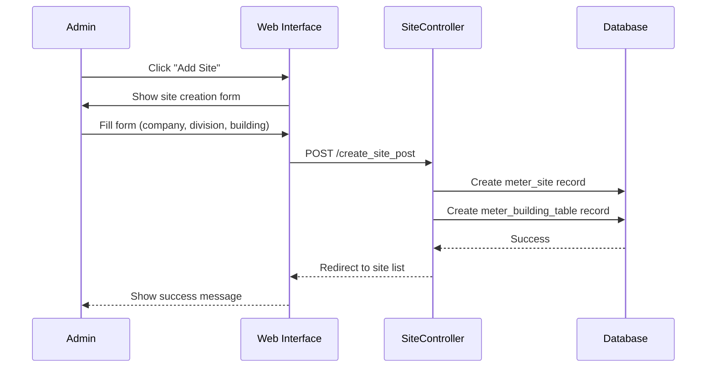
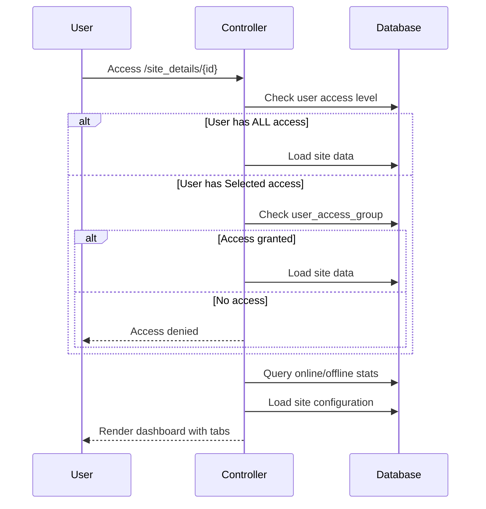

# Site Management

## 🏢 Overview

Site Management is the core module for managing physical locations (malls, properties) where metering equipment is deployed. Each site contains gateways, meters, buildings, and meter locations organized in a hierarchical structure.

**Controller:** `app/Http/Controllers/CAMRSiteController.php`  
**Route:** `/site`  
**Model:** `SiteModel` (table: `meter_site`)

## 📊 Site Dashboard

The Site Dashboard provides a comprehensive view with 5 tabs:

1. **Status** - Online/offline overview
2. **Gateway** - Gateway management
3. **Meter** - Meter management
4. **Building** - Building management
5. **Meter Location** - EE room management

### Dashboard Statistics

```sql
-- Calculated for each site
SELECT 
    COUNT(*) AS total_gateway FROM meter_rtu WHERE site_idx = ?
    COUNT(*) AS online_gateway WHERE DATEDIFF(NOW(), last_log_update) < 0
    COUNT(*) AS offline_gateway WHERE DATEDIFF(NOW(), last_log_update) >= 1
    COUNT(*) AS total_meter FROM meter_details WHERE site_idx = ?
    COUNT(*) AS online_meter WHERE DATEDIFF(NOW(), last_log_update) < 0
    COUNT(*) AS offline_meter WHERE DATEDIFF(NOW(), last_log_update) >= 1
```

## 📝 Features

### 1. Site List View

**Access:** Administrators see all sites, regular users see only assigned sites

**Displayed Information:**
- Building Code
- Building Description
- Company Name
- Division Code
- IP Network Configuration
- Cut-off Day
- Online/Offline Status
- Action Buttons (View, Edit, Delete)

**Access Control:**
```php
if($user_data->user_access == 'ALL') {
    // Show all sites
} else {
    // Join with user_access_group to show only assigned sites
}
```

### 2. Online/Offline Status

**Status Indicators:**
- 🟢 **Online** - Last update within 24 hours (`DATEDIFF < 1`)
- 🔴 **Offline** - No update for 1+ days
- ⚫ **No Data** - `last_log_update = '0000-00-00 00:00:00'`

**Logic:**
```php path=/Users/rli/Documents/DEC/camr_robinsons-main/camr_robinsons-main/app/Http/Controllers/CAMRSiteController.php start=130
$diff = date_diff($server_time, $last_log_update);
if($last_log_update == "0000/00/00 00:00") {
    $status = "No Data";
} else if($diff->format("%a") <= 0) {
    $status = "Online";
} else {
    $status = "Offline";
}
```

### 3. Create Site

**Required Fields:**
- Division (dropdown)
- Company (dropdown)
- Building Code
- Building Description
- IP Network Configuration (optional)
  - Device IP Range
  - IP Network
  - IP Netmask
  - IP Gateway
- Cut-off Day (billing)

**Process:**
1. Select company and division
2. Enter building details
3. Configure network settings (if applicable)
4. Set billing cut-off day
5. System creates both `meter_site` and `meter_building_table` records

### 4. Edit Site

**Editable Fields:**
- Division
- Company
- Building description
- IP network configuration
- Cut-off day

**Note:** Building code typically not changed after creation

### 5. Delete Site

**Validation:**
- Cannot delete site with associated gateways
- Cannot delete site with associated meters
- Soft delete sets `deleted_at` field

### 6. View Site Details

**Route:** `/site_details/{siteID}`

**Tabbed Interface:**

#### Status Tab
- Total/Online/Offline gateways
- Total/Online/Offline meters
- Building information
- Company/Division details
- Network configuration

#### Gateway Tab
- Gateway list with DataTables
- Add/Edit/Delete gateway
- Enable CSV update
- Enable SSH access
- Force load profile

#### Meter Tab
- Meter list with DataTables
- Add/Edit/Delete meter
- Import meters from CSV
- Assign to gateways and locations

#### Building Tab
- Building hierarchy management
- Add/Edit/Delete buildings
- Accordion view of buildings

#### Meter Location Tab
- EE room management
- Add/Edit/Delete locations
- Assign to buildings

## 📊 Hierarchy Structure



## 🔄 Workflows

### Create New Site Workflow



### Site Dashboard Access



## 📑 Database Relations

### Site Record Structure

```sql
-- meter_site table
INSERT INTO meter_site (
    division_idx,
    company_idx,
    building_idx,
    site_code,
    created_by_user_idx,
    created_at
) VALUES (?, ?, ?, ?, ?, NOW());

-- meter_building_table
INSERT INTO meter_building_table (
    site_idx,
    building_code,
    building_description,
    cut_off,
    device_ip_range,
    ip_network,
    ip_netmask,
    ip_gateway,
    created_by_user_idx,
    created_at
) VALUES (?, ?, ?, ?, ?, ?, ?, ?, ?, NOW());
```

### Query Site with Relationships

```sql
SELECT 
    ms.site_id,
    ms.last_log_update,
    mbt.building_code,
    mbt.building_description,
    mct.company_name,
    mdt.division_code,
    mbt.device_ip_range,
    mbt.ip_network,
    mbt.cut_off
FROM meter_site ms
JOIN meter_building_table mbt ON mbt.site_idx = ms.site_id
LEFT JOIN meter_division_table mdt ON mdt.division_id = ms.division_idx
LEFT JOIN meter_company_table mct ON mct.company_id = ms.company_idx
WHERE ms.site_id = ?
```

## 👥 User Access Control

### Access Levels

**ALL Access:**
- See all sites in the system
- Create/Edit/Delete any site
- Manage gateways and meters for any site

**Selected Access:**
- See only assigned sites (`user_access_group` table)
- View-only access to site details
- Cannot create, edit, or delete sites
- Can generate reports for assigned sites

### Access Check Example

```php path=null start=null
// Check user access level
$user = User::where('user_id', Session::get('loginID'))->first();

if($user->user_access == 'ALL') {
    // Admin: Show all sites
    $sites = SiteModel::all();
} else {
    // Regular user: Show only assigned sites
    $sites = SiteModel::join('user_access_group', 'user_access_group.site_idx', '=', 'meter_site.site_id')
        ->where('user_idx', $user->user_id)
        ->get();
}
```

## ⚠️ Important Notes

1. **Site-Building Relationship:** Sites have a one-to-one relationship with a primary building
2. **Status Calculation:** Based on `last_log_update` timestamp comparison
3. **Session Management:** Current tab state stored in session for user experience
4. **DataTables:** Uses server-side processing for large datasets
5. **Soft Delete:** Sites use soft delete (varchar field, not Laravel's soft delete)
6. **Activity Logging:** All site operations logged via Spatie ActivityLog

## 📡 Related Features

### From Site Dashboard

**Gateway Management:**
- Add gateways to site
- Monitor gateway status
- Enable remote configuration

**Meter Management:**
- Register meters
- Import meters via CSV
- Assign to gateways and locations

**Building Management:**
- Add buildings to site
- Configure building network
- Set billing cut-off

**Location Management:**
- Create EE rooms
- Organize by building
- Assign equipment

## 🐛 Troubleshooting

### Site Shows Offline

**Check:**
1. Gateway `last_log_update` timestamps
2. Gateway network connectivity
3. Gateway polling status

```sql
-- Check gateway status
SELECT gateway_sn, last_log_update, 
       DATEDIFF(NOW(), last_log_update) AS days_offline
FROM meter_rtu
WHERE site_idx = ?
ORDER BY last_log_update DESC;
```

### Cannot Delete Site

**Reason:** Site has associated equipment

**Solution:**
1. Remove or reassign all meters
2. Remove all gateways
3. Remove buildings and locations
4. Then delete site

### User Cannot See Site

**Check Access:**
```sql
SELECT * FROM user_access_group
WHERE user_idx = ? AND site_idx = ?;
```

**Grant Access:** Add record to `user_access_group` table

## 📚 Related Documentation

- [Database Schema](../database-schema.md) - meter_site table
- [Models](../models.md) - SiteModel
- [Gateway Management](gateway-management.md) - Managing gateways
- [Meter Management](meter-management.md) - Managing meters
- [Building Management](building-management.md) - Building hierarchy
- [User Management](../user-management.md) - Access control

---

**Primary Route:** `/site`  
**Dashboard Route:** `/site_details/{siteID}`  
**Access:** Login required (`isLoggedIn` middleware)  
**DataTables:** Server-side processing enabled
