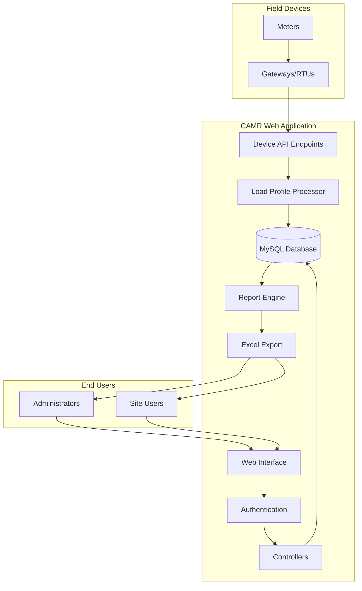

# System Overview

## 📋 Project Summary

**Project Name:** CAMR Robinsons - Centralized Automated Meter Reading  
**Purpose:** Monitor and report on electricity consumption across multiple Robinsons properties  
**Framework:** Laravel 8.x  
**Database:** MySQL (`meter_reading_robinsons`)  
**Status:** Production

## 🎯 Business Objectives

The CAMR system was developed to:

1. **Centralize Meter Data Collection** - Aggregate electricity consumption data from multiple sites into a single platform
2. **Enable Real-Time Monitoring** - Track gateway and meter status, detect offline devices
3. **Generate Compliance Reports** - Produce SAP-compatible reports for accounting and billing integration
4. **Support Multi-Site Management** - Allow administrators to manage multiple properties from one interface
5. **Provide Consumption Analytics** - Analyze energy usage patterns at site, building, and meter levels

## 🏗️ System Architecture

### High-Level Components

### Data Flow

1. **Data Collection:**
   - Gateways poll meters on-site
   - Gateways upload load profile data to `/lp/receive_file.php`
   - Data stored in `meter_data` and `load_profile` tables

2. **Device Management:**
   - Gateways poll `/rtu/index.php/rtu/rtu_check_update/{mac}/...` endpoints
   - System provides configuration updates (CSV, site codes)
   - Remote control capabilities (SSH enable/disable, force load profile)

3. **User Interface:**
   - Web-based dashboard for site management
   - Multi-level access control (admin vs. site-specific users)
   - Real-time status monitoring

4. **Reporting:**
   - Multiple report types (SAP, RAW, Site, Consumption, Demand)
   - Web preview with DataTables
   - Direct Excel export functionality

## 🔑 Key Features Breakdown

### Site Management
- Create and configure sites with metadata (location, company, division)
- Dashboard view showing gateways, meters, and status
- Building and meter location organization
- Site access assignment to users

### Gateway Management
- Register gateways with MAC address, IP, and metadata
- Monitor online/offline status
- Remote configuration:
  - CSV updates for meter configurations
  - Site code updates
  - SSH access control
  - Force load profile collection
- Import meters from CSV

### Meter Management
- Register meters with serial numbers and metadata
- Associate meters with gateways, buildings, and locations
- Track meter data collection status
- Import/export via Excel

### Reporting System
- **SAP Report:** Formatted for SAP system import
- **RAW Report:** Unprocessed meter data
- **Site Report:** Site-level consumption summaries
- **Consumption Report:** Hourly/daily analysis per meter
- **Demand Report:** Peak demand tracking (15-min intervals)
- **Offline Report:** Gateway and meter availability
- **Site As-Built:** Infrastructure documentation

## 👥 User Roles

### Administrator
- Full system access
- Manage all sites, gateways, and meters
- Create and manage users
- Configure companies and divisions
- Customize web interface branding

### Site User
- Access assigned sites only
- View site dashboards and reports
- Generate reports for authorized sites
- Cannot manage users or system configuration

## 🔐 Security Features

- Session-based authentication
- Password reset via email
- Role-based access control
- Site-level access restrictions
- Activity logging (via Spatie Laravel ActivityLog)
- Middleware protection on all routes (`isLoggedIn`, `alreadyLoggedIn`)

## 📊 Data Model Overview

### Core Entities
- **Sites** - Physical locations (malls, properties)
- **Gateways** - Data collection devices (RTUs)
- **Meters** - Electricity meters
- **Buildings** - Site subdivisions
- **Meter Locations** - EE rooms within buildings
- **Companies** - Organizations
- **Divisions** - Company subdivisions
- **Users** - System accounts
- **Meter Data** - Time-series consumption data
- **Load Profiles** - Detailed load curve data

### Relationships
- Sites belong to Companies and Divisions
- Gateways belong to Sites
- Meters belong to Gateways, Buildings, and Meter Locations
- Users have access to specific Sites (many-to-many)
- Meter Data links to Meters and Gateways

## 🚀 Technology Highlights

- **Laravel 8** - Modern PHP framework with Eloquent ORM
- **DataTables** - Server-side pagination and filtering for large datasets
- **Maatwebsite Excel** - Excel import/export with PhpSpreadsheet
- **Blade Templates** - Server-side rendering with Bootstrap UI
- **Laravel Mix** - Asset compilation (Webpack wrapper)
- **Activity Logging** - Audit trail for user actions

## 📈 Scalability Considerations

- Designed for multiple sites (current: Robinsons properties)
- Supports many-to-many gateway-meter relationships
- Time-series data stored with indexes on timestamps
- DataTables pagination for large result sets
- Excel export with memory-efficient streaming

## 🔄 Integration Points

### Inbound
- Gateway device polling (RTU check update endpoints)
- Load profile data upload (POST multipart/form-data)

### Outbound
- SAP report generation (Excel format)
- Email notifications (password reset)

## 📅 Maintenance Schedule

### Regular Tasks
- Database backup and retention (time-series data grows continuously)
- Monitor storage for load profile files
- Review offline gateway/meter alerts
- User access audits

### Periodic Updates
- Update meter configurations via CSV
- Refresh site codes for gateways
- Generate monthly/quarterly reports

## 🎓 Learning Path for New Developers

1. **Review this documentation** - Understand system purpose and architecture
2. **Explore the database** - Review migrations and models
3. **Study key controllers** - CAMRSiteController, CAMRGatewayController, CAMRMeterController
4. **Test report generation** - Run reports to see data flow
5. **Examine device API** - CAMRGatewayDeviceController and LoadProfileController
6. **Read route definitions** - `routes/web.php` maps all endpoints

---

**Next Steps:** Review [System Requirements](system-requirements.md) and [Installation Guide](installation.md)
