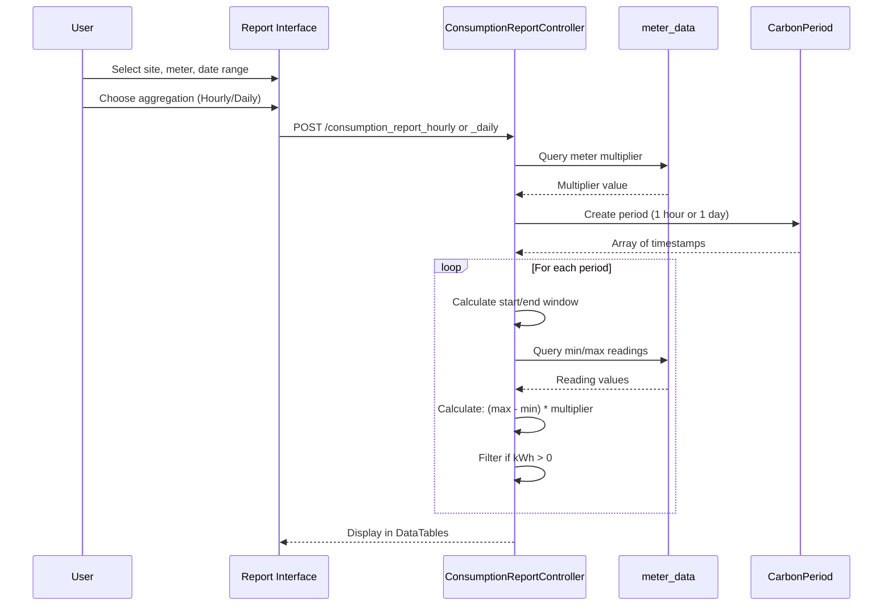

# Consumption Report

## 📊 Overview

The Consumption Report analyzes meter energy consumption over flexible time periods with hourly or daily aggregation. It calculates consumption between readings and applies meter multipliers for accurate kWh totals.

**Controller:** `ConsumptionReportController.php`  
**Route:** `/consumption_report`  
**Data Source:** `meter_data` table

## 🔑 Key Features

### Report Types

**1. Hourly Consumption**
- Aggregates consumption per hour
- Uses CarbonPeriod with '1 hour' intervals
- 55-minute reading windows
- Filters zero consumption periods

**2. Daily Consumption**
- Aggregates consumption per day
- Uses CarbonPeriod with '1 Day' intervals  
- 1435-minute (23h 55m) reading windows
- Filters zero consumption periods

### Report Parameters

- **Site:** Building/property selection
- **Meter:** Specific meter
- **Start Date/Time:** Report period start
- **End Date/Time:** Report period end
- **Aggregation:** Hourly or Daily
- **Format:** DataTables or Excel export

## 📊 Calculation Logic

### Consumption Formula

```php
$consumption_kwh = ($max_reading - $min_reading) * $meter_multiplier;
```

**Where:**
- `$max_reading` = Latest `wh_total` in period
- `$min_reading` = Earliest `wh_total` in period
- `$meter_multiplier` = CT/PT multiplier from meter config

### Hourly Consumption

```php path=/Users/rli/Documents/DEC/camr_robinsons-main/camr_robinsons-main/app/Http/Controllers/ConsumptionReportController.php start=115
$period = CarbonPeriod::create(
    "$start_date $start_time", 
    '1 hour', 
    "$end_date $end_time"
);

foreach ($period as $key => $date) {
    $hourly = $date->format('Y-m-d H:i:s');
    
    // Start: 5 minutes before the hour
    $hourly_start = $hourly - 5 minutes;
    
    // End: 55 minutes after the hour
    $hourly_end = $hourly + 55 minutes;
    
    // Query min and max readings in window
    $KWh = ($max_wh_total - $min_wh_total) * $meter_multiplier;
    
    if($KWh > 0) {
        // Include in report
    }
}
```

**Reading Window:**
- Hour: 10:00
- Start: 09:55 (5 min before)
- End: 10:55 (55 min after)
- Captures: 09:55 to 10:55 readings

### Daily Consumption

```php path=/Users/rli/Documents/DEC/camr_robinsons-main/camr_robinsons-main/app/Http/Controllers/ConsumptionReportController.php start=230
$period = CarbonPeriod::create(
    "$start_date $start_time", 
    '1 Day', 
    "$end_date $end_time"
);

foreach ($period as $key => $date) {
    $daily = $date->format('Y-m-d H:i:s');
    
    // Start: 5 minutes before
    $daily_start = $daily - 5 minutes;
    
    // End: 1435 minutes (23h 55m) after
    $daily_end = $daily + 1435 minutes;
    
    $KWh = ($max_wh_total - $min_wh_total) * $meter_multiplier;
    
    if($KWh > 0) {
        // Include in report
    }
}
```

**Reading Window:**
- Day: 2024-01-15 00:00
- Start: 2024-01-14 23:55
- End: 2024-01-15 23:55
- Captures: Nearly 24-hour period

## 📊 Query Logic

### Min/Max Reading Query

```sql
SELECT 
    a.meter_id AS meter_id,
    a.datetime AS min_datetime,
    a.wh_total AS min_wh_total,
    b.datetime AS max_datetime,
    b.wh_total AS max_wh_total
FROM meter_data a
USE INDEX(meter_data_index)
INNER JOIN meter_data b
WHERE 
    a.meter_id = ? AND
    a.location = ? AND
    a.datetime >= ? AND  -- period start
    b.meter_id = ? AND
    b.datetime >= ?      -- period end
LIMIT 0, 1
```

**Key Points:**
- Uses `meter_data_index` for performance
- Self-join to get min and max in one query
- Filters by meter_id, location, datetime range

### Get Meter Multiplier

```sql
SELECT meter_multiplier
FROM meter_details
WHERE meter_name = ? AND site_idx = ?
```

## 📝 Report Output

### Displayed Columns

**Hourly Report:**
- Hour (datetime)
- Building Code
- Min DateTime (first reading)
- Min kWh Total (starting value)
- Max DateTime (last reading)
- Max kWh Total (ending value)
- Multiplier
- kWh Consumed (calculated)

**Daily Report:**
- Day (datetime)
- Building Code
- Min DateTime
- Min kWh Total
- Max DateTime
- Max kWh Total
- Multiplier
- kWh Consumed

### Filtering

**Zero Consumption Filter:**
```php
if($KWh > 0) {
    // Only include periods with consumption
}
```

Periods with zero or negative consumption are excluded from results.

## 🔄 Usage Workflow



## ⚡ Performance

### Index Usage

**Critical Index:**
```sql
CREATE INDEX meter_data_index 
ON meter_data(meter_id, location, datetime);
```

### Performance Considerations

**Hourly Report:**
- 1 day = 24 queries
- 1 week = 168 queries
- 1 month = 720 queries

**Daily Report:**
- 1 month = 30 queries
- 1 year = 365 queries

**Recommendations:**
- Hourly: Best for ≤ 7 days
- Daily: Best for > 7 days
- Use Daily for month/year analysis

### Optimization

**CarbonPeriod:**
- Efficient date iteration
- No manual date arithmetic
- Memory efficient

**Query Optimization:**
- Index on (meter_id, location, datetime)
- LIMIT 0,1 for single result
- Self-join for min/max in one query

## 🐛 Troubleshooting

### No Data Returned

**Check:**
1. Meter has data for selected period
2. Meter multiplier > 0
3. Date range contains readings
4. All consumption > 0 (zero filtered out)

**Debug Query:**
```sql
SELECT COUNT(*), MIN(datetime), MAX(datetime)
FROM meter_data
WHERE meter_id = ? AND location = ?
AND datetime BETWEEN ? AND ?;
```

### Incorrect Consumption Values

**Verify:**
1. Meter multiplier correct
2. CT/PT ratios configured
3. Meter readings increasing (not reset)
4. Time zone alignment

**Check Multiplier:**
```sql
SELECT meter_name, meter_multiplier
FROM meter_details
WHERE meter_id = ?;
```

### Missing Time Periods

**Reasons:**
- No data for that period
- Consumption = 0 (filtered out)
- Gateway offline
- Meter not polled

**Check Coverage:**
```sql
SELECT DATE(datetime) as date, COUNT(*) as readings
FROM meter_data
WHERE meter_id = ?
AND datetime BETWEEN ? AND ?
GROUP BY DATE(datetime)
ORDER BY date;
```

### Slow Performance

**Solutions:**
1. Use Daily instead of Hourly for long ranges
2. Verify index exists and is used
3. Limit date range
4. Check table size

## 📊 Usage Examples

### Weekly Hourly Analysis

**Parameters:**
- Meter: MAIN-METER-001
- Start: 2024-01-15 00:00
- End: 2024-01-21 23:59
- Type: Hourly

**Result:** ~168 rows (7 days × 24 hours)

**Use Case:**
- Identify peak usage hours
- Analyze daily patterns
- Detect anomalies

### Monthly Daily Analysis

**Parameters:**
- Meter: TENANT-A-MAIN
- Start: 2024-01-01 00:00
- End: 2024-01-31 23:59
- Type: Daily

**Result:** ~31 rows (31 days)

**Use Case:**
- Monthly consumption billing
- Trend analysis
- Budget tracking

### Comparison Query

**Month-over-Month:**
```sql
SELECT 
    DATE_FORMAT(datetime, '%Y-%m') as month,
    SUM(kwh_total) as total_consumption
FROM consumption_report_results
GROUP BY month
ORDER BY month;
```

## 💡 Best Practices

### Aggregation Selection

**Use Hourly When:**
- Analyzing patterns < 7 days
- Need detailed breakdown
- Identifying peak hours
- Troubleshooting issues

**Use Daily When:**
- Reporting periods > 7 days
- Monthly/yearly trends
- Billing summaries
- Performance critical

### Date Range Guidelines

**Hourly:**
- Optimal: 1-7 days
- Maximum: 30 days
- Beyond 30 days: Use Daily

**Daily:**
- Optimal: 7-365 days
- No practical limit
- Efficient for any range

### Meter Selection

**Main Meters:**
- Best for overall consumption
- Billing purposes
- Tenant tracking

**Sub Meters:**
- Circuit-level analysis
- Load breakdown
- Energy distribution

## 📚 Related Documentation

- [SAP Report](sap-report.md) - Billing with month comparison
- [RAW Report](raw-report.md) - Detailed 15-min data
- [Demand Report](demand-report.md) - Peak demand analysis
- [Database Schema](../database-schema.md) - meter_data table
- [Meter Management](../modules/meter-management.md) - Meter configuration

---

**Access:** Login required (`isLoggedIn` middleware)  
**Data Aggregation:** Hourly or Daily via CarbonPeriod  
**Calculation:** (max_reading - min_reading) × multiplier  
**Filtering:** Zero consumption periods excluded  
**Export Format:** DataTables (Excel export available)  
**Index Required:** `meter_data_index` for optimal performance
