# Demand Report

## 📊 Overview

The Demand Report calculates electrical demand (kW) over time periods by analyzing energy consumption intervals. Demand represents the rate of energy usage and is critical for capacity planning and demand charge billing.

**Controller:** `DemandReportController.php`  
**Route:** `/demand_report`  
**Data Source:** `meter_data` table

## 🔑 Key Features

### Report Types

**1. Hourly Demand**
- Calculates demand per hour
- Uses CarbonPeriod with '1 hour' intervals
- 55-minute reading windows
- Filters zero demand periods

**2. 15-Minute Demand** (Optional)
- Most accurate demand calculation
- Uses CarbonPeriod with '15 minute' intervals
- 14-minute reading windows
- Standard demand metering interval

### Report Parameters

- **Site:** Building/property selection
- **Meter:** Specific meter
- **Start Date/Time:** Report period start
- **End Date/Time:** Report period end
- **Interval:** Hourly or 15-minute
- **Format:** DataTables or Excel export

## 📊 Demand Calculation

### Demand Formula

```php
$demand_kw = (60 / $interval_minutes) * $kwh_consumed * $meter_multiplier;
```

**Where:**
- `60` = minutes per hour
- `$interval_minutes` = actual time between readings
- `$kwh_consumed` = energy used in interval
- `$meter_multiplier` = CT/PT multiplier

### Calculation Logic

```php path=/Users/rli/Documents/DEC/camr_robinsons-main/camr_robinsons-main/app/Http/Controllers/DemandReportController.php start=170
// Calculate interval time in minutes
$to_time = strtotime($min_datetime);
$from_time = strtotime($max_datetime);
$total_intervaltime = round((abs($to_time - $from_time)) / 60, 0);

// Calculate energy consumption
$_wh_total = ($max_wh_total - $min_wh_total);

// Calculate demand (kW)
if($total_intervaltime > 0) {
    $kw_demand = (60 / $total_intervaltime) * ($_wh_total) * $meter_multiplier;
} else {
    $kw_demand = 0;
}
```

### Why Demand Matters

**Demand vs Energy:**
- **Energy (kWh):** Total consumption over time
- **Demand (kW):** Rate of consumption at a specific moment

**Example:**
- 10 kWh consumed in 1 hour = 10 kW demand
- 10 kWh consumed in 2 hours = 5 kW demand
- Same energy, different demand

**Billing Impact:**
- Many utilities charge based on peak demand
- Demand charges can be 30-70% of electric bill
- Reducing peak demand saves money

## 📊 Query Logic

### Hourly Demand Query

```php path=/Users/rli/Documents/DEC/camr_robinsons-main/camr_robinsons-main/app/Http/Controllers/DemandReportController.php start=115
$period = CarbonPeriod::create(
    "$start_date $start_time", 
    '1 hour', 
    "$end_date $end_time"
);

foreach ($period as $key => $date) {
    $hourly = $date->format('Y-m-d H:i:s');
    
    // Window: -5 min to +55 min
    $hourly_start = $hourly - 5 minutes;
    $hourly_end = $hourly + 55 minutes;
    
    // Query min/max readings
    $kwh_consumed = ($max_wh_total - $min_wh_total);
    $interval_minutes = time difference in minutes;
    $kw_demand = (60 / $interval_minutes) * $kwh_consumed * $multiplier;
    
    if($kw_demand > 0) {
        // Include in report
    }
}
```

### Min/Max Reading Query

```sql
SELECT 
    a.meter_id AS meter_id,
    IFNULL(a.datetime, '0000-00-00 00:00:00') AS min_datetime,
    IFNULL(a.wh_total, 0) AS min_wh_total,
    IFNULL(b.datetime, '0000-00-00 00:00:00') AS max_datetime,
    IFNULL(b.wh_total, 0) AS max_wh_total
FROM meter_data a
USE INDEX(meter_data_index)
INNER JOIN meter_data b
WHERE 
    a.meter_id = ? AND
    a.location = ? AND
    a.datetime >= ? AND  -- period start
    b.meter_id = ? AND
    b.datetime >= ?      -- period end
LIMIT 0, 1
```

### Handling Edge Cases

```php path=/Users/rli/Documents/DEC/camr_robinsons-main/camr_robinsons-main/app/Http/Controllers/DemandReportController.php start=152
if(@$site_data[0]->min_wh_total == 0) {
    // No min reading, use max for both
    $min_wh_total = $max_wh_total;
    $min_datetime = $max_datetime;
} else {
    // Normal case
    $min_wh_total = $site_data[0]->min_wh_total;
    $min_datetime = $site_data[0]->min_datetime;
}

if($max_wh_total == 0 || ($max_wh_total - $min_wh_total) == 0) {
    $kw_demand = 0;  // No consumption = no demand
}
```

## 📝 Report Output

### Displayed Columns

**Hourly Demand Report:**
- Hour (datetime)
- Building Code
- Min DateTime (period start)
- Min kWh Total (starting value)
- Max DateTime (period end)
- Max kWh Total (ending value)
- kW Demand (calculated)
- Multiplier

### Filtering

**Zero Demand Filter:**
```php
if($kw_demand > 0) {
    // Only include periods with demand
}
```

Periods with zero demand are excluded from results.

## 🔄 Usage Workflow

```mermaid
sequenceDiagram
    participant User
    participant UI as Report Interface
    participant C as DemandReportController
    participant DB as meter_data
    participant Carbon as CarbonPeriod
    
    User->>UI: Select site, meter, date range
    User->>UI: Choose interval (Hourly/15-min)
    UI->>C: POST /demand_report_hourly
    C->>DB: Query meter multiplier
    DB-->>C: Multiplier value
    
    C->>Carbon: Create period (1 hour or 15 min)
    Carbon-->>C: Array of timestamps
    
    loop For each period
        C->>C: Calculate start/end window
        C->>DB: Query min/max readings
        DB-->>C: Reading values with timestamps
        C->>C: Calculate interval time (minutes)
        C->>C: Calculate kWh consumed
        C->>C: Calculate: (60/interval) × kWh × multiplier
        C->>C: Filter if kW > 0
    end
    
    C-->>UI: Display in DataTables
```



## ⚡ Performance

### Index Usage

**Critical Index:**
```sql
CREATE INDEX meter_data_index 
ON meter_data(meter_id, location, datetime);
```

### Performance Considerations

**Hourly Demand:**
- 1 day = 24 queries
- 1 week = 168 queries
- 1 month = 720 queries

**15-Minute Demand:**
- 1 day = 96 queries
- 1 week = 672 queries
- 1 month = 2,880 queries

**Recommendations:**
- Hourly: Best for ≤ 30 days
- 15-minute: Best for ≤ 7 days
- For longer periods, use hourly or daily aggregation

## 🐛 Troubleshooting

### Zero Demand Results

**Check:**
1. Meter has data for period
2. Energy consumption > 0
3. Meter multiplier correct
4. Interval time calculated correctly

**Debug Query:**
```sql
SELECT 
    datetime,
    wh_total,
    TIMESTAMPDIFF(MINUTE, LAG(datetime) OVER (ORDER BY datetime), datetime) AS interval_min
FROM meter_data
WHERE meter_id = ? 
AND datetime BETWEEN ? AND ?
ORDER BY datetime;
```

### Incorrect Demand Values

**Common Issues:**
1. **Too High:** Multiplier applied twice
2. **Too Low:** Multiplier not applied
3. **Negative:** Min/Max reversed
4. **Zero:** No consumption in interval

**Verify Calculation:**
```sql
SELECT 
    meter_name,
    meter_multiplier,
    -- Example: 10 kWh in 60 minutes with 20x multiplier
    -- Demand = (60/60) * 10 * 20 = 200 kW
    (60/60) * 10 * meter_multiplier AS example_demand
FROM meter_details
WHERE meter_id = ?;
```

### Missing Time Periods

**Reasons:**
- No readings in period
- Demand = 0 (filtered out)
- Gateway offline
- Meter not polled

### Interval Time Issues

**Check Timestamp Difference:**
```sql
SELECT 
    DATE_FORMAT(datetime, '%Y-%m-%d %H:%i') as time,
    wh_total,
    LAG(datetime) OVER (ORDER BY datetime) as prev_time,
    TIMESTAMPDIFF(MINUTE, LAG(datetime) OVER (ORDER BY datetime), datetime) as minutes_diff
FROM meter_data
WHERE meter_id = ?
ORDER BY datetime
LIMIT 20;
```

## 📊 Usage Examples

### Daily Peak Demand Analysis

**Parameters:**
- Meter: MAIN-METER-001
- Start: 2024-01-15 00:00
- End: 2024-01-15 23:59
- Type: Hourly

**Result:** ~24 rows showing hourly demand

**Use Case:**
- Identify peak demand hours
- Analyze load profiles
- Plan demand reduction strategies

### Monthly Demand Report

**Parameters:**
- Meter: TENANT-A-MAIN
- Start: 2024-01-01 00:00
- End: 2024-01-31 23:59
- Type: Hourly

**Result:** ~744 rows (31 days × 24 hours)

**Use Case:**
- Billing demand calculation
- Peak demand identification
- Capacity planning

### Find Peak Demand

**Query:**
```sql
SELECT 
    hour,
    max_datetime,
    kw_demand,
    building_code
FROM demand_report_results
WHERE meter_id = ?
AND hour BETWEEN ? AND ?
ORDER BY kw_demand DESC
LIMIT 1;
```

## 💡 Best Practices

### Interval Selection

**Use Hourly When:**
- Analyzing patterns > 1 week
- Billing demand calculation
- Trend analysis
- Performance critical

**Use 15-Minute When:**
- Accurate peak demand measurement
- Utility billing compliance (15-min standard)
- Short-term analysis (≤ 7 days)
- Detailed load profiling

### Demand Management

**Reduce Peak Demand:**
1. Identify peak hours from report
2. Schedule high-load operations off-peak
3. Implement load shedding
4. Use energy storage
5. Improve power factor

**Monitor Trends:**
- Track demand over time
- Compare month-to-month
- Identify seasonal patterns
- Set demand targets

### Billing Demand

**Typical Utility Rules:**
- Use highest 15-minute interval
- May use 80-90% of peak if higher than previous 11 months
- "Ratchet clause" - minimum based on historical peak

**Calculate Billing Demand:**
```sql
SELECT MAX(kw_demand) as billing_demand
FROM demand_report_results
WHERE meter_id = ?
AND hour BETWEEN ? AND ?;
```

## 📚 Related Documentation

- [Consumption Report](consumption-report.md) - Energy consumption (kWh)
- [RAW Report](raw-report.md) - Detailed 15-min data with demand fields
- [SAP Report](sap-report.md) - Billing energy comparison
- [Database Schema](../database-schema.md) - meter_data table
- [Meter Management](../modules/meter-management.md) - Meter configuration

---

**Access:** Login required (`isLoggedIn` middleware)  
**Calculation:** (60 / interval_minutes) × kWh × multiplier  
**Standard Interval:** 15 minutes (utility standard)  
**Filtering:** Zero demand periods excluded  
**Use Case:** Capacity planning, demand charge billing, peak demand tracking  
**Index Required:** `meter_data_index` for optimal performance
