# 📴 Offline Report

The **Offline Report** provides real-time visibility into gateway and meter devices that have stopped transmitting data to the CAMR system. This critical operational report helps identify communication issues, device failures, or network problems that require immediate attention.

---

## 📋 Overview

**Controller:** `OfflineReportController.php`  
**Routes:**
- `GET /download_offline_gateway` - Export offline gateway report  
- `GET /download_offline_meter` - Export offline meter report

**Purpose:** Generate Excel reports listing all gateways and meters that have not transmitted data for 24 hours or more, enabling operations teams to quickly identify and troubleshoot connectivity issues.

**Report Types:**
1. **Offline Gateway Report** - RTU devices with no communication
2. **Offline Meter Report** - Individual meters with stale data

---

## 🔑 Key Features

### Input Parameters

| Parameter | Type | Description |
|-----------|------|-------------|
| `siteID` | Integer | Site identifier (required) |

### Offline Detection Criteria

A device is considered **offline** if:
- Last log update timestamp is **24+ hours old** (`DATEDIFF(NOW(), last_log_update) >= 1`)
- Last log update is set to default value (`'0000-00-00 00:00:00'`)

### Excel Output Format

**Offline Gateway Report:**
- Template: `public/template/Offline Gateway.xlsx`
- Filename: `Offline_Gateway_{building_code}_{timestamp}.xlsx`

**Offline Meter Report:**
- Template: `public/template/Offline Meter.xlsx`
- Filename: `Offline_Meter_{building_code}_{timestamp}.xlsx`

---

## ⚙️ Query Logic

### Offline Gateway Detection

```php path=/Users/rli/Documents/DEC/camr_robinsons-main/camr_robinsons-main/app/Http/Controllers/OfflineReportController.php start=77
$raw_query_offline = "SELECT
    `meter_rtu`.`rtu_id`,
    `meter_rtu`.`gateway_sn`,
    `meter_rtu`.`gateway_mac`,
    `meter_rtu`.`gateway_ip`,
    `meter_rtu`.`idf_number`,
    `meter_rtu`.`switch_name`,
    `meter_rtu`.`idf_port`,
    `meter_rtu`.`last_log_update`,
    `meter_rtu`.`soft_rev`,
    `meter_rtu`.`location_idx`,
    `meter_location_table`.`location_code`, 
    `meter_location_table`.`location_description` 
from `meter_rtu`
inner join `meter_location_table` 
    on `meter_location_table`.`location_id` = `meter_rtu`.`location_idx`
where `meter_rtu`.`site_idx` = ?
    and DATEDIFF(NOW(), meter_rtu.last_log_update) >= 1 
    OR (meter_rtu.last_log_update = '0000-00-00 00:00:00' 
        AND meter_rtu.site_idx = ?)";

$offline_gateway_data = DB::select("$raw_query_offline", [$siteID, $siteID]);
```

**Query Explanation:**
1. Joins `meter_rtu` with `meter_location_table` to get EE room information
2. Filters by site ID
3. Identifies offline gateways using two conditions:
   - `DATEDIFF(NOW(), last_log_update) >= 1` - No data for 24+ hours
   - `last_log_update = '0000-00-00 00:00:00'` - Never initialized

### Offline Meter Detection

```php path=/Users/rli/Documents/DEC/camr_robinsons-main/camr_robinsons-main/app/Http/Controllers/OfflineReportController.php start=197
$raw_query_offline = "SELECT
    `meter_details`.`meter_id`,
    `meter_details`.`meter_name`,
    `meter_details`.`customer_name`,
    `meter_details`.`meter_role`,
    `meter_details`.`meter_status`,
    `meter_details`.`last_log_update`,
    `meter_details`.`meter_status`,
    `meter_details`.`meter_remarks`,
    `meter_details`.`meter_default_name`,
    `meter_configuration_file`.`config_file`,
    `meter_location_table`.`location_code`,
    `meter_location_table`.`location_description`,
    `meter_rtu`.`gateway_sn`
from meter_details
    left join `meter_location_table` 
        on `meter_location_table`.`location_id` = `meter_details`.`location_idx`
    left join `meter_rtu` 
        on `meter_rtu`.`rtu_id` = `meter_details`.`rtu_idx`
    left join `meter_configuration_file` 
        on `meter_configuration_file`.`config_id` = `meter_details`.`config_idx`
where `meter_details`.`site_idx` = ?
    and DATEDIFF(NOW(), meter_details.last_log_update) >= 1 
    OR (meter_details.last_log_update = '0000-00-00 00:00:00' 
        AND meter_details.site_idx = ?)";

$offline_meter_data = DB::select("$raw_query_offline", [$siteID, $siteID]);
```

**Query Explanation:**
1. Joins `meter_details` with location, gateway, and configuration tables
2. Uses LEFT JOIN to include meters even if related records are missing
3. Applies same 24-hour offline threshold as gateway detection

---

## 📊 Report Data Flow

```mermaid
flowchart TB
    Start([User Request]) --> ValidateSite[Validate Site ID]
    ValidateSite --> QuerySite[Query Site/Building Data]
    QuerySite --> SetMemory["Set Execution Limits<br/>(max_execution_time: 0<br/>memory_limit: 500M)"]
    SetMemory --> LoadTemplate[Load Excel Template]
    
    LoadTemplate --> Choice{Report Type}
    
    Choice -->|Gateway| QueryGW["Query Offline Gateways<br/>(DATEDIFF >= 1)"]
    Choice -->|Meter| QueryMeter["Query Offline Meters<br/>(DATEDIFF >= 1)"]
    
    QueryGW --> LoopGW["Populate Excel Rows<br/>(Gateway Data)"]
    QueryMeter --> LoopMeter["Populate Excel Rows<br/>(Meter Data)"]
    
    LoopGW --> GWColumns["Write Columns:<br/>• Gateway SN<br/>• IP Address<br/>• MAC Address<br/>• IDF/Switch Info<br/>• Location<br/>• Last Update"]
    
    LoopMeter --> MeterColumns["Write Columns:<br/>• Meter Name<br/>• Customer Name<br/>• Gateway SN<br/>• Meter Role/Status<br/>• Config File<br/>• Location<br/>• Last Update"]
    
    GWColumns --> GenerateFile[Generate Excel File]
    MeterColumns --> GenerateFile
    
    GenerateFile --> Download["Stream to Browser<br/>(Force Download)"]
    Download --> End([Complete])
    
    style Start fill:#e1f5ff
    style End fill:#e1f5ff
    style QueryGW fill:#fff4e6
    style QueryMeter fill:#fff4e6
    style Download fill:#e8f5e9
```



---

## 📄 Excel Report Structure

### Offline Gateway Report Columns

| Column | Field | Description |
|--------|-------|-------------|
| A | Row Number | Sequential counter |
| B | Gateway Serial Number | Unique RTU identifier |
| C | Gateway IP | Device IP address |
| D | Gateway MAC | Device MAC address |
| E | IDF Number | Intermediate Distribution Frame number |
| F | Switch Name | Network switch identifier |
| G | IDF Port | Physical network port |
| H | Location Code | EE room code |
| I | Location Description | EE room description |
| J | Last Log Update | Last data transmission timestamp |

**Example Use Case:** Network troubleshooting - identifies which switch/port the offline gateway is connected to.

### Offline Meter Report Columns

| Column | Field | Description |
|--------|-------|-------------|
| A | Row Number | Sequential counter |
| B | Meter Name | User-assigned meter identifier |
| C | Customer Name | Tenant/customer name |
| D | Gateway Serial Number | Parent RTU device |
| E | Meter Role | Meter classification (Main, Sub, Check) |
| F | Meter Status | Active/Inactive |
| G | Meter Remarks | Notes/comments |
| H | Meter Default Name | System-generated name |
| I | Config File | Modbus configuration file |
| J | Location Code | EE room code |
| K | Location Description | EE room description |
| L | Last Log Update | Last data transmission timestamp |

**Example Use Case:** Billing verification - confirms which tenant meters are not reporting data.

---

## 🔄 Implementation Details

### Download Offline Gateway Report

```php path=/Users/rli/Documents/DEC/camr_robinsons-main/camr_robinsons-main/app/Http/Controllers/OfflineReportController.php start=19
public function download_offline_gateway(Request $request){
    $siteID = $request->siteID;

    // Query site data for building code (used in filename)
    $site_data = SiteModel::join('meter_building_table', ...)
        ->where('meter_site.site_id', $siteID)
        ->get([...]);
    
    $building_code = $site_data[0]->building_code;
    
    // Set execution limits for large reports
    ini_set('max_execution_time', 0);
    ini_set('memory_limit', '500M');
    
    // Load pre-formatted Excel template
    $spreadSheet = IOFactory::load(public_path('/template/Offline Gateway.xlsx'));
    
    $no_excl = 2;  // Start at row 2 (after header)
    $n = 1;        // Row counter
    
    // Populate spreadsheet with offline gateway data
    foreach ($offline_gateway_data as $data_column){
        $spreadSheet->getActiveSheet()
            ->setCellValue('A'.$no_excl, $n)
            ->setCellValue('B'.$no_excl, $data_column->gateway_sn)
            ->setCellValue('C'.$no_excl, $data_column->gateway_ip)
            // ... additional columns
            ->setCellValue('J'.$no_excl, $data_column->last_log_update);
        
        $no_excl++;
        $n++;
    }
    
    // Generate timestamped filename
    $_server_time = date('Y_m_d_H_i_s');
    $report_name = "Offline_Gateway_{$building_code}_{$_server_time}";
    
    // Stream Excel file to browser
    header('Content-Type: application/vnd.openxmlformats-officedocument.spreadsheetml.sheet');
    header("Content-Disposition: attachment;filename={$report_name}.xlsx");
    header('Cache-Control: max-age=0');
    ob_end_clean();
    $Excel_writer->save('php://output');
    exit();
}
```

### Download Offline Meter Report

Similar implementation pattern:
1. Query site/building data
2. Load `Offline Meter.xlsx` template
3. Execute offline meter query
4. Populate 12 columns (A-L) with meter data
5. Generate timestamped filename with `Offline_Meter_` prefix
6. Stream to browser as Excel download

---

## 📈 Site Dashboard Integration

Offline counts are displayed on the **Site Details** dashboard:

```php path=/Users/rli/Documents/DEC/camr_robinsons-main/camr_robinsons-main/app/Http/Controllers/CAMRSiteController.php start=345
$raw_query_offline = "SELECT 
    (
    SELECT COUNT(*) from `meter_rtu` where `site_idx` = ?
    ) AS `total_gateway`,
    (
    SELECT COUNT(*) from `meter_rtu` where `site_idx` = ? 
        and DATEDIFF(NOW(), meter_rtu.last_log_update) >= 1 
        OR (meter_rtu.last_log_update = '0000-00-00 00:00:00' AND `site_idx` = ?)
    ) AS `offline_gateway`,
    (
    SELECT COUNT(*) from `meter_details` where `site_idx` = ?
    ) AS `total_meter`,
    (
    SELECT COUNT(*) from `meter_details` where `site_idx` = ? 
        and DATEDIFF(NOW(), meter_details.last_log_update) >= 1 
        OR (meter_details.last_log_update = '0000-00-00 00:00:00' AND `site_idx` = ?)
    ) AS `offline_meter"`;

$offline_data = DB::select("$raw_query_offline", [$siteID, ..., $siteID]);
```

**Dashboard Display:**
- **Total Gateways:** 24
- **Offline Gateways:** 2 🔴 (with download button)
- **Total Meters:** 156
- **Offline Meters:** 8 🔴 (with download button)

Clicking the download button triggers the respective report generation.

---

## ⚡ Performance Considerations

### Execution Limits
```php
ini_set('max_execution_time', 0);  // No time limit
ini_set('memory_limit', '500M');    // 500MB memory allocation
```
These settings prevent timeout for sites with hundreds of offline devices.

### Query Optimization
- **Indexed columns:** `site_idx`, `last_log_update` should have database indexes
- **DATEDIFF function:** Uses MySQL's built-in date comparison (efficient)
- **JOIN strategy:** Inner join for gateways, LEFT join for meters (preserves orphaned records)

### Expected Performance

| Offline Devices | Generation Time | File Size |
|-----------------|-----------------|----------|
| 1-50 devices | < 2 seconds | < 100 KB |
| 51-200 devices | 2-5 seconds | 100-300 KB |
| 201-500 devices | 5-15 seconds | 300 KB-1 MB |
| 500+ devices | 15-30 seconds | 1-3 MB |

---

## 🛠️ Troubleshooting

### Issue: Report Shows All Devices Offline

**Cause:** System clock mismatch or gateway communication failure

**Solution:**
```sql
-- Check system time vs. last updates
SELECT 
    NOW() AS current_time,
    MAX(last_log_update) AS latest_gateway_update,
    DATEDIFF(NOW(), MAX(last_log_update)) AS days_offline
FROM meter_rtu
WHERE site_idx = 1;
```

If `days_offline` is unusually high (> 7 days), investigate:
- Gateway network connectivity
- Load profile API functionality
- Database synchronization

### Issue: Empty Report (No Offline Devices Found)

**Cause:** All devices are online OR query logic issue

**Solution:**
```sql
-- Verify there are devices with old timestamps
SELECT COUNT(*) 
FROM meter_rtu 
WHERE site_idx = 1 
    AND DATEDIFF(NOW(), last_log_update) >= 1;
```

If count is 0, all devices are healthy. Otherwise, check query parameter binding.

### Issue: Template File Not Found

**Error:** `public/template/Offline Gateway.xlsx` missing

**Solution:**
1. Verify template files exist:
   ```bash
   ls -la public/template/Offline*.xlsx
   ```
2. If missing, restore from backup or recreate with proper column headers
3. Ensure web server has read permissions on template directory

### Issue: Excel Download Corrupted

**Cause:** Output buffering not cleared before streaming

**Solution:**
Ensure `ob_end_clean()` is called before `save('php://output')`:
```php
ob_start();  // Start output buffering
// ... populate spreadsheet ...
ob_end_clean();  // Clear buffer (critical!)
$Excel_writer->save('php://output');
exit();
```

---

## 📖 Usage Examples

### Example 1: Daily Operational Check

**Scenario:** Operations team performs morning health check

1. Navigate to **Site Details** for Robinson's Galleria
2. Check dashboard metrics:
   - Total Gateways: 32
   - Offline Gateways: 3 🔴
3. Click **Download Offline Gateway Report**
4. Open Excel file: `Offline_Gateway_RG_2024_03_15_08_30_45.xlsx`
5. Review offline devices:
   - RTU-001 - Last update: 2024-03-13 (2 days ago)
   - RTU-012 - Last update: 0000-00-00 (never initialized)
   - RTU-024 - Last update: 2024-03-14 (1 day ago)
6. Create work orders for field technicians

### Example 2: Billing Period Verification

**Scenario:** Finance team preparing monthly billing

1. Before generating SAP Report, check offline meters
2. Download **Offline Meter Report** for each site
3. Identify meters with no data in billing period:
   - Tenant A Meter - 5 days offline
   - Tenant B Meter - 3 days offline
4. Options:
   - Estimate consumption based on historical data
   - Delay billing until meters are restored
   - Perform manual meter reading

### Example 3: Network Infrastructure Audit

**Scenario:** IT team troubleshooting network segment

1. Download Offline Gateway Report
2. Filter by IDF Number or Switch Name
3. Identify all gateways on problematic switch:
   - Switch-3, Port 12 - RTU-005 offline
   - Switch-3, Port 18 - RTU-009 offline
   - Switch-3, Port 24 - RTU-015 offline
4. Diagnose: Switch-3 port failures or upstream connectivity issue

---

## 🔐 Security & Access Control

### Route Middleware
```php path=/Users/rli/Documents/DEC/camr_robinsons-main/camr_robinsons-main/routes/web.php start=187
Route::get('/download_offline_gateway', 
    [OfflineReportController::class,'download_offline_gateway'])
    ->name('download_offline_gateway')
    ->middleware('isLoggedIn');

Route::get('/download_offline_meter', 
    [OfflineReportController::class,'download_offline_meter'])
    ->name('download_offline_meter')
    ->middleware('isLoggedIn');
```

**Authentication:** `isLoggedIn` middleware enforces user authentication

**Authorization:** Site-level access control (user must have permission for the requested `siteID`)

### Audit Logging

**Not currently implemented** - Consider adding activity logging:
```php
activity('offline_report')
    ->causedBy(auth()->user())
    ->withProperties(['site_id' => $siteID, 'report_type' => 'gateway'])
    ->log('Downloaded offline gateway report');
```

---

## 📝 Best Practices

### For Operations Teams

1. **Daily Monitoring**
   - Check offline counts every morning
   - Download reports for any site with > 5% devices offline
   - Track offline duration trends over time

2. **Proactive Maintenance**
   - Investigate any gateway offline > 48 hours
   - Schedule preventive checks for devices with intermittent connectivity
   - Maintain network infrastructure documentation

3. **Escalation Procedures**
   - 1 day offline: Log issue, monitor
   - 3 days offline: Field technician dispatch
   - 7 days offline: Site visit + equipment replacement consideration

### For Development Teams

1. **Template Management**
   - Version control Excel templates alongside code
   - Document required column headers
   - Test template changes in staging environment

2. **Query Optimization**
   - Add database indexes on `last_log_update` columns
   - Consider materialized views for large sites (> 500 devices)
   - Monitor query execution time in production

3. **Error Handling**
   - Implement try-catch blocks with user-friendly error messages
   - Log exceptions to application logs
   - Add fallback queries if complex joins fail

### For System Administrators

1. **Database Maintenance**
   ```sql
   -- Monthly cleanup of very old offline records (> 1 year)
   UPDATE meter_rtu 
   SET last_log_update = NULL 
   WHERE DATEDIFF(NOW(), last_log_update) > 365;
   ```

2. **Monitoring Alerts**
   - Set up automated alerts when offline % exceeds thresholds
   - Daily summary email with offline counts per site
   - Dashboard widgets showing offline trends

---

## 🔗 Related Documentation

- **[Site Management](../modules/site-management.md)** - Site dashboard and metrics
- **[Gateway Management](../modules/gateway-management.md)** - Gateway device lifecycle
- **[Meter Management](../modules/meter-management.md)** - Meter configuration
- **[Database Schema](../database-schema.md)** - `last_log_update` column details
- **[Gateway Device API](../api/gateway-device-api.md)** - How gateways update timestamps
- **[Load Profile API](../api/load-profile-api.md)** - Meter data upload process

---

## 📚 Additional Notes

### Why 24-Hour Threshold?

The system uses a **24-hour offline threshold** (`DATEDIFF >= 1`) because:
- Gateways poll meters every 15 minutes
- Normal communication gaps should not exceed 1-2 hours
- 24 hours provides buffer for temporary network issues
- Prevents false alarms from brief connectivity loss

### Future Enhancements

1. **Real-Time Dashboard**
   - WebSocket integration for live offline counts
   - Color-coded site map showing device health
   - Historical offline trend graphs

2. **Automated Alerting**
   - Email notifications when devices go offline
   - SMS alerts for critical gateways
   - Integration with ticketing systems

3. **Predictive Analytics**
   - Machine learning to predict device failures
   - Identify patterns in offline events
   - Recommend preventive maintenance schedules

4. **Mobile App Integration**
   - Push notifications for offline alerts
   - Field technician dispatch interface
   - On-site troubleshooting guides

---

**Last Updated:** 2024-03-15  
**Document Version:** 1.0  
**Maintainer:** CAMR Development Team
