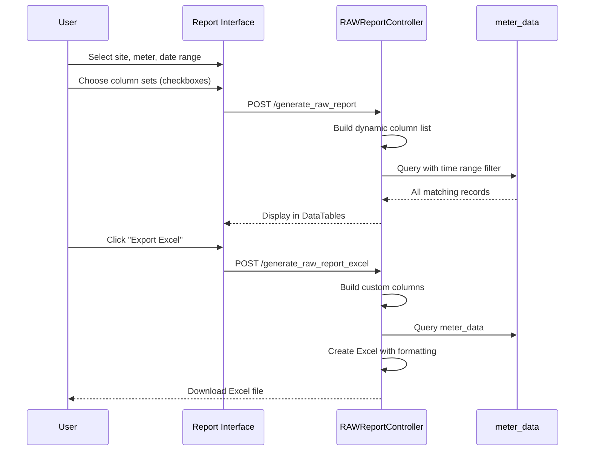

# RAW Report

## 📊 Overview

The RAW Report extracts detailed meter data for a specific meter and time range. It provides all electrical parameters recorded by the gateway, including voltage, current, power, energy, and demand readings.

**Controller:** `RAWReportController.php`  
**Route:** `/raw_report`  
**Data Source:** `meter_data` table

## 🔑 Key Features

### Report Parameters

- **Site:** Building/property
- **Meter:** Specific meter selection
- **Start Date/Time:** Beginning of report period
- **End Date/Time:** End of report period
- **Column Sets:** Selectable parameter groups

### Column Sets (Customizable)

**Set 1: Voltage (VRMS)**
- `vrms_a`, `vrms_b`, `vrms_c`

**Set 2: Current (IRMS)**
- `irms_a`, `irms_b`, `irms_c`

**Set 3: Power Parameters**
- `freq` (Frequency)
- `pf` (Power Factor)
- `watt` (kW)
- `va` (kVA)
- `var` (kVAR)

**Set 4: Energy (Default, always included)**
- `datetime`
- `wh_del` (kWh Delivered)
- `wh_rec` (kWh Received)
- `wh_net` (kWh Net)
- `wh_total` (kWh Total)

**Set 5: Reactive Energy**
- `varh_neg`, `varh_pos`, `varh_net`, `varh_total`, `vah_total`

**Set 6: Demand**
- `max_rec_kw_dmd` (Max kW Demand)
- `max_rec_kw_dmd_time` (Time of max demand)

**Set 7: Device Info**
- `soft_rev` (Software Revision)
- `mac_addr` (Gateway MAC Address)

## 📊 Query Logic

### Dynamic Column Selection

```php path=/Users/rli/Documents/DEC/camr_robinsons-main/camr_robinsons-main/app/Http/Controllers/RAWReportController.php start=163
$cols_set1 = $request->cols_set1;
if($cols_set1 == 'true') { 
    $column_set1 = "`vrms_a`,`vrms_b`,`vrms_c`,"; 
} else { 
    $column_set1 = ""; 
}

// Repeat for all column sets...

$_custom_column = "`datetime`,`wh_del`,`wh_rec`,`wh_net`,`wh_total`,$column_set1$column_set2$column_set3$column_set5$column_set6$column_set7";
$custom_column = rtrim($_custom_column, ',');
```

### Data Retrieval

```sql
SELECT * 
FROM meter_data USE INDEX (meter_data_index)
WHERE meter_id = ?
AND location = ?
AND datetime >= ?
AND datetime <= ?
ORDER BY datetime ASC
```

**Index Used:**
```sql
CREATE INDEX meter_data_index 
ON meter_data(meter_id, location, datetime);
```

## 📝 Excel Export

### Export Process

1. Build custom column list based on selections
2. Query data from `meter_data` table
3. Create Excel file with PhpSpreadsheet
4. Populate rows with data
5. Apply formatting and borders
6. Download file

### Column Headers in Excel

Headers are renamed for clarity:
- `watt` → `kw`
- `va` → `kva`
- `var` → `kvar`
- `varh_*` → `kvarh_*`

**Example Export Code:**
```php
$spreadSheet = new Spreadsheet();
$sheet = $spreadSheet->getActiveSheet();

// Headers
$headers = explode(',', $custom_column_excel);
$col = 'A';
foreach($headers as $header) {
    $sheet->setCellValue($col.'1', $header);
    $col++;
}

// Data rows
$row = 2;
foreach($data as $record) {
    $sheet->setCellValue('A'.$row, $record->datetime);
    $sheet->setCellValue('B'.$row, $record->wh_del);
    // ... populate all columns
    $row++;
}

$writer = new Xlsx($spreadSheet);
$writer->save("RAW_Report_{$meter_id}_{$date}.xlsx");
```

## 🔄 Usage Workflow



## ⚡ Performance

### Index Usage

**Critical Index:**
```sql
CREATE INDEX meter_data_index 
ON meter_data(meter_id, location, datetime);
```

**Without Index:** Query can take minutes for large datasets  
**With Index:** Query completes in seconds

### Data Volume

**15-minute intervals:**
- 1 day = 96 records
- 1 week = 672 records
- 1 month = ~2,880 records
- 1 year = ~35,040 records

**Recommendations:**
- Limit queries to ≤ 3 months for best performance
- For longer periods, use date aggregation
- Consider archiving old data

### Optimization Settings

```php
ini_set('max_execution_time', 0); // No time limit
ini_set('memory_limit', '512M');  // Increase memory
```

## 🐛 Troubleshooting

### No Data Returned

**Check:**
1. Meter name matches exactly (case-sensitive)
2. Building code correct
3. Date range contains data
4. Meter was active during period
5. Time zone correct

**Debug Query:**
```sql
SELECT COUNT(*), MIN(datetime), MAX(datetime)
FROM meter_data
WHERE meter_id = ?
AND location = ?;
```

### Slow Query Performance

**Solutions:**
1. Reduce date range (max 3 months)
2. Verify `meter_data_index` exists
3. Run `ANALYZE TABLE meter_data`
4. Check table size: `SELECT COUNT(*) FROM meter_data`

**Check Index:**
```sql
SHOW INDEX FROM meter_data 
WHERE Key_name = 'meter_data_index';
```

### Missing Columns in Export

**Ensure:**
- Column set checkboxes selected
- Meter supports requested parameters
- Gateway firmware version compatible
- Data exists in database

**Verify Data:**
```sql
SELECT vrms_a, vrms_b, vrms_c, irms_a, irms_b, irms_c
FROM meter_data
WHERE meter_id = ?
LIMIT 1;
```

### Excel Export Fails

**Common Issues:**
1. **Memory limit exceeded** → Increase `memory_limit`
2. **Execution timeout** → Set `max_execution_time = 0`
3. **Too many rows** → Limit date range
4. **PhpSpreadsheet missing** → Check composer dependencies

## 📊 Usage Examples

### Basic Energy Report

**Parameters:**
- Site: Robinsons Mall
- Meter: METER-001
- Start: 2024-01-01 00:00
- End: 2024-01-31 23:59
- Columns: Energy only (Set 4)

**Result:** ~2,976 rows (31 days × 96 readings/day)

### Full Electrical Analysis

**Parameters:**
- Site: Robinsons Mall
- Meter: MAIN-METER
- Start: 2024-01-15 00:00
- End: 2024-01-15 23:59
- Columns: All sets enabled

**Result:** 96 rows with all electrical parameters

### Demand Analysis

**Parameters:**
- Columns: Energy (Set 4) + Demand (Set 6)
- Purpose: Identify peak demand times
- Export: Excel for further analysis

**Query:**
```sql
SELECT 
    datetime,
    wh_total,
    max_rec_kw_dmd,
    max_rec_kw_dmd_time
FROM meter_data
WHERE meter_id = 'MAIN-METER'
AND datetime BETWEEN '2024-01-01' AND '2024-01-31'
ORDER BY max_rec_kw_dmd DESC
LIMIT 10;
```

## 💡 Best Practices

### Date Range Selection

**Short Ranges (< 1 week):**
- Include all column sets
- Fast query and export
- Detailed analysis possible

**Medium Ranges (1 week - 1 month):**
- Select essential columns only
- Consider splitting into weekly reports
- Export to Excel for analysis

**Long Ranges (> 1 month):**
- Use aggregated reports instead
- Or split into multiple RAW reports
- Consider using Consumption Report

### Column Selection

**For Energy Analysis:**
- Set 4 (Energy) only
- Fastest performance
- Billing and consumption focus

**For Power Quality:**
- Set 1 (Voltage)
- Set 2 (Current)
- Set 3 (Power)
- Troubleshooting electrical issues

**For Demand Tracking:**
- Set 4 (Energy)
- Set 6 (Demand)
- Peak demand analysis

## 📚 Related Documentation

- [SAP Report](sap-report.md) - Billing consumption
- [Consumption Report](consumption-report.md) - Period analysis
- [Demand Report](demand-report.md) - Peak demand tracking
- [Database Schema](../database-schema.md) - meter_data table
- [Meter Management](../modules/meter-management.md) - Meter configuration

---

**Access:** Login required (`isLoggedIn` middleware)  
**Data Granularity:** 15-minute intervals  
**Export Format:** Excel (.xlsx) via PhpSpreadsheet  
**Performance:** Best with date ranges ≤ 3 months  
**Index Required:** `meter_data_index` for optimal performance
