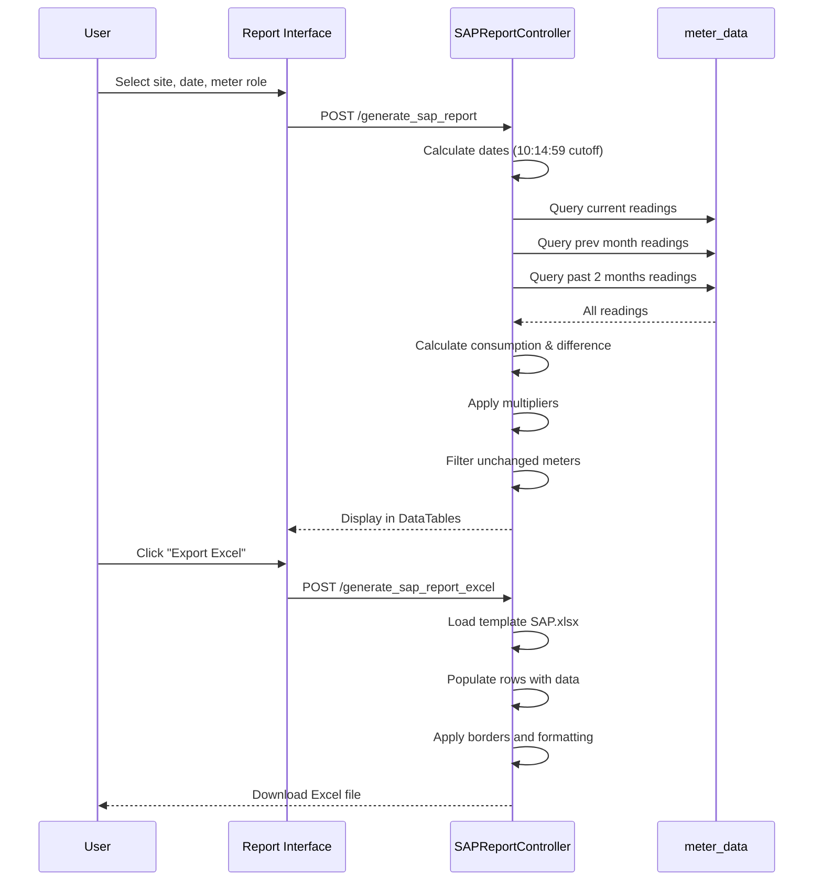

# SAP Report

## 📊 Overview

The SAP Report generates billing-ready consumption data formatted for SAP system integration. It calculates current consumption, compares with previous month, and exports to Excel format.

**Controller:** `SAPReportController.php`  
**Route:** `/sap_report`  
**Template:** `public/template/SAP.xlsx`

## 🔑 Key Features

### Report Parameters

- **Site:** Building/property selection
- **Date:** Cut-off date for billing (typically 10:00 AM + 14 minutes)
- **Meter Role:** Filter by Main/Sub/Check (optional)
- **Format:** Web view (DataTables) or Excel export

### Calculated Fields

1. **Current Reading** - Meter reading at cut-off date
2. **Previous Reading** - Reading from 1 month prior
3. **Past Two Months Reading** - Reading from 2 months prior
4. **Current Consumption** - Current - Previous (with multiplier)
5. **Previous Consumption** - Previous - Past Two Months (with multiplier)
6. **Consumption Difference** - Percentage change vs previous month

### Date Logic

```php path=/Users/rli/Documents/DEC/camr_robinsons-main/camr_robinsons-main/app/Http/Controllers/SAPReportController.php start=95
$dt_from = "$_end_date 10:00:00";
$date1 = date_create($dt_from);
date_add($date1, date_interval_create_from_date_string("14 minutes"));
$start_date = date_format($date1, "Y-m-d H:i:59"); // 10:14:59

$prev_month = date('Y-m-d', strtotime($_end_date. ' - 1 months'));
$prev_month_date = "$prev_month 10:14:59";

$past_two_months = date('Y-m-d', strtotime($_end_date. ' - 2 months'));
$past_two_months_date = "$past_two_months 10:14:59";
```

## 📊 Report Calculation

### Query Logic

```sql
SELECT 
    meter_details.meter_name,
    meter_details.customer_name,
    meter_details.meter_type,
    meter_details.meter_multiplier,
    (
        SELECT wh_total FROM meter_data USE INDEX (meter_data_index)
        WHERE location = ? AND meter_id = meter_name
        AND datetime <= ? -- current cut-off
        ORDER BY datetime DESC LIMIT 1
    ) AS current_reading,
    (
        SELECT wh_total FROM meter_data USE INDEX (meter_data_index)
        WHERE location = ? AND meter_id = meter_name
        AND datetime <= ? -- 1 month prior
        ORDER BY datetime DESC LIMIT 1
    ) AS prev_reading,
    (
        SELECT wh_total FROM meter_data USE INDEX (meter_data_index)
        WHERE location = ? AND meter_id = meter_name
        AND datetime <= ? -- 2 months prior
        ORDER BY datetime DESC LIMIT 1
    ) AS past_two_months_reading
FROM meter_details
WHERE site_idx = ?
AND meter_status = 'Active'
AND meter_role = ? -- optional filter
```

### Consumption Calculation

```php path=/Users/rli/Documents/DEC/camr_robinsons-main/camr_robinsons-main/app/Http/Controllers/SAPReportController.php start=148
// Present Consumption
$current_consumption = number_format(
    ($current_reading * $meter_multiplier) - ($prev_reading * $meter_multiplier),
    3, '.', ''
);

// Previous Consumption  
$previous_consumption = number_format(
    ($prev_reading * $meter_multiplier) - ($past_two_months_reading * $meter_multiplier),
    3, '.', ''
);

// Percentage Difference
if($current_consumption == 0 || $previous_consumption == 0) {
    $difference_consumption = 0;
} else {
    $difference = ($current_consumption - $previous_consumption) / $previous_consumption;
    $difference_consumption = number_format($difference * 100, 2, '.', '');
}
```

### Filters

**Exclude Unchanged Meters:**
```php path=/Users/rli/Documents/DEC/camr_robinsons-main/camr_robinsons-main/app/Http/Controllers/SAPReportController.php start=166
if($current_reading != $prev_reading) {
    // Include in report
}
```

## 📝 Excel Export

### Template Structure

**File:** `public/template/SAP.xlsx`

**Columns:**
1. Meter Name
2. Date Generated
3. Time Generated
4. Customer Name
5. Initial (empty)
6. Meter Multiplier
7. Meter Type
8. Building Code
9. Current Reading
10. Previous Reading
11. Current Consumption
12. Previous Consumption
13. Difference (%)

### Export Format

```php
$spreadSheet = IOFactory::load(public_path('/template/SAP.xlsx'));

$no_excl = 2; // Start at row 2
foreach ($data as $sap_data_column) {
    $spreadSheet->getActiveSheet()
        ->setCellValue("A$no_excl", $meter_name)
        ->setCellValue("B$no_excl", $date_generated)
        ->setCellValue("C$no_excl", $time_generated)
        // ... all columns
    $no_excl++;
}

$writer = new Xlsx($spreadSheet);
$writer->save("SAP_Report_{$building_code}_{$date}.xlsx");
```

## 🔄 Usage Workflow



## ⚡ Performance

### Index Usage

```sql
USE INDEX (meter_data_index)
```

**Composite Index:**
```sql
CREATE INDEX meter_data_index 
ON meter_data(location, meter_id, datetime);
```

### Optimization Notes

- Each meter requires 3 subqueries (current, prev month, past 2 months)
- Index critical for performance with large datasets
- `max_execution_time` set to 0 for Excel export

## 🐛 Troubleshooting

### Zero Consumption

**Check:**
1. Meter status = 'Active'
2. Readings exist for all 3 periods
3. Current reading ≠ previous reading
4. Meter multiplier is set

### Missing Meters in Report

**Reasons:**
- Meter status = 'INACTIVE'
- No reading at cut-off time
- Current reading = Previous reading (filtered out)

### Incorrect Percentage

**Division by Zero:**
```php
if($current_consumption == 0 || $previous_consumption == 0) {
    $difference_consumption = 0; // Avoid division by zero
}
```

## Related Reports

- [RAW Report](raw-report.md) - Detailed meter data
- [Consumption Report](consumption-report.md) - Consumption analysis
- [Site Report](site-report.md) - Site-level summary
