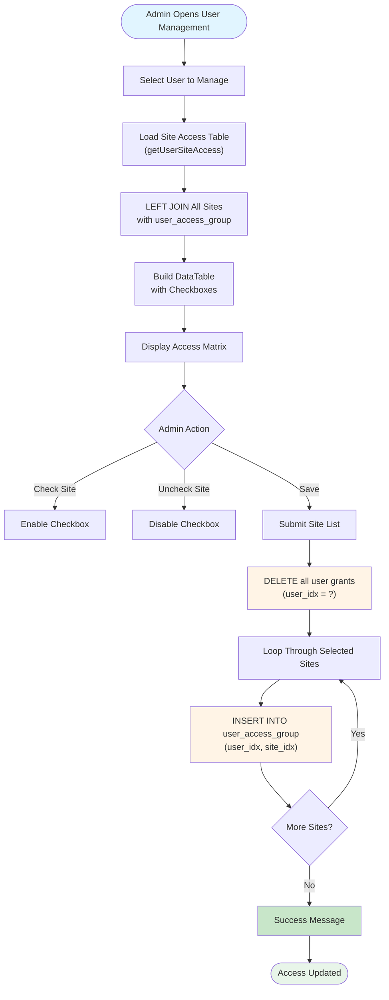

# 🔒 Site Access Control

The CAMR system implements **role-based access control (RBAC)** at the site level, allowing administrators to grant or revoke user access to specific sites (properties/buildings). This ensures users only see data for sites they're authorized to manage.

---

## 📋 Overview

**Controller:** `UserSiteAccessController.php`  
**Model:** `UserSiteAccessModel.php`  
**Database Table:** `user_access_group`  
**Access Granularity:** Per-site (building level)

**Permission Model:** Whitelist-based (explicit grant required)

---

## 🔑 Key Concepts

### Access Control Hierarchy

```
User
  └─ Site Access Grants (user_access_group)
       ├─ Site 1 (Robinson's Galleria)
       ├─ Site 2 (Robinson's Place Manila)
       └─ Site 3 (Robinson's Magnolia)
```

### User Roles

| Role | Description | Site Access Behavior |
|------|-------------|----------------------|
| **Admin** | System administrator | Can access all sites regardless of explicit grants |
| **User** | Standard user | Can only access sites explicitly granted |
| **Viewer** | Read-only access | Can view assigned sites but cannot modify data |

**Role Field:** `user_role` in `user_tb` table

---

## ⚙️ Access Control Implementation

### Routes

```php path=/Users/rli/Documents/DEC/camr_robinsons-main/camr_robinsons-main/routes/web.php start=234
/*View Site Access*/
Route::get('user_site_access', [UserSiteAccessController::class, 'getUserSiteAccess'])
    ->name('getUserSiteAccess')
    ->middleware('isLoggedIn');

/*Add Site Access*/
Route::post('/add_user_access_post', [UserSiteAccessController::class,'add_user_access_post'])
    ->name('add_user_access_post')
    ->middleware('isLoggedIn');
```

### Get User Site Access (DataTable)

```php path=/Users/rli/Documents/DEC/camr_robinsons-main/camr_robinsons-main/app/Http/Controllers/UserSiteAccessController.php start=20
public function getUserSiteAccess(Request $request)
{
    $userID = $request->UserID;
    
    if ($request->ajax()) {
    
    // LEFT JOIN to show all sites with access flag
    $user_site_access_data = SiteModel::leftJoin('user_access_group', function($q) use ($userID)
        {
            $q->on('meter_site.site_id', '=', 'user_access_group.site_idx')
                ->where('user_idx', '=', $userID);
        })
        ->leftjoin('meter_building_table', 'meter_building_table.site_idx', '=', 'meter_site.site_id')
        ->leftjoin('meter_division_table', 'meter_division_table.division_id', '=', 'meter_site.division_idx')
        ->leftjoin('meter_company_table', 'meter_company_table.company_id', '=', 'meter_site.company_idx')
        ->get([...]);

    return DataTables::of($user_site_access_data)
        ->addIndexColumn()
        ->addColumn('action', function($row){
            
            $user_id = $row->user_idx;
            $site_id = $row->site_id;
            $access_verified = $row->site_idx;
            
            // Generate checkbox - checked if access granted
            if($access_verified != NULL){
                $chk_status = "checked='checked'";
            }else{
                $chk_status = "";
            }
            
            $actionBtn = "<input type='checkbox' name='site_checklist' 
                onclick='enableUpdateUserAccess();' 
                value='".$site_id."' 
                id='CheckboxGroup1_".$site_id."' 
                ".$chk_status."/>";
            return $actionBtn;
        })
        ->rawColumns(['action'])
        ->make(true);
    }
}
```

**Query Logic:**
1. **LEFT JOIN** `user_access_group` with `meter_site` on site ID
2. Filter by target user ID
3. If `user_access_group.site_idx` is **NULL** → No access
4. If `user_access_group.site_idx` is **NOT NULL** → Access granted
5. Generate checkbox UI element (checked = granted)

---

## 🔄 Grant/Revoke Access

### Update User Site Access

```php path=/Users/rli/Documents/DEC/camr_robinsons-main/camr_robinsons-main/app/Http/Controllers/UserSiteAccessController.php start=79
public function add_user_access_post(Request $request){
    
    $userID = $request->userID;
    $site_items = $request->site_items; // Comma-separated site IDs

    $site_list_ids = $site_items;
    @$site_list_arr = explode(",", $site_list_ids);

    /*RESET - Remove all existing access*/
    UserSiteAccessModel::where('user_idx', $userID)->delete();

    if($site_list_ids!=''){
        
        /*LIST OF SITE ID's*/		
        foreach ($site_list_arr as $site_list_ids_row):

            @$site_id = $site_list_ids_row; 
            
            /*Re Insert Updated List*/
            $NewUserSiteAccess = new UserSiteAccessModel();
            $NewUserSiteAccess->makeHidden(['user_name']);
            $NewUserSiteAccess->user_idx = $userID;
            $NewUserSiteAccess->site_idx = $site_id;
            $NewUserSiteAccess->created_by_user_idx = Session::get('loginID');
            $NewUserSiteAccess->access_list_src = 'CAMR';
            $result = $NewUserSiteAccess->save();
        
        endforeach; 

        if($result){
            return response()->json(['success'=>'User Site Access Updated!']);
        }
        else{
            return response()->json(['success'=>'User Site Access Information']);
        }
    }
    else{
        return response()->json(['success'=>'User Site Access Removed!']);
    }
}
```

**Update Process:**
1. **Delete all existing grants** for user
2. **Loop through selected sites** (from comma-separated string)
3. **Insert new records** in `user_access_group` table
4. **Record audit trail** - `created_by_user_idx` tracks who granted access
5. **Return success message** to frontend

---

## 📊 Access Control Flow



---

## 🗄️ Database Schema

### user_access_group Table

| Column | Type | Description |
|--------|------|-------------|
| `user_access_id` | INT (PK) | Auto-increment primary key |
| `user_idx` | INT (FK) | User ID (references `user_tb.user_id`) |
| `site_idx` | INT (FK) | Site ID (references `meter_site.site_id`) |
| `created_by_user_idx` | INT | Admin who granted access |
| `access_list_src` | VARCHAR | Source system (always 'CAMR') |
| `created_at` | TIMESTAMP | Grant timestamp |
| `updated_at` | TIMESTAMP | Last modification timestamp |

**Indexes:**
```sql
CREATE INDEX idx_user_site ON user_access_group(user_idx, site_idx);
CREATE INDEX idx_user ON user_access_group(user_idx);
CREATE INDEX idx_site ON user_access_group(site_idx);
```

**Unique Constraint:**
```sql
ALTER TABLE user_access_group 
ADD CONSTRAINT unique_user_site 
UNIQUE (user_idx, site_idx);
```

---

## 🔍 Checking Access in Controllers

### Admin vs User Site Lists

**Admin Route:**
```php path=/Users/rli/Documents/DEC/camr_robinsons-main/camr_robinsons-main/routes/web.php start=63
Route::get('site/list', [CAMRSiteController::class, 'getSiteForAdmin'])
    ->name('AdminSiteList')
    ->middleware('isLoggedIn');
```

**User Route:**
```php path=/Users/rli/Documents/DEC/camr_robinsons-main/camr_robinsons-main/routes/web.php start=64
Route::get('site/user/list', [CAMRSiteController::class, 'getSiteForUser'])
    ->name('UserSiteList')
    ->middleware('isLoggedIn');
```

### Implementation Pattern

```php
// Check if user is admin
if ($currentUser->user_role == 'Admin') {
    // Return all sites
    $sites = SiteModel::all();
} else {
    // Filter by user_access_group
    $sites = SiteModel::join('user_access_group', 
        'meter_site.site_id', '=', 'user_access_group.site_idx')
        ->where('user_access_group.user_idx', $currentUser->user_id)
        ->get();
}
```

**Query Example:**
```sql
-- For standard users
SELECT meter_site.* 
FROM meter_site
INNER JOIN user_access_group 
    ON meter_site.site_id = user_access_group.site_idx
WHERE user_access_group.user_idx = 123;

-- For admins
SELECT * FROM meter_site;
```

---

## 🛡️ Security Best Practices

### Always Validate Access

```php
// Before allowing site data access
public function site_details($siteID)
{
    $currentUser = Session::get('loginID');
    $userRole = User::find($currentUser)->user_role;
    
    // Admin bypass
    if ($userRole == 'Admin') {
        return $this->renderSiteDetails($siteID);
    }
    
    // Check user has access
    $hasAccess = UserSiteAccessModel::where('user_idx', $currentUser)
        ->where('site_idx', $siteID)
        ->exists();
    
    if (!$hasAccess) {
        abort(403, 'Unauthorized access to this site');
    }
    
    return $this->renderSiteDetails($siteID);
}
```

### Prevent Privilege Escalation

```php
// Only admins can grant site access
public function add_user_access_post(Request $request)
{
    $currentUser = User::find(Session::get('loginID'));
    
    if ($currentUser->user_role != 'Admin') {
        return response()->json(['error' => 'Unauthorized'], 403);
    }
    
    // Proceed with access grant...
}
```

---

## 📖 Usage Examples

### Example 1: Grant Site Access to New User

**Scenario:** New operations staff needs access to 3 sites

1. Admin logs into CAMR system
2. Navigate to **User Management** → **Users**
3. Click **Edit** on user "jane.smith"
4. Click **Site Access** tab
5. Check boxes for:
   - ✅ Robinson's Galleria
   - ✅ Robinson's Place Manila
   - ✅ Robinson's Magnolia
6. Click **Save Changes**
7. System deletes all existing grants
8. System inserts 3 new records in `user_access_group`
9. Jane can now see these 3 sites in her dashboard

### Example 2: Revoke Access When User Changes Role

**Scenario:** User transferred to different property group

1. Admin opens user's Site Access page
2. **Uncheck** old sites:
   - ❌ Robinson's Galleria
   - ❌ Robinson's Place Manila
3. **Check** new sites:
   - ✅ Robinson's Ermita
   - ✅ Robinson's Otis
4. Save changes
5. User loses access to old sites immediately
6. User gains access to new sites

### Example 3: Admin Privilege

**Scenario:** System admin needs universal access

1. Create user with `user_role = 'Admin'`
2. **No site access grants needed**
3. Admin sees all sites automatically
4. Admin can manage all sites regardless of `user_access_group` table

---

## 🛠️ Troubleshooting

### Issue: User Cannot See Any Sites

**Cause:** No records in `user_access_group` for user

**Solution:**
```sql
-- Check current grants
SELECT * FROM user_access_group WHERE user_idx = 123;

-- If empty, grant access
INSERT INTO user_access_group (user_idx, site_idx, created_by_user_idx, access_list_src)
VALUES (123, 1, 1, 'CAMR');
```

### Issue: Admin Cannot See All Sites

**Cause:** User role not set to 'Admin'

**Solution:**
```sql
-- Check user role
SELECT user_id, user_name, user_role FROM user_tb WHERE user_id = 1;

-- Update to admin
UPDATE user_tb SET user_role = 'Admin' WHERE user_id = 1;
```

### Issue: Access Changes Not Taking Effect

**Cause:** Session caching old permissions

**Solution:**
```php
// User should logout and login again
// Or clear session programmatically
Session::forget('cached_user_sites');
```

### Issue: Duplicate Access Records

**Cause:** Missing unique constraint

**Solution:**
```sql
-- Remove duplicates
DELETE t1 FROM user_access_group t1
INNER JOIN user_access_group t2 
WHERE t1.user_access_id > t2.user_access_id
  AND t1.user_idx = t2.user_idx
  AND t1.site_idx = t2.site_idx;

-- Add unique constraint
ALTER TABLE user_access_group 
ADD CONSTRAINT unique_user_site UNIQUE (user_idx, site_idx);
```

---

## 📊 Access Audit & Reporting

### Query: List All User Permissions

```sql
SELECT 
    u.user_name,
    u.user_real_name,
    u.user_role,
    b.building_code,
    b.building_description,
    ua.created_at AS granted_on,
    creator.user_name AS granted_by
FROM user_access_group ua
INNER JOIN user_tb u ON ua.user_idx = u.user_id
INNER JOIN meter_site s ON ua.site_idx = s.site_id
INNER JOIN meter_building_table b ON s.site_id = b.site_idx
LEFT JOIN user_tb creator ON ua.created_by_user_idx = creator.user_id
ORDER BY u.user_name, b.building_code;
```

### Query: Users With No Site Access

```sql
SELECT 
    u.user_id,
    u.user_name,
    u.user_real_name,
    u.user_role
FROM user_tb u
LEFT JOIN user_access_group ua ON u.user_id = ua.user_idx
WHERE ua.user_access_id IS NULL
  AND u.user_role != 'Admin'
ORDER BY u.user_name;
```

### Query: Sites With No Assigned Users

```sql
SELECT 
    s.site_id,
    b.building_code,
    b.building_description,
    COUNT(ua.user_access_id) AS user_count
FROM meter_site s
INNER JOIN meter_building_table b ON s.site_id = b.site_idx
LEFT JOIN user_access_group ua ON s.site_id = ua.site_idx
GROUP BY s.site_id, b.building_code, b.building_description
HAVING user_count = 0
ORDER BY b.building_code;
```

---

## 🔗 Related Documentation

- **[Authentication](authentication.md)** - Login and session management
- **[User Management](user-management.md)** - User CRUD operations
- **[Site Management](modules/site-management.md)** - Site/building management
- **[Database Schema](database-schema.md)** - `user_access_group` table structure
- **[Models](models.md)** - UserSiteAccessModel implementation

---

## 📝 Best Practices

### For Administrators

1. **Follow Principle of Least Privilege**
   - Only grant access to sites users actually need
   - Review permissions quarterly
   - Remove access when users change roles

2. **Document Access Grants**
   - Maintain spreadsheet of user-to-site mappings
   - Track why access was granted
   - Record access removal reasons

3. **Audit Regularly**
   - Monthly review of user permissions
   - Alert on users with excessive access
   - Verify admins are legitimate

### For Developers

1. **Always Check Permissions**
   ```php
   // NEVER assume user has access
   // ALWAYS validate before displaying site data
   if (!$this->userHasAccessToSite($userId, $siteId)) {
       abort(403);
   }
   ```

2. **Use Consistent Queries**
   ```php
   // Create helper method for site filtering
   public function getSitesForUser($userId) {
       return SiteModel::join('user_access_group', ...)
           ->where('user_idx', $userId)
           ->get();
   }
   ```

3. **Log Access Changes**
   ```php
   activity('site_access')
       ->causedBy(auth()->user())
       ->performedOn($targetUser)
       ->withProperties(['granted_sites' => $siteIds])
       ->log('Updated site access');
   ```

### For Security

1. **Implement Access Logging**
   - Log every site access attempt
   - Alert on unauthorized access attempts
   - Track who granted/revoked access

2. **Prevent Horizontal Privilege Escalation**
   - Users cannot grant themselves access
   - Users cannot view other users' permissions
   - Only admins can modify `user_access_group`

3. **Test Access Controls**
   ```php
   // Unit test example
   public function test_user_cannot_access_unauthorized_site()
   {
       $user = User::factory()->create();
       $site = Site::factory()->create();
       
       $response = $this->actingAs($user)
           ->get('/site_details/' . $site->site_id);
       
       $response->assertStatus(403);
   }
   ```

---

**Last Updated:** 2024-03-15  
**Document Version:** 1.0  
**Maintainer:** CAMR Development Team
