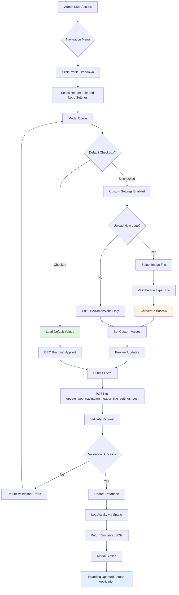

# Web Page Settings

The **Web Page Settings** module provides comprehensive control over the application's visual identity, enabling administrators to customize the navigation header title, brand logos, and logo dimensions across different pages. This customization capability allows organizations to maintain brand consistency while using the CAMR system.

---

## 📋 Overview

**Controller:** `CAMRWebpageController.php`  
**Model:** `WebPageSettingsModel.php`  
**Database Table:** `web_page_settings`  
**Routes Prefix:** N/A (Accessed via modal from navigation bar)

### Purpose

The Web Page Settings module allows authorized users (typically administrators) to:

- Customize the navigation header title displayed across all application pages
- Upload and manage custom brand logos (stored as base64-encoded LONGBLOB)
- Configure logo dimensions for both header navigation and login page
- Reset to default DEC branding with a single checkbox
- Preview logo appearance in real-time during configuration

### Access Control

- **Accessible to:** Admin users only (via navigation bar menu)
- **Middleware:** `isLoggedIn`
- **Menu Location:** User profile dropdown → "Header Title and Logo Settings"

---

## 🔑 Key Features

### 1. Navigation Header Title Customization

**Field:** `navigation_header_title`  
**Type:** String (varchar 255)  
**Default:** "Centralized Automated Meter Reading"  

Customizes the text displayed in the main navigation header across all authenticated pages.

```php
// File: app/Http/Controllers/CAMRWebpageController.php
public function update_web_navigation_header_title_settings_post(Request $request){
    $default_web_settings = $request->default_web_settings;
    
    if($default_web_settings=='on'){
        // Set to Default
        $WebPageSettings = WebPageSettingsModel::first();
        $WebPageSettings->default_web_settings = 1;
        $WebPageSettings->navigation_header_title = 'Centralized Automated Meter Reading';
        $WebPageSettings->header_navigation_width = '70';
        $WebPageSettings->login_page_logo_width = '100';
        $WebPageSettings->image_logo = "iVBORw0KGg..." // Default DEC logo
        $result = $WebPageSettings->update();
    }
}
```

### 2. Custom Logo Upload

**Field:** `image_logo`  
**Type:** LONGBLOB (base64-encoded)  
**Accepted Formats:** JPG, JPEG, PNG  
**Max Size:** 10MB (10,048 KB)

Uploads custom brand logo stored as base64-encoded binary data.

```php
// File: app/Http/Controllers/CAMRWebpageController.php
if ($request->hasFile('image_logo')) {
    $request->validate([
        'image_logo' => 'image|mimes:jpg,png,jpeg|max:10048',
        'navigation_header_title' => 'required',
        'header_navigation_width' => 'required',
        'login_page_logo_width' => 'required',
    ]);
    
    $path = $request->file('image_logo')->getRealPath();
    $logo = file_get_contents($path);
    $image_blob = base64_encode($logo);
    
    $WebPageSettings = WebPageSettingsModel::first();
    $WebPageSettings->image_logo = $image_blob;
    $result = $WebPageSettings->update();
}
```

### 3. Header Navigation Logo Width

**Field:** `header_navigation_width`  
**Type:** Double  
**Range:** 1-100  
**Default:** 70  
**Unit:** Percentage or pixels

Controls the logo size in the main navigation header (top bar) across all authenticated pages.

### 4. Login Page Logo Width

**Field:** `login_page_logo_width`  
**Type:** Double  
**Range:** 1-200  
**Default:** 100  
**Unit:** Percentage or pixels

Controls the logo size displayed on the login/authentication page.

### 5. Default Settings Reset

**Field:** `default_web_settings`  
**Type:** Integer (boolean flag)  
**Values:** 0 (custom) | 1 (default)

Enables one-click restoration of default DEC branding:

- Title: "Centralized Automated Meter Reading"
- Logo: Default DEC logo (embedded base64)
- Header width: 70
- Login width: 100

### 6. Real-Time Logo Preview

The settings modal includes two preview cards:

- **Header Logo Preview:** Shows how logo appears in navigation header
- **Login Page Logo Preview:** Shows how logo appears on login page

Previews update in real-time as settings are adjusted.

---

## 🗄️ Database Schema

### `web_page_settings` Table

```sql
-- Migration: 2024_10_21_083851_create_web_page_settings_table.php
Schema::create('web_page_settings', function (Blueprint $table) {
    $table->integer('default_web_settings')->nullable()->default(1);
    $table->string('navigation_header_title', 255)->nullable()
          ->default('Lighting Automation System');
    $table->double('header_navigation_width')->nullable()->default('70');
    $table->double('login_page_logo_width')->nullable()->default(NULL);
    $table->dateTime('created_at')->nullable()->default(NULL);
    $table->integer('created_by_user_idx')->nullable()->default(NULL);
    $table->dateTime('updated_at')->nullable()->default(NULL);
    $table->integer('modified_by_user_idx')->nullable()->default(NULL);
});

DB::statement("ALTER TABLE web_page_settings ADD image_logo LONGBLOB after navigation_header_title");
```

**Key Characteristics:**

- **No Primary Key:** Table uses `first()` to retrieve single configuration row
- **LONGBLOB Storage:** `image_logo` stored via raw SQL statement (not in Blueprint)
- **Audit Fields:** `created_by_user_idx`, `modified_by_user_idx` track changes
- **Activity Logging:** Uses Spatie ActivityLog trait for change tracking

---

## 🔄 Model Configuration

### WebPageSettingsModel

```php
// File: app/Models/WebPageSettingsModel.php
class WebPageSettingsModel extends Model
{
    use LogsActivity;
    
    protected $table = 'web_page_settings';
    
    protected $fillable = [
        'default_web_settings',
        'navigation_header_title',
        'image_logo',
        'header_navigation_width',
        'header_navigation_height',
        'login_page_logo_width',
        'created_at',
        'created_by_user_idx',
        'updated_at',
        'modified_by_user_idx'
    ];
    
    protected $primaryKey = null; // No primary key
    
    protected static $logName = 'Web Page Details';
    protected static $logOnlyDirty = true;
    protected static $logAttributes = [
        'default_web_settings',
        'navigation_header_title',
        'image_logo',
        'header_navigation_width',
        'header_navigation_height',
        'login_page_logo_width',
    ];
}
```

**Notable Features:**

- **No Primary Key:** Uses `first()` for singleton pattern retrieval
- **Activity Logging:** All fillable attributes logged for audit trail
- **Dirty Tracking:** Only logs changed attributes (not entire model)
- **Session-Based Attribution:** Uses `Session::get('loginID')` for causer tracking

---

## 🛠️ Implementation Details

### Retrieving Web Settings

```php
// File: app/Http/Controllers/CAMRWebpageController.php
public function web_settings_info(Request $request){
    $data = WebPageSettingsModel::first();
    return response()->json($data);
}
```

**Route:** `POST /web_settings_info`  
**Middleware:** `isLoggedIn`  
**Returns:** JSON object with all web settings

### Updating Web Settings (With Custom Logo)

```php
if ($request->hasFile('image_logo')) {
    $request->validate([
        'image_logo' => 'image|mimes:jpg,png,jpeg|max:10048',
        'navigation_header_title' => 'required',
        'header_navigation_width' => 'required',
        'login_page_logo_width' => 'required',
    ]);
    
    // Store file temporarily (optional)
    $path = 'files/';
    $file = $request->file('image_logo');
    $file_name = time().'_'.$file->getClientOriginalName();
    $upload = $file->storeAs($path, $file_name, 'public');
    
    // Convert to base64 for database storage
    $path = $request->file('image_logo')->getRealPath();
    $logo = file_get_contents($path);
    $image_blob = base64_encode($logo);
    
    $WebPageSettings = WebPageSettingsModel::first();
    $WebPageSettings->default_web_settings = 0; // Custom settings
    $WebPageSettings->navigation_header_title = $request->navigation_header_title;
    $WebPageSettings->header_navigation_width = $request->header_navigation_width;
    $WebPageSettings->login_page_logo_width = $request->login_page_logo_width;
    $WebPageSettings->image_logo = $image_blob;
    $result = $WebPageSettings->update();
}
```

### Updating Web Settings (Without Custom Logo)

```php
else {
    $WebPageSettings = WebPageSettingsModel::first();
    $WebPageSettings->default_web_settings = 0;
    $WebPageSettings->navigation_header_title = $request->navigation_header_title;
    $WebPageSettings->header_navigation_width = $request->header_navigation_width;
    $WebPageSettings->login_page_logo_width = $request->login_page_logo_width;
    // Retains existing logo
    $result = $WebPageSettings->update();
}
```

### Resetting to Default Settings

```php
if($default_web_settings=='on'){
    $WebPageSettings = WebPageSettingsModel::first();
    $WebPageSettings->default_web_settings = 1;
    $WebPageSettings->navigation_header_title = 'Centralized Automated Meter Reading';
    $WebPageSettings->header_navigation_width = '70';
    $WebPageSettings->login_page_logo_width = '100';
    $WebPageSettings->image_logo = "iVBORw0KGg..." // Default DEC logo (base64)
    $result = $WebPageSettings->update();
}
```

---

## 🔀 Workflow Diagram



---

## 🎯 Usage Examples

### Example 1: Resetting to Default DEC Branding

**Scenario:** Organization wants to revert to default CAMR branding

**Steps:**

1. Navigate to profile dropdown (top right)
2. Click "Header Title and Logo Settings"
3. Check the "Default" checkbox
4. Click "Submit"
5. System applies DEC branding automatically

**Result:** Title becomes "Centralized Automated Meter Reading", DEC logo restored, dimensions reset

### Example 2: Uploading Custom Robinsons Brand Logo

**Scenario:** Robinsons Land Corporation wants custom branding

**Steps:**

1. Access "Header Title and Logo Settings" modal
2. Ensure "Default" checkbox is **unchecked**
3. Set **Header Title:** "Robinsons CAMR System"
4. Set **Header Logo Width:** 80
5. Set **Login Logo Width:** 120
6. Click "Upload" and select `robinsons_logo.png`
7. Preview logo in both preview cards
8. Click "Submit"

**Result:** Custom Robinsons branding applied across all pages

### Example 3: Adjusting Logo Dimensions Only

**Scenario:** Logo is correct but appears too large in header

**Steps:**

1. Open settings modal
2. Keep existing logo (don't upload new file)
3. Reduce **Header Logo Width** from 80 to 60
4. Keep **Login Logo Width** unchanged
5. Submit changes

**Result:** Header logo shrinks to 60, login logo remains at original size

---

## 🚨 Troubleshooting

### Issue 1: Logo Not Appearing After Upload

**Symptoms:** Logo upload succeeds but image doesn't display

**Possible Causes:**

- Base64 encoding failed
- Image file corrupted or invalid format
- Browser cache showing old logo
- LONGBLOB field size exceeded

**Solutions:**

```php
// Verify base64 encoding
$logo = file_get_contents($path);
$image_blob = base64_encode($logo);
if (strlen($image_blob) > 16777215) { // Max LONGBLOB size
    throw new Exception('Image file too large for LONGBLOB storage');
}
```

- Clear browser cache (Ctrl+F5 or Cmd+Shift+R)
- Verify file format is JPG, JPEG, or PNG
- Check file size is under 10MB
- Check `image_logo` BLOB storage in database

### Issue 2: Validation Error on File Upload

**Symptoms:** "The image logo must be an image" error

**Possible Causes:**

- Invalid MIME type
- File extension mismatch
- Corrupted file header

**Solutions:**

```php
// Verify MIME type validation
$request->validate([
    'image_logo' => 'image|mimes:jpg,png,jpeg|max:10048',
]);
```

- Ensure file is genuine image (not renamed PDF or other format)
- Use image editing software to re-save as PNG/JPG
- Check file isn't corrupted

### Issue 3: Default Checkbox Doesn't Reset Logo

**Symptoms:** Checking "Default" doesn't restore DEC logo

**Possible Causes:**

- JavaScript not triggering on checkbox change
- Default base64 string truncated in code
- Database update failed

**Solutions:**

```javascript
// Verify checkbox JavaScript trigger
function default_web_settings_action() {
    if ($('#default_web_settings').is(':checked')) {
        // Disable custom input fields
        $('#navigation_header_title').prop('disabled', true);
        $('#header_navigation_width').prop('disabled', true);
        $('#login_page_logo_width').prop('disabled', true);
        $('#image_logo').prop('disabled', true);
    } else {
        // Enable custom input fields
        $('#navigation_header_title').prop('disabled', false);
        // ... etc
    }
}
```

- Check browser console for JavaScript errors
- Verify default base64 logo string is complete in controller
- Check database update succeeded (check activity log)

### Issue 4: Logo Dimensions Not Applying

**Symptoms:** Logo size doesn't change after updating width values

**Possible Causes:**

- CSS override preventing size change
- Width value exceeds maximum (100 for header, 200 for login)
- Browser caching old dimensions

**Solutions:**

```php
// Verify dimension validation
$request->validate([
    'header_navigation_width' => 'required|numeric|min:1|max:100',
    'login_page_logo_width' => 'required|numeric|min:1|max:200',
]);
```

- Check CSS in `resources/views/layouts/navigation.blade.php` and `login.blade.php`
- Clear browser cache
- Verify width values stored in database correctly

### Issue 5: Modal Not Opening

**Symptoms:** Clicking "Header Title and Logo Settings" does nothing

**Possible Causes:**

- JavaScript not loaded
- Bootstrap modal conflict
- User doesn't have admin permissions

**Solutions:**

- Check browser console for JavaScript errors
- Verify Bootstrap JS is loaded
- Verify user role is admin
- Check modal ID matches trigger button: `data-bs-target="#WebPageSettingsTitleModal"`

---

## ✅ Best Practices

### 1. Logo File Optimization

**Recommendation:** Optimize logo images before upload

```bash
# Use image optimization tools
convert logo.png -resize 500x500 -quality 85 optimized_logo.png
```

- Keep file size under 500KB for faster loading
- Use PNG format for logos with transparency
- Use JPG format for photos or complex images
- Recommended dimensions: 300x300 to 500x500 pixels

### 2. Backup Before Changing Settings

**Recommendation:** Export current settings before making changes

```sql
-- Backup web_page_settings table
SELECT * FROM web_page_settings;

-- Export as SQL
mysqldump -u root -p meter_reading_robinsons web_page_settings > backup_web_settings.sql
```

### 3. Test Branding Changes in Development First

**Recommendation:** Test custom branding in non-production environment

- Create development instance with cloned database
- Upload test logo and verify appearance
- Check both header and login page rendering
- Verify mobile responsiveness

### 4. Use Consistent Branding Elements

**Recommendation:** Maintain brand consistency

- Use same logo file across header and login page (system handles sizing)
- Keep title concise (max 50-60 characters for readability)
- Choose appropriate dimensions for professional appearance

### 5. Document Customization Decisions

**Recommendation:** Keep record of custom settings

```
Branding Configuration Log:
- Date: 2024-11-15
- Title: "Robinsons CAMR System"
- Header Width: 80
- Login Width: 120
- Logo File: robinsons_logo.png (250KB)
- Reason: Corporate rebranding initiative
```

### 6. Regular Activity Log Review

**Recommendation:** Monitor branding changes via activity log

```php
// Query activity log for web settings changes
use Spatie\Activitylog\Models\Activity;

$activities = Activity::where('log_name', 'Web Page Details')
    ->orderBy('created_at', 'desc')
    ->get();
```

---

## 🔗 Related Documentation

- [Configuration Files](configuration/config-files.md) - System-wide configuration management
- [Company & Division](configuration/company-division.md) - Organizational structure setup
- [User Management](user-management.md) - User roles and permissions
- [Authentication](authentication.md) - Login and password management
- [Custom Branding](branding.md) - Advanced branding customization

---

## 📝 Summary

The **Web Page Settings** module provides a user-friendly interface for customizing the CAMR application's visual identity. By centralizing branding control in a single table with base64-encoded logo storage, the system enables organizations to maintain brand consistency across all pages without requiring file system access or complex configuration.

Key capabilities include custom navigation titles, logo uploads with real-time preview, flexible dimension controls, and one-click default restoration. The module uses activity logging for audit trails and follows Laravel best practices with model-based CRUD operations and form request validation.
